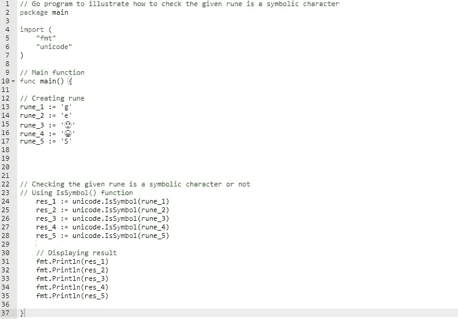
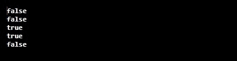
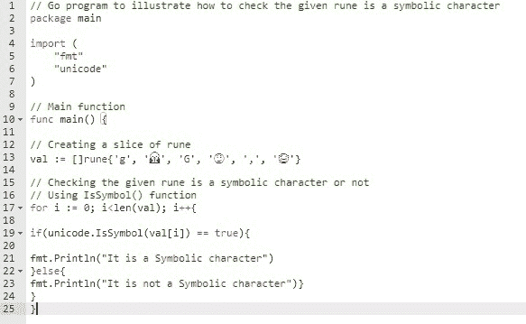
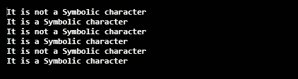

# 检查符文在戈朗是否是符号角色

> 原文:[https://www . geesforgeks . org/check-如果符文是符号字符或不在 golang/](https://www.geeksforgeeks.org/check-if-the-rune-is-a-symbolic-character-or-not-in-golang/)

符文是 ASCII 的超集或者是 int32 的别名。它保存了世界书写系统中所有可用的字符，包括重音符号和其他发音符号、制表符和回车等控制代码，并为每个字符分配了一个标准数字。在围棋语言中，这个标准数字被称为 Unicode 码位或符文。
你可以借助 **IsSymbol()** 功能检查给定的符文是否为符号字符。如果给定的符文是一个符号字符，此函数返回 true 如果给定的符文不是一个符号字符，则返回 false。该函数是在 Unicode 包下定义的，因此要访问该方法，您需要在程序中导入 Unicode 包。

**语法:**

```go
func IsSymbol(r rune) bool
```

这个函数的返回类型是布尔型的。让我们借助给定的例子来讨论这个概念:

**例 1:**



**输出:**


**例 2:**



**输出:**

