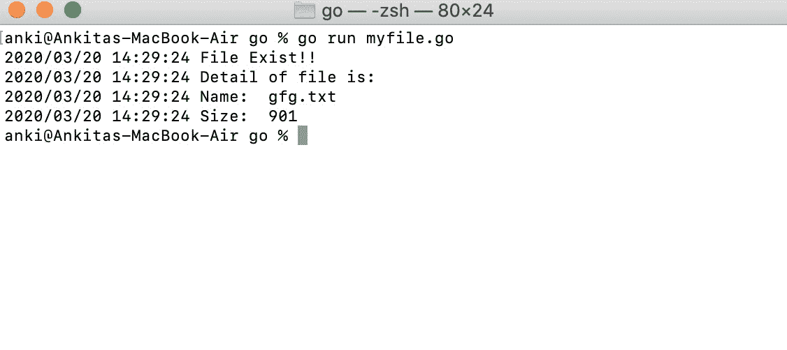
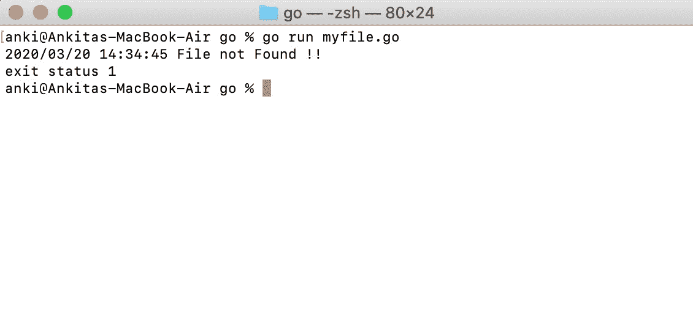

# 检查给定文件在 Golang 中是否存在

> 原文:[https://www . geesforgeks . org/checking-给定文件存在与否-in-golang/](https://www.geeksforgeeks.org/checking-the-given-file-exists-or-not-in-golang/)

在 Go 语言中，允许您借助 **IsNotExist()** 函数检查给定文件是否存在。如果此函数返回 true，则表示已知错误，报告指定的文件或目录已经不存在，如果返回 false，则表示给定的文件或目录存在。ErrNotExist 和一些系统调用错误也满足这个方法。它是在 os 包下定义的，所以您必须在程序中导入 os 包才能访问 IsNotExist()函数。

**语法:**

```go
func IsNotExist(e error) bool
```

**例 1:**

```go
// Golang program to illustrate how to check the
// given file exists or not in the default directory
package main

import (
    "log"
    "os"
)

var (
    myfile *os.FileInfo
    e      error
)

func main() {

    // Here Stat() function returns file info and 
    //if there is no file, then it will return an error

    myfile, e := os.Stat("gfg.txt")
    if e != nil {

      // Checking if the given file exists or not
      // Using IsNotExist() function
        if os.IsNotExist(e) {
            log.Fatal("File not Found !!")
        }
    }
    log.Println("File Exist!!")
    log.Println("Detail of file is:")
    log.Println("Name: ", myfile.Name())
    log.Println("Size: ", myfile.Size())

}
```

**输出:**



**例 2:**

```go
// Golang program to illustrate how to check
// the given file exists or not in given 
// directory
package main

import (
    "log"
    "os"
)

var (
    myfile *os.FileInfo
    e      error
)

func main() {

    // Here Stat() function 
    // returns file info and 
    // if there is no file, 
    // then it will return an error

    myfile, e := os.Stat("/Users/anki/Documents/new_folder/myfolder/hello.txt")
    if e != nil {

      // Checking if the given file exists or not
      // Using IsNotExist() function
        if os.IsNotExist(e) {
            log.Fatal("File not Found !!")
        }
    }
    log.Println("File Exist!!")
    log.Println("Detail of file is:")
    log.Println("Name: ", myfile.Name())
    log.Println("Size: ", myfile.Size())

}
```

**输出:**

