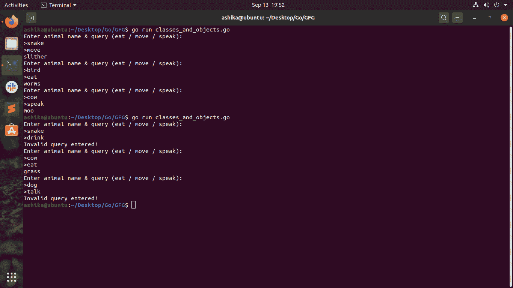

# Golang 中的类和对象

> 原文:[https://www.geeksforgeeks.org/class-and-object-in-golang/](https://www.geeksforgeeks.org/class-and-object-in-golang/)

每个人(不包括婴儿)都可以与封装相关，而不管他/她先前是否了解封装。你想知道为什么吗？很简单。回想一下你生病的所有时间，医生给你开了几天所有那些大剂量的胶囊，直到你恢复健康！邪恶胶囊包含所有神秘的元素，这些元素以某种方式神奇地装进了那个小胶囊！！有没有想过胶囊里的东西？我们只看到胶囊的外部结构，老实说，我们没有人能仅仅通过看它的结构就知道它到底装了什么。对吗？嗯，让你惊讶的是，这就是我们所说的**封装**。

想知道为什么我们把封装引入到一篇关于类和对象的文章中？嗯，一个 ***类就是一个高超的实现封装*** 。一个胶囊将疾病的药物元素绑定在一起，类将程序员和用户的多行语句和/或函数绑定在一起！你知道最有趣的部分是什么吗？ ***戈朗没有阶级*** 但确实有！困惑？一开始似乎是这样。 ***基本上 Go 没有关键字，“class”不像其他面向对象语言像 C++/Java/Python*** 、 ***等……但是(*** **这里** ***就来了例外！！！)*** Go 支持类的全部功能。就像 Go 支持类而不把它命名为类。

那么如果不能使用**类**这个关键词呢？去抢走一个关键词却给回了 ***4 个不同类型的实现一个类*** 。有意思！让我们深入探讨这 4 位魔术师的细节:

**1。** [**结构**](https://www.geeksforgeeks.org/structures-in-golang/) ( *或者更确切地说结构* )
结构是用户定义的数据类型/结构。它们的工作方式与其他语言(如 C++/Python)中的结构相同。普通结构和隐式类的唯一区别是，结构由程序员定义，然后传递给函数或方法，然后进行处理。人们永远无法判断程序是否包含隐含地被视为类的部分，但是 GO 支持 OOPs(面向对象编程系统)，尽管程序员看不到名称和有组织的容器，但我们坚信我们可以以不同的方式在 Go 中执行所有 OOPs 功能。

**2。嵌入**
一种不太流行但有用的技术是使用嵌入。顾名思义，它支持以特定的方式嵌套结构。例如，你有一个含有 T4 b 内容的结构 1。现在您希望创建一个结构 2，它包括结构 1 的内容以及 c & d。在这种情况下，您可以简单地在结构 2 中提到结构 1，然后 c & d，这类似于内联函数逻辑！嵌入也是由结构驱动的。作为类的隐式转换没有区别，只是结构简单，嵌套结构被称为嵌入式结构。

**3。方法/函数**
嗯，你可以简单地创建定制类型的函数，这些函数可以被隐式地当作一个类。在 [Go 的功能](https://www.geeksforgeeks.org/functions-in-go-language/)中，你可以学到的令人兴奋的新东西是，功能有一个特定的接收器类型，它们只在那个非常特定的类型上运行；不像 C++中的模板。

**4。接口**
接口就像那些包含多列火车站立和一些往返于一个地方的火车站台。是的，你读对了！接口将各种不能像在 Java 中那样显式实现的方法集合绑定在一起。关于 Go 中的接口，需要注意的一点是，接口名称必须以“ ***er*** 结尾，这是 Go 的约定。位于 ***er*** 之前的字符实际上是实现同名+ ***er*** 接口的类型名称。通过下面的代码部分，您将获得最大的清晰度。

```go
For instance:

Line1: type X struct {}

Line1 is a simple demo of defining X class (indirectly)
```

**对象**可以与现实生活中的实体相关。正如对类的功能有规定但没有类关键字一样，Go 中的对象也是如此。对象或者说变量可以用特定的类类型来实例化，并且变量可以像在任何其他语言中使用对象一样被进一步使用。

```go
***For instance:***

Line2: obj := X()

*Line2 is a simple demo of instantiating X class to obj (indirectly)*
```

**代码:类和对象的演示。**

## 去

```go
package main

// Importing fmt package for the sake of printing
import (
    "fmt"
)

// Animal is the name we want but since we are
// to use it as an interface, we will change
// the name into Animaler.
type Animaler interface {

    // Note that we will
    // declare the methods to be used
    // later here in this
    // interface
    Eat()
    Move()
    Speak()
    Error()
}

// A struct holding a string variable: SuperAnimals
type SuperAnimals struct {
    locomotion string
}

// An embedded struct holding content
// from another struct and two
// other string variables
// named Animals
type Animals struct {
    SuperAnimals
    food  string
    sound string
}

// Now we are indirectly implementing
// the Animaler interface without any
// keywords.
// We are about to define each method
// declared in the Animaler interface.
func (x Animals) Eat() {
    // this method will access the variable
    // food in Animal class
    fmt.Println(x.food)
}

func (x Animals) Move() {
    // this method will access the variable
    // locomotion in Animal class
    fmt.Println(x.locomotion)
}

func (x Animals) Speak() {
    // this method will access the variable
    // sound in Animal class
    fmt.Println(x.sound)
}

func (x Animals) Error() {
    fmt.Println("Invalid query entered!")
}

// Finally reached main function where we can
// now test our "GO classes"
func main() {

    // Experiencing a dictionary / map in GO
    // For the animal name as a key,
    // that particular object is a value
    m := map[string]Animals{
        "cow":   Animals{SuperAnimals{"walk"}, "grass", "moo"},
        "Cow":   Animals{SuperAnimals{"walk"}, "grass", "moo"},
        "Bird":  Animals{SuperAnimals{"fly"}, "worms", "peep"},
        "bird":  Animals{SuperAnimals{"fly"}, "worms", "peep"},
        "Snake": Animals{SuperAnimals{"slither"}, "mice", "hsss"},
        "snake": Animals{SuperAnimals{"slither"}, "mice", "hsss"},
    }
    for i := 0; i < 3; i++ {
        fmt.Println("Enter animal name & query (eat / move / speak): ")
        fmt.Print(">")
        var animal, op string
        fmt.Scan(&animal)
        fmt.Print(">")
        fmt.Scan(&op)
        if op == "eat" {
            m[animal].Eat()
        } else if op == "move" {
            m[animal].Move()
        } else if op == "speak" {
            m[animal].Speak()
        } else {
            m[animal].Error()
        }
    }
}
```

**运行命令:**

```go
Directory where the GO file is present:/> go run (file_name).go
```

**有效测试用例 1:**

**输入:**

```go
Enter animal name & query (eat / move / speak): 
>snake
>move

Enter animal name & query (eat / move / speak): 
>bird
>eat

Enter animal name & query (eat / move / speak): 
>cow
>speak
```

**输出:**

```go
slither
worms
moo
```

**无效测试用例 2:**

**输入:**

```go
Enter animal name & query (eat / move / speak): 
>snake
>drink

Enter animal name & query (eat / move / speak): 
>cow
>eat 

Enter animal name & query (eat / move / speak): 
>dog
>talk
```

**输出:**

```go
Invalid query entered!
grass
Invalid query entered!
```

**Linux 终端上的可视化演示:**

