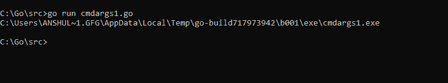
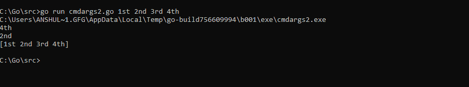

# Golang 中的命令行参数

> 原文:[https://www . geesforgeks . org/命令行参数 in-golang/](https://www.geeksforgeeks.org/command-line-arguments-in-golang/)

命令行参数是向程序的[主函数](https://www.geeksforgeeks.org/main-and-init-function-in-golang/)提供参数的一种方式。类似地，在 Go 中，我们使用这种技术在程序运行时传递参数。

在 Golang，我们有一个名为 **os package** 的包，其中包含一个名为**“Args”**的[数组](https://www.geeksforgeeks.org/arrays-in-go/)。 **Args** 是一个包含所有传递的命令行参数的[字符串](https://www.geeksforgeeks.org/strings-in-golang/)数组。

**第一个参数将始终是程序名，如下所示。**

**例 1:** 尽量使用离线编译器，效果更好。将以下文件保存为 *cmdargs1.go*

```go
// Golang program to show how
// to use command-line arguments
package main

import (
    "fmt"
    "os"
)

func main() {

    // The first argument
    // is always program name
    myProgramName := os.Args[0]

    // it will display 
    // the program name
    fmt.Println(myProgramName)
}
```

**输出:**在这里，可以看到它正在用全路径显示程序名。基本上你可以称之为 Os 文件路径输出。如果你用一些伪参数运行程序，那么它也将作为程序名打印出来。



**示例 2:** 将以下文件保存为 *cmdargs2.go*

```go
// Golang program to show how
// to use command-line arguments
package main

import (
    "fmt"
    "os"
)

func main() {

    // The first argument
    // is always program name
    myProgramName := os.Args[0]

    // this will take 4
    // command line arguments
    cmdArgs := os.Args[4]

    // getting the arguments
    // with normal indexing
    gettingArgs := os.Args[2]

    toGetAllArgs := os.Args[1:]

    // it will display
    // the program name
    fmt.Println(myProgramName)

    fmt.Println(cmdArgs)

    fmt.Println(gettingArgs)

    fmt.Println(toGetAllArgs)
}
```

**输出:**

