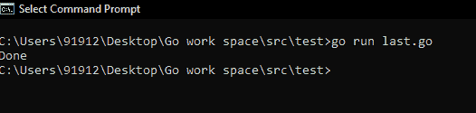
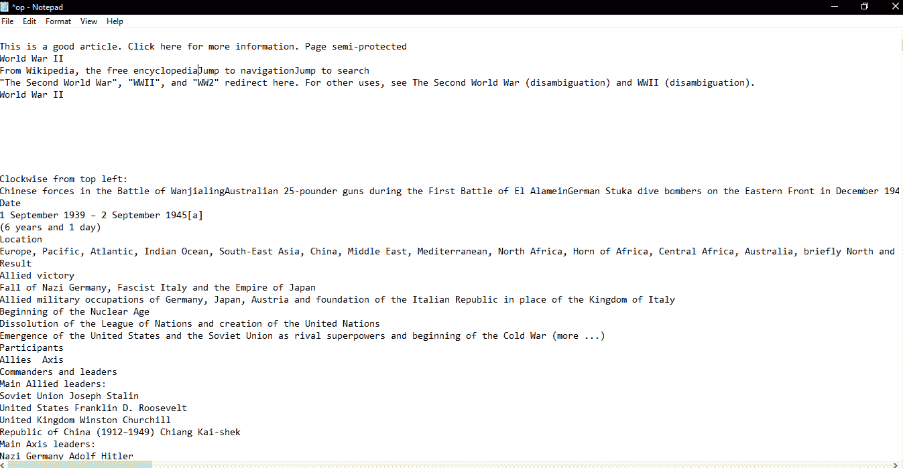
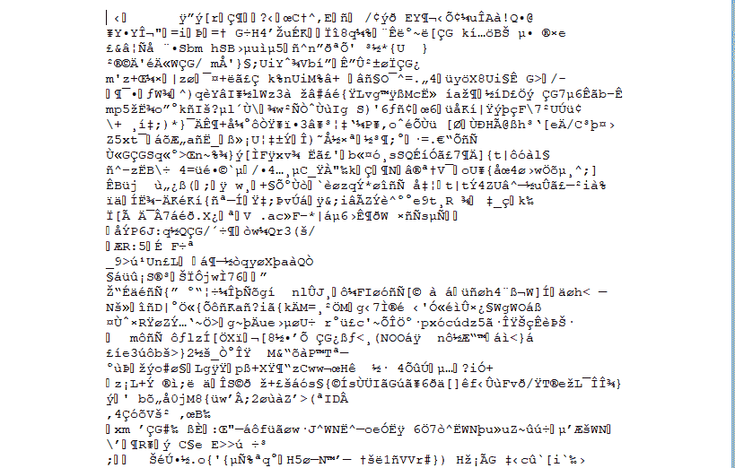
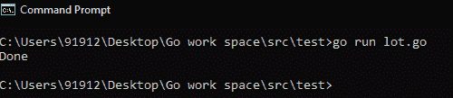

# 在 Golang 中压缩文件

> 原文:[https://www.geeksforgeeks.org/compressing-a-file-in-golang/](https://www.geeksforgeeks.org/compressing-a-file-in-golang/)

根据维基百科，**数据压缩**或文件压缩可以理解为在保留原始数据的同时减小特定文件/文件夹/任何数据大小的过程。较小的文件大小有很多好处，因为它将占用较少的存储区域，为您提供更多的空间来容纳其他数据，随着文件大小的减小，传输文件的速度会更快，并且在文件压缩时会解锁各种其他额外功能。压缩文件以压缩文件扩展名文件夹的形式存储，如“*”。拉链*、*。rar* ”、“ *.tar.gz* ”、“*。arj* ”和“*”。tgz* ”。压缩会将文件大小减小到最大压缩大小。如果不能进一步压缩，则尺寸应保持不变，且不能变小。

下面是一些例子，看看压缩是如何在 Golang 工作的。我们可以使用哪些内置方法？如何使用路径跟踪文件？我们如何打开文件？压缩是如何工作的？让我们看看第一个例子

### 例 1:

*   要压缩 Golang 中的文件，我们使用 gzip 命令。
*   然后创建一个路径来跟踪我们的文件。
*   然后让命令读取我们的文件。

下面程序读入一个文件。它使用 **ioutil。ReadAll** 从文件中获取所有字节。之后，它将创建一个新文件，即压缩文件，将扩展名替换为“ **gz** ”。

**注意:**要进行交叉检查，可以使用 WinRar 或 7-ZIp 等打开压缩文件。

## 去

```go
package main

// Declare all the libraries needed
import (
    "bufio"
    "compress/gzip"
    "fmt"
    "io/ioutil"
    "os"
    "strings"
)

func main() {

    // Compressing a file takes many steps

    // In this example we will see how to open
    // a file
    // Then read all its componenets
    // Create out own file with a gz extension
    // Read all bytes and copy it into our new file
    // Close our new file
    // Let us start now by checking and verifying
    // each step in detail

    // Open file on disk.

    // Mention the  name of the text file in quoted marks
    // Here we have mentioned the name of the variable
    // which checks the file name as "name_of_file"
    name_of_file := "Gfg.txt"

    // After checking this, we would now trace the file path.
    // Now we would use os.Open command
    // This command would help us to open the file
    // This command takes in the path of the file as input.
    f, _ := os.Open("C://ProgramData//" + name_of_file)

    // Now let use read the bytes of the document we opened.
    // Create a Reader to get all the bytes from the file.

    read := bufio.NewReader(f)

    // Now we would use the variable Read All to get all the bytes
    // So we just used variable data which will read all the bytes
    data, _ := ioutil.ReadAll(read)

    // Now we would use the extension method
    // Now with the help of replace command we can
    // Replace txt file with gz extension
    // So we would now use the file name to give
    // this command a boost
    name_of_file = strings.Replace(name_of_file, ".txt", ".gz", -1)

    // Open file for writing
    // Now using the Os.create method we would use the
    // To store thr information of the file gz extension
    f, _ = os.Create("C://ProgramData//" + name_of_file)

    // Write compresses Data
    // We would use NewWriter to basically
    // copy all the compressed data

    w := gzip.NewWriter(f)

    // With the help of the Writer method, we would
    // write all the bytes in the data variable
    // copied from the original file
    w.Write(data)

    // We would now close the file.
    w.Close()

    // Now we would see a file with gz extension in the below path
    // This gz entension file we have to open using 7zip tool

}
```

**输出:**



执行程序


扩展名为 gz 的输出文件



使用 7-Zip 打开压缩文件



压缩文件的内容–直接在记事本中打开

### 例 2:

这里我们有一个随机字符串。基本上，这里用户想要将这个字符串的压缩版本写入磁盘上的文件。所以首先他必须用 **os 创建一个文件。创建**。现在使用 NewWriter 创建一个针对我们创建的文件的 gzip 编写器。现在调用 Write()来写入字节。使用转换表达式将字符串转换为字节值。

## 去

```go
package main

// Declare all the libraries which are needed.
import (
    "compress/gzip"
    "fmt"
    "os"
)

func main() {

    // Here we use random text
    // We would now put that random text into a file we created.
    // Once we create a random file we created, we would use
    // that for compression
    // And then we would check its output.

    // Now first let us create a random string variable named text
    // This random text will store some characters.
    text := "Geeks for geeks"

    // With the help of os.Create command let us
    // first open a file named "file.gz"

    // Open a file for writing
    f, _ := os.Create("C:\\ProgramData\\file.gz")

    // Create a gzip writer
    // Now we the help of the NewWriter command we simply try
    // to copy all the files into variable "f"

    // Let us name this variable p
    p := gzip.NewWriter(f)

    // Now with the help of the Write command we will
    // use all the bytes to write it in the file
    // named text.
    p.Write([]byte(text))

    // Once we are done copying all the files
    // we would leave the command "close".

    // Close the file
    p.Close()

    // Now once we are done. To,notify our work
    // We would print the statement "Done"
    fmt.Println("Done")
}
```

**输出:**



执行代码


文件拍摄


使用 7 压缩工具输出压缩文件


在记事本中打开压缩文件