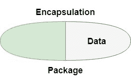

# 封装在戈朗

> 原文:[https://www.geeksforgeeks.org/encapsulation-in-golang/](https://www.geeksforgeeks.org/encapsulation-in-golang/)

封装被定义为将数据包装在一个单元下。它是将代码及其操作的数据绑定在一起的机制。从另一个角度来说，封装是一个保护屏障，防止数据被这个屏障之外的代码访问。



在面向对象语言中，一个类的变量或数据对任何其他类都是隐藏的，只能通过声明它们的自己类的任何成员函数来访问。但是 Go 语言不支持类和对象。因此，在 Go 语言中，封装是通过使用包来实现的。Go 提供两种不同类型的标识符，即导出和未导出的标识符。封装是通过从包中导出元素([变量](https://www.geeksforgeeks.org/go-variables/)、[函数](https://www.geeksforgeeks.org/functions-in-go-language/)、[方法](https://www.geeksforgeeks.org/methods-in-golang/)、字段、[结构](https://www.geeksforgeeks.org/structures-in-golang/))来实现的，它有助于控制元素(变量、函数、方法、字段、结构)的可见性。如果在其中定义元素的包在您的程序中可用，则元素是可见的。

**1。导出的标识符:**导出的标识符是从定义它们的包中导出的那些标识符。这些标识符的第一个字母总是大写字母。这个大写字母表示给定的标识符是导出的标识符。导出的标识符始终限于定义它们的包。当您从包中导出指定的标识符时，您只需导出名称，而不是该标识符的实现。这种机制也适用于函数、字段、方法和结构。

**示例:**

```go
// Go program to illustrate
// the concept of encapsulation
// using exported function
package main

import (
    "fmt"
    "strings"
)

// Main function
func main() {

    // Creating a slice of strings
    slc := []string{"GeeksforGeeks", "geeks", "gfg"}

    // Convert the case of the
    // elements of the given slice
    // Using ToUpper() function
    for x := 0; x < len(slc); x++ {

        // Exported Method
        res := strings.ToUpper(slc[x])

        // Exported Method
        fmt.Println(res)
    }
}
```

**输出:**

```go
GEEKSFORGEEKS
GEEKS
GFG

```

**说明:**在上面的例子中，我们通过从字符串包中导出 *ToUpper()* 函数，将 *slc* 切片的元素大小写转换为大写。

```go
res := strings.ToUpper(slc[x])
```

这里 *ToUpper()* 函数的第一个字母为大写，表示该函数为导出函数。如果试图将 *ToUpper()* 函数的大小写改为小写，那么编译器会给出一个错误，如下所示:

```go
res := strings.toUpper(slc[x])

Output:
./prog.go:22:9: cannot refer to unexported name strings.toUpper
./prog.go:22:9: undefined: strings.toUpper

```

因此，这个过程(变量、字段、方法、函数、结构的导出)被称为封装。由于封装，我们只导出函数的名称，而不导出程序中函数的整个定义，并且 ToUpper()函数的定义被包装在字符串包中，因此要导出 ToUpper()函数，首先需要在程序中导入字符串包。

**2。未报告的标识符:**未报告的标识符是那些不从任何包中导出的标识符。它们总是小写的。如下例所示，加法函数与任何包都不相关，因此它是一个未导出的函数，此方法的可见性仅限于此程序。

**示例:**

```go
// Go program to illustrate
// the unexported function
package main

import "fmt"

// The addition function returns
// the sum of the elements
// Unexported function
func addition(val ...int) int {
    s := 0

    for x := range val {
        s += val[x]
    }

    fmt.Println("Total Sum: ", s)
    return s
}

// Main function
func main() {

    addition(23, 546, 65, 42, 21, 24, 67)
}
```

**输出:**

```go
Total Sum:  788
```

**封装的好处:**

*   对用户隐藏实现细节。
*   增加代码的可重用性。
*   它防止用户任意设置函数的变量。它只由同一个包中的函数设置，该包的作者确保函数保持它们的内部不变量。