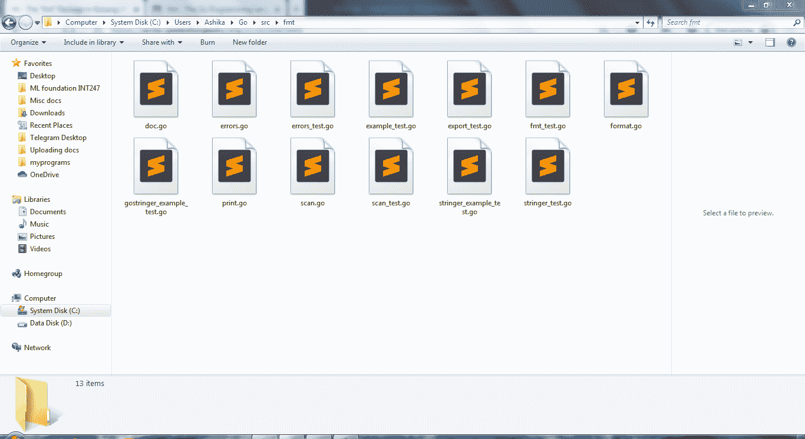

# 戈朗 fmt 包装

> 原文:[https://www.geeksforgeeks.org/fmt-package-in-golang/](https://www.geeksforgeeks.org/fmt-package-in-golang/)

**先决条件:**格朗的[包裹](https://www.geeksforgeeks.org/packages-in-golang/)和[在格朗的](https://www.geeksforgeeks.org/import-in-golang/)进口

从技术上来说，包本质上是为了某种特定目的的源代码容器。包是非常重要的，因为在从最基本的程序到高级复杂代码的所有程序中，都使用这些包。一个包可以确保没有重复的代码，并且主代码以一种结构良好的方式尽可能简洁。Go 向用户提供各种内置包，以便他们能够轻松地使用预定义的基本功能包进行编码。“ **fmt** 包中的此类包之一。 ***fmt*** 代表 ***格式包*** 。这个包允许格式化基本字符串、值或任何东西并打印它们，或者从控制台收集用户输入，或者使用编写器写入文件，甚至打印定制的花哨错误消息。这个包是关于格式化输入和输出的。

不管你安装了什么系统，继续，找到你的$GOPATH，然后访问你系统上的***" $ GOPATH/src/fmt/"***。您将在这个特定的目录中找到以下包文件。嗯，我们可以说这些文件都属于 fmt 包。



该图显示了您电脑上“$GOPATH/src/fmt/”目录中的所有文件

让我们看看它为用户提供的功能，以及每个功能的简要描述:

<figure class="table">

| 

**功能**

 | 

**描述**

 |
| --- | --- |
| [**打印**](https://www.geeksforgeeks.org/fmt-print-function-in-golang-with-examples/) | [打印](https://www.geeksforgeeks.org/fmt-print-function-in-golang-with-examples/)只打印它在输出控制台屏幕上接收到的任何输入，从当前光标位置开始，不附加任何空格或换行符，除非明确编码。除了打印之外，它还返回两个值:写入的字节数和遇到任何写入错误时的错误消息。 |
| [**Printf**](https://www.geeksforgeeks.org/fmt-printf-function-in-golang-with-examples/) | [Printf](https://www.geeksforgeeks.org/fmt-printf-function-in-golang-with-examples/) 根据用户的选择格式化输入字符串，然后从当前光标位置开始将格式化的字符串打印到输出控制台上，除非明确编码，否则不附加任何空格或换行符。除了打印，它还返回两个值:写入的字节数和遇到错误时的错误消息。 |
| [**【print ln】**](https://www.geeksforgeeks.org/fmt-println-function-in-golang-with-examples/) | [Println](https://www.geeksforgeeks.org/fmt-println-function-in-golang-with-examples/) 的工作原理与 print 函数相同，只是它在输入字符串的末尾追加了一个换行符，因此无论输出是什么，最终光标都会移动到下一行。同样在这种情况下，任何变量都被添加到输入字符串中，那么这个函数将确保变量之间用空格隔开。除了打印之外，它还返回两个值:写入的字节数和遇到任何写入错误时的错误消息。 |
| [**冲刺**](https://www.geeksforgeeks.org/fmt-sprint-function-in-golang-with-examples/)

 | [冲刺](https://www.geeksforgeeks.org/fmt-sprint-function-in-golang-with-examples/)的功能与打印相同。唯一的区别是 Sprint 返回输入字符串，而不是在输出控制台上打印。 |
| [**【sprint】**](https://www.geeksforgeeks.org/fmt-sprintf-function-in-golang-with-examples/) | [Sprintf](https://www.geeksforgeeks.org/fmt-sprintf-function-in-golang-with-examples/) 的功能与 printf 相同。唯一不同的是，Sprintf 返回格式化的输入字符串，而不是在输出控制台上打印。 |
|  | [Sprintln](https://www.geeksforgeeks.org/fmt-sprintln-function-in-golang-with-examples/) 的功能与 println 相同。唯一的区别是 Sprintln 返回输出控制台上打印的输入字符串。 |
| [**【fprint】**](https://www.geeksforgeeks.org/fmt-fprint-function-in-golang-with-examples/) | 与其他打印功能不同，Fprint 不读取或打印控制台上的任何内容。 [Fprint](https://www.geeksforgeeks.org/fmt-fprint-function-in-golang-with-examples/) 按照默认格式对输入字符串进行格式化，并将格式化后的输入字符串写入输入文件。每当遇到两个变量时，fprint 会自动在它们之间添加空格。除了写入文件，fprint 还返回两个值:写入的字节数&错误消息(如果出现任何错误)。 |
| [**【fprinff】**](https://www.geeksforgeeks.org/fmt-fprintf-function-in-golang-with-examples/) | 只是和 fprint 类似，但两者划清界限的一个区别是 [fprintf](https://www.geeksforgeeks.org/fmt-fprintf-function-in-golang-with-examples/) 按照指定格式格式化，不按照默认格式格式化。Fprintf 然后使用将格式化的输入字符串写入文件。除了写入文件之外，fprintf 还返回两个值:写入的字节数和错误消息(如果出现任何错误)。 |
| [**【fprin】**](https://www.geeksforgeeks.org/fmt-fprintln-function-in-golang-with-examples/) | 工作原理与 fprint 完全相同。 [Fprintln](https://www.geeksforgeeks.org/fmt-fprintln-function-in-golang-with-examples/) 中的一个额外要点是添加了一个换行符。格式化的输入字符串将在编写器的帮助下被写入上述文件。除了写入文件之外，fprintln 还返回两个值:写入的字节数和一条错误消息(如果出现任何错误)。 |
| [**扫描**](https://www.geeksforgeeks.org/fmt-scan-function-in-golang-with-examples/)

 | [扫描](https://www.geeksforgeeks.org/fmt-scan-function-in-golang-with-examples/)从标准控制台收集输入，并将该输入存储在连续的参数中。用空格或下划线分隔的值被视为多个值。这些存储在多个参数中。除了屏幕扫描工作，扫描还返回两个值:从控制台读取的字节数和一条错误消息(如果有)。 |
| **扫描** | 就像 C 语言中的 scanf 一样，格式说明符是常规的，然后是存储输入值的变量的地址，Go 中的 [Scanf](https://www.geeksforgeeks.org/fmt-scanf-function-in-golang-with-examples/) 扫描从标准输入中读取的文本，并根据指定的格式将其存储在参数中。除了屏幕扫描工作，扫描还返回两个值:从控制台读取的字节数和错误消息(如果有)。 |
| [**扫描**](https://www.geeksforgeeks.org/fmt-scanln-function-in-golang-with-examples/) | [Scanln](https://www.geeksforgeeks.org/fmt-scanln-function-in-golang-with-examples/) 的工作方式与 Scan 相似，但 Scanln 在一条线上停止扫描。这意味着最后一个输入字符后面应该跟一个换行符，以便 Scanln 停止扫描。这也可能是一个文件结束，没有内容没有扫描！ |
| [**【sscan】**](https://www.geeksforgeeks.org/fmt-sscan-function-in-golang-with-examples/) | [Sscan](https://www.geeksforgeeks.org/fmt-sscan-function-in-golang-with-examples/) 的工作方式与 scan 相似，不同之处在于 Sscan 将输入作为参数字符串收集，而不是默认格式下来自控制台屏幕的输入。和其他的一样，它返回两个值:字节数&错误消息(如果有的话)。 |
| [**【sscannf】**](https://www.geeksforgeeks.org/fmt-sscanf-function-in-golang-with-examples/) | [Sscanf](https://www.geeksforgeeks.org/fmt-sscanf-function-in-golang-with-examples/) 的工作方式与 scanf 相似，不同之处在于 Sscanf 将输入作为参数字符串收集，而不是以上述格式从控制台屏幕输入。 |
| [**【sscannn】**](https://www.geeksforgeeks.org/fmt-sscanln-function-in-golang-with-examples/) | [Sscanln](https://www.geeksforgeeks.org/fmt-sscanln-function-in-golang-with-examples/) 与 Sscan 相似，但 Sscanln 在一条线上停止扫描。这意味着最后一个输入字符后面应该跟一个换行符，以便 Sscanln 停止扫描。这也可能是一个文件结束，没有内容没有扫描！ |
| [**Fscan**T3】](https://www.geeksforgeeks.org/fmt-fscan-function-in-golang-with-examples/) | 与从用户或程序控制台收集输入的其他扫描功能不同，在默认格式中， [Fscan](https://www.geeksforgeeks.org/fmt-fscan-function-in-golang-with-examples/) 从输入文件中读取内容或文本，并返回解析的项目数。它按字符读取，前进方向取决于您提供的指针位置。 |
| [**Fscanf**](https://www.geeksforgeeks.org/fmt-fscanf-function-in-golang-with-examples/) | [fscanf](https://www.geeksforgeeks.org/fmt-fscanf-function-in-golang-with-examples/) 的工作原理与 Fscan 类似。唯一的区别是，fscanf 以指定的格式从读取器读取，而不是遵循默认格式。匹配大小写对整个单词、空格和换行符敏感，因此参数字符串和文本字符串必须完全匹配。Fscanf 除了读取字符之外，还返回解析的项数。 |
| **检查**T3] | [Fscanln](https://www.geeksforgeeks.org/fmt-fscanln-function-in-golang-with-examples/) 与 Fscan 相似，但 Fscanln 在换行符处停止扫描。这意味着最后一个输入字符后面应该跟一个换行符，以便 Fscanln 停止扫描。这也可能是一个文件结束，没有内容没有扫描！ |
| [**误差**](https://www.geeksforgeeks.org/fmt-errorf-function-in-golang-with-examples/) | [Errorf](https://www.geeksforgeeks.org/fmt-errorf-function-in-golang-with-examples/) 根据上述格式说明符进行格式化，并将该格式化字符串赋给一个变量。这是错误信息。该功能允许您根据用户的意愿打印定制的错误消息，并将其作为错误消息打印到控制台。 |

</figure>

除了功能之外，Go 的包中还有一些内置接口。“fmt”包由以下接口组成。以下描述参考了 Go 官方网站，您可以点击这里了解更多。

<figure class="table">

| 

类型

 | 

描述

 |
| --- | --- |
| **格式化器** | 格式化程序是一个使自定义格式化成为可能的接口。调用格式可以是像 Printf、Fprintf、Sprintf 等..在控制台上生成自定义格式的输出。 |
| **香精** | 任何具有 GoString 方法的代码值都会隐式地直接实现 GoString 接口。 |
| **扫描状态** | ScanState 接口保存有价值函数的声明，如:ReadRune、UnreadRune、SkipSpace、Token、Width & Read。基本上，他们讲述了更多关于定制扫描仪的状态。 |
| **扫描仪** | 我们使用的所有扫描功能——扫描、扫描和扫描等……无论何时使用，都要调用扫描仪接口。扫描仪接口使我们能够通过控制台和/或输入参数字符串来收集输入。 |
| **状态** | 它表示传送到特定格式的打印机的状态。它还保存关于 argumentstring 格式说明符的标志和可用选项的信息。 |
| **桁条** | 任何包含字符串方法(可以将字符串参数转换为输出)并使用默认格式的值都直接实现 Stringer 接口。例如:打印、冲刺等。 |

</figure>

所以基本上，在 Go 中实现任何接口，我们刚刚了解到我们不需要显式地做任何事情。相反，调用特定的方法会自动为用户实现接口。正是通过在接口中实现方法，使得特定的值能够采取多种形式。这简称为多态性。综上所述，go 中的接口是在调用其方法时隐式实现的，接口有助于多态的概念。

### fmt 包装的样本代码:

***1。**打印功能*

## 去

```go
// Go code to visualise the differences
// between various print functions in fmt

package main

import "fmt"

func main() {

    // NOTE:
    // 1\. Print(arg) prints arg as
    // it is on the console screen
    fmt.Print("Hello, welcome!")
    // OUTPUT: "Hello, welcome!"

    // Some variables to use in our code
    const x, id = "Ashika", 22

    // 2\. Printf(arg) first formats arg
    // and then prints on the console screen
    fmt.Printf("\n1\. Name %q and ID %d found!\n", x, id)
    // OUTPUT:
    // 1\. Name "Ashika" and ID 22 found!

    // 3\. Println(arg) does not format arg
    // It simply prints arg, appends any values
    // mentioned after arg and appends spaces in
    // between and also appends a new line at the end
    fmt.Println("2\. Name %q and ID %d found!", x, id)
    // OUTPUT: 2\. Name %q and ID %d found! Ashika 22

    // Print(arg) does not format, does not add
    // any spaces and does not append any newlines
    fmt.Print("3\. Name %q and ID %d found!", x, id)
    // OUTPUT: 3\. Name %q and ID %d found!Ashika22

    // 4\. Sprint(arg) works similar to Print(arg)
    // The key difference is: Sprint returns arg as
    // it is as mentioned in the paranthesis and
    // Print(arg) prints on console screen.
    res := fmt.Sprint("\n4\. Name %q and ID %d found!", x, id)
    fmt.Println(res)
    // OUTPUT:
    // 4\. Name %q and ID %d found!Ashika22

    // 5\. Sprintf(arg) works similar to Printf(arg)
    // The key difference is: Sprintf returns arg as
    // a formatted string as mentioned in the paranthesis
    // and Printf prints formatted arg on console screen
    res = fmt.Sprintf("5\. Name %q and ID %d found!", x, id)
    fmt.Println(res)
    // OUTPUT: 5\. Name "Ashika" and ID 22 found!

    // 6\. Sprintln(arg) works similar to Println(arg)
    // The key difference is: Sprintln returns arg as
    // it is as mentioned in paranthesis and adds spaces
    // between variables and appends a newline to arg &
    // returns arg value while Println directly prints arg
    // onto the console screen.
    res = fmt.Sprintln("6\. Name %q and ID %d found!", x, id)
    fmt.Print(res)
    // OUTPUT: 6\. Name %q and ID %d found! Ashika 22

    fmt.Print("Goodbye!")
    // OUTPUT: "Goodbye!"
}
```