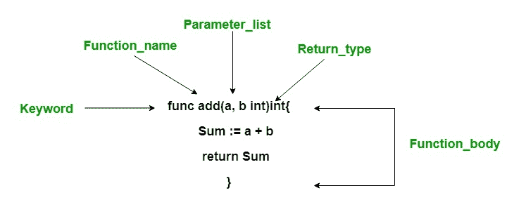

# Go 语言中的功能

> 原文:[https://www.geeksforgeeks.org/functions-in-go-language/](https://www.geeksforgeeks.org/functions-in-go-language/)

函数通常是程序中的代码或语句块，它使用户能够重用相同的代码，最终节省了过多的内存使用，节省了时间，更重要的是，提供了更好的代码可读性。因此，基本上，函数是执行特定任务并将结果返回给调用者的语句的集合。一个函数也可以在不返回任何东西的情况下执行一些特定的任务。

#### 函数声明

函数声明意味着一种构造函数的方法。
**语法:**

```go
func function_name(Parameter-list)(Return_type){
    // function body.....
}

```

函数的声明包含:

*   **func:** 是 Go 语言中的一个关键字，用来创建函数。
*   **函数 _ 名称:**是函数的名称。
*   **参数表:**包含功能参数的名称和类型。
*   **Return_type:** 可选，包含函数返回值的类型。如果在函数中使用 return_type，那么就需要在函数中使用 return 语句。



#### 函数调用

函数调用或函数调用是在用户想要执行函数时完成的。需要调用函数才能使用它的功能。如下例所示，我们有一个名为 area()的函数，它有两个参数。现在我们在主函数中使用它的名字来调用这个函数，即带有两个参数的区域(12，10)。
**例:**

## C

```go
// Go program to illustrate the
// use of function
package main
import "fmt"

// area() is used to find the
// area of the rectangle
// area() function two parameters,
// i.e, length and width
func area(length, width int)int{

    Ar := length* width
    return Ar
}

// Main function
func main() {

   // Display the area of the rectangle
   // with method calling
   fmt.Printf("Area of rectangle is : %d", area(12, 10))
}
```

**输出:**

```go
Area of rectangle is : 120

```

#### 函数参数

在 Go 语言中，传递给函数的参数称为实际参数，而函数接收的参数称为形式参数。
**注意:**默认情况下 Go 语言使用 call by value 方法在函数中传递参数。
*Go 语言支持两种向函数传递参数的方式:*

*   **按值调用:**:在这个参数传递方法中，实际参数的值被复制到函数的形式参数中，两种类型的参数存储在不同的内存位置。因此，函数内部所做的任何更改都不会反映在调用者的实际参数中。
    **例:**

## C

```go
// Go program to illustrate the
// concept of the call by value
package main

import "fmt"

// function which swap values
func swap(a, b int)int{

    var o int
    o= a
    a=b
    b=o

   return o
}

// Main function
func main() {
 var p int = 10
 var q int = 20
  fmt.Printf("p = %d and q = %d", p, q)

 // call by values
 swap(p, q)
   fmt.Printf("\np = %d and q = %d",p, q)
}
```

**输出:**

```go
p = 10 and q = 20
p = 10 and q = 20

```

*   **引用调用:**实际参数和形式参数都引用相同的位置，因此函数内部所做的任何更改实际上都反映在调用方的实际参数中。
    **例:**

## C

```go
// Go program to illustrate the
// concept of the call by reference
package main

import "fmt"

// function which swap values
func swap(a, b *int)int{
    var o int
    o = *a
    *a = *b
    *b = o

   return o
}

// Main function
func main() {

 var p int = 10
 var q int = 20
 fmt.Printf("p = %d and q = %d", p, q)

 // call by reference
 swap(&p, &q)
   fmt.Printf("\np = %d and q = %d",p, q)
}
```

**输出:**

```go
p = 10 and q = 20
p = 20 and q = 10

```