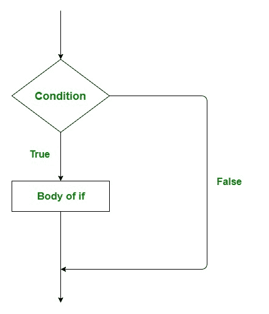
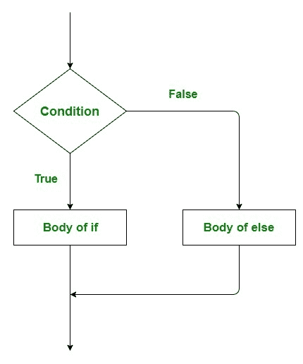
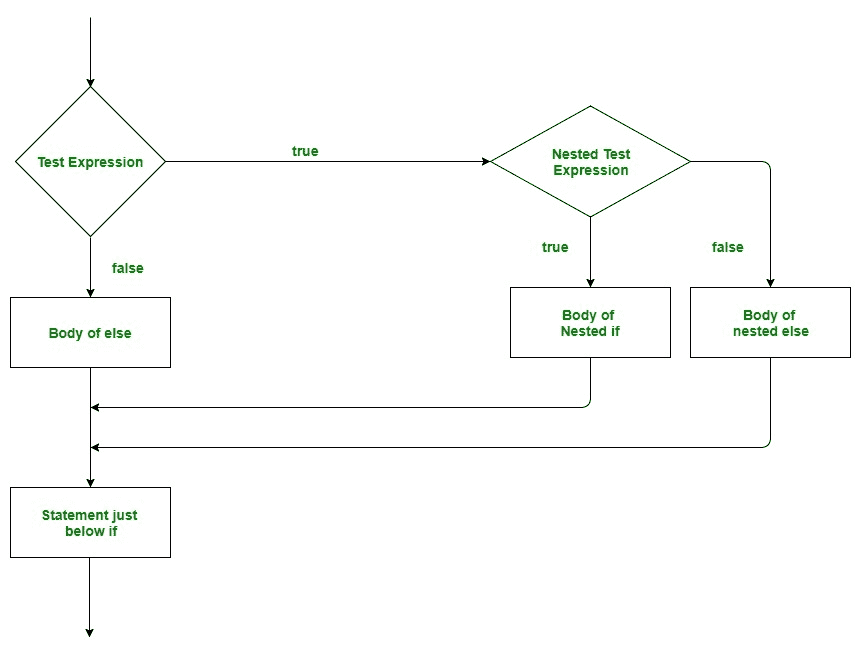
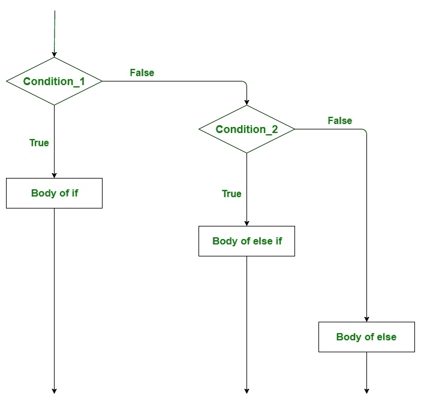

# 进行决策(如果，如果-否则，嵌套如果，如果-否则-如果)

> 原文:[https://www . geesforgeks . org/go-决策-if-if-else-嵌套-if-else-if/](https://www.geeksforgeeks.org/go-decision-making-if-if-else-nested-if-if-else-if/)

编程中的决策类似于现实生活中的决策。在决策过程中，当满足给定的条件时，执行一段代码。有时这些也被称为控制流语句。 [Golang](https://www.geeksforgeeks.org/go-programming-language-introduction/) 根据一定的条件，使用控制语句来控制程序的执行流程。这些用于使执行流程前进，并根据程序状态的变化进行转移。
**围棋编程的决策语句为:**

### 如果语句

这是最简单的决策陈述。它用于决定是否执行某个语句或语句块，即如果某个条件为*真*，则执行一个语句块，否则不执行。
**语法:**

```go
if(condition) {

   // Statements to execute if
   // condition is true
}
```

**流程图:**



**例:**

## C

```go
// Go program to illustrate the
// use of if statement
package main

import "fmt"

func main() {

   // taking a local variable
   var v int = 700

   // using if statement for
   // checking the condition
   if(v < 1000) {

      // print the following if
      // condition evaluates to true
      fmt.Printf("v is less than 1000\n")
   }

   fmt.Printf("Value of v is : %d\n", v)

}
```

**输出:**

```go
v is less than 1000
value of v is : 700
```

### if…else 语句

if 语句单独告诉我们，如果条件为真，它将执行一组语句，如果条件为假，它不会执行。但是如果条件是假的，我们想做别的事情怎么办。接下来是 else 语句。当条件为假时，我们可以使用 else 语句和 if 语句来执行一段代码。
**语法:**

```go

if (condition) {

    // Executes this block if
    // condition is true
} else {

    // Executes this block if
    // condition is false
}
```

**流程图:**



**例:**

## C

```go
// Go program to illustrate the
// use of if...else statement
package main

import "fmt"

func main() {

   // taking a local variable
   var v int = 1200

   // using if statement for
   // checking the condition
   if(v < 1000) {

      // print the following if
      // condition evaluates to true
      fmt.Printf("v is less than 1000\n")

   } else {

       // print the following if
      // condition evaluates to true
      fmt.Printf("v is greater than 1000\n")
   }

}
```

**输出:**

```go
v is greater than 1000
```

### 嵌套 if 语句

在 Go 语言中，嵌套的 if 是一个 if 语句，它是另一个 if 或 else 的目标。嵌套的 if 语句意味着 if 语句中的 if 语句。是的，Golang 允许我们在 if 语句中嵌套 if 语句。也就是说，我们可以将一个 if 语句放在另一个 if 语句中。
**语法:**

```go
if (condition1) {

   // Executes when condition1 is true

   if (condition2) {

      // Executes when condition2 is true
   }
}
```

**流程图:**



**例:**

## C

```go
// Go program to illustrate the
// use of nested if statement
package main
import "fmt"

func main() {

   // taking two local variable
   var v1 int = 400
   var v2 int = 700

   // using if statement
   if( v1 == 400 ) {

      // if condition is true then
      // check the following
      if( v2 == 700 )  {

         // if condition is true
         // then display the following
         fmt.Printf("Value of v1 is 400 and v2 is 700\n" );
      }
   }

}
```

**输出:**

```go
Value of v1 is 400 and v2 is 700
```

### 如果..其他..if 阶梯

在这里，用户可以在多个选项中进行选择。if 语句从上到下执行。一旦控制 if 的条件之一为真，就执行与该 if 关联的语句，并绕过阶梯的其余部分。如果这些条件都不成立，那么将执行最后的 else 语句。
**要点:**

*   if 语句可以有零个或一个其他的，它必须在任何其他 if 之后。
*   if 语句可以有零到多个其他 if，并且它必须在其他 if 之前。
*   如果成功，其余的 *if 的*或*if 的*都不会被测试。

**语法:**

```go
if(condition_1) {

     // this block will execute 
     // when condition_1 is true

} else if(condition_2) {

    // this block will execute 
    // when condition2 is true
}
.
.
. else {

      // this block will execute when none
     // of the condition is true
}
```

**流程图:**



**例:**

## C

```go
// Go program to illustrate the
// use of if..else..if ladder
package main
import "fmt"

func main() {

   // taking a local variable
   var v1 int = 700

   // checking the condition
   if(v1 == 100) {

      // if condition is true then
      // display the following */
      fmt.Printf("Value of v1 is 100\n")

   } else if(v1 == 200) {

      fmt.Printf("Value of a is 20\n")

   } else if(v1 == 300) {

      fmt.Printf("Value of a is 300\n")

   } else {

      // if none of the conditions is true
      fmt.Printf("None of the values is matching\n")
   }
}
```

**输出:**

```go
None of the values is matching
```