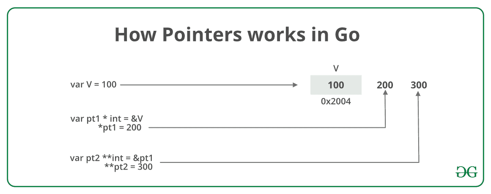

# 转指针到指针(双指针)

> 原文:[https://www . geesforgeks . org/go-指针对指针-双指针/](https://www.geeksforgeeks.org/go-pointer-to-pointer-double-pointer/)

**先决条件:[围棋指针](https://www.geeksforgeeks.org/pointers-in-golang/)**

Go 编程语言或 [Golang](https://www.geeksforgeeks.org/go-programming-language-introduction/) 中的指针是一个变量，用于存储另一个变量的内存地址。指针是一种特殊的变量，因此它可以指向任何类型的变量，甚至指针。基本上，这看起来像一个指针链。当我们定义一个指向指针的指针时，第一个指针用来存储第二个指针的地址。这个概念有时被称为**双指针**。

**如何在 Golang 中将指针声明为指针？**
声明指针指向指针类似于在 Go 中声明[指针。不同的是，我们必须在指针名称的名称前附加一个' ***** '。这通常是在我们使用](https://www.geeksforgeeks.org/pointers-in-golang/) [var 关键字](https://www.geeksforgeeks.org/var-keyword-in-go/)和类型一起声明指针变量时完成的。下面的例子和图片将更好地解释这个概念。

**例 1:** 在下面的程序中，指针 *pt2* 存储 *pt1* 指针的地址。取消引用 **pt2** 即 ***pt2** 会给出变量 **v** 的地址，也可以说指针 **pt1** 的值。如果您尝试 ****pt2** ，那么这将给出变量 **v** 的值，即 100。

[](https://media.geeksforgeeks.org/wp-content/uploads/20190710183146/Pointer-To-Pointer.jpg)

```go
// Go program to illustrate the
// concept of the Pointer to Pointer
package main

import "fmt"

// Main Function
func main() {

        // taking a variable
        // of integer type
    var V int = 100

    // taking a pointer 
    // of integer type 
    var pt1 *int = &V

    // taking pointer to 
    // pointer to pt1
    // storing the address 
    // of pt1 into pt2
    var pt2 **int = &pt1

    fmt.Println("The Value of Variable V is = ", V)
    fmt.Println("Address of variable V is = ", &V)

    fmt.Println("The Value of pt1 is = ", pt1)
    fmt.Println("Address of pt1 is = ", &pt1)

    fmt.Println("The value of pt2 is = ", pt2)

    // Dereferencing the 
    // pointer to pointer
    fmt.Println("Value at the address of pt2 is or *pt2 = ", *pt2)

    // double pointer will give the value of variable V
    fmt.Println("*(Value at the address of pt2 is) or **pt2 = ", **pt2)
}
```

**输出:**

```go
The Value of Variable V is =  100
Address of variable V is =  0x414020
The Value of pt1 is =  0x414020
Address of pt1 is =  0x40c128
The value of pt2 is =  0x40c128
Value at the address of pt2 is or *pt2 =  0x414020
*(Value at the address of pt2 is) or **pt2 =  100

```

**例 2:** 我们对上面的程序做一些修改。通过使用如下所示的取消引用来更改指针的值，从而为指针分配一些新值:

[](https://media.geeksforgeeks.org/wp-content/uploads/20190710182934/HowPointersWorksInGo.png)

```go
// Go program to illustrate the
// concept of the Pointer to Pointer
package main

import "fmt"

// Main Function
func main() {

    // taking a variable
    // of integer type
    var v int = 100

    // taking a pointer
    // of integer type
    var pt1 *int = &v

    // taking pointer to
    // pointer to pt1
    // storing the address
    // of pt1 into pt2
    var pt2 **int = &pt1

    fmt.Println("The Value of Variable v is = ", v)

    // changing the value of v by assigning
    // the new value to the pointer pt1
    *pt1 = 200

    fmt.Println("Value stored in v after changing pt1 = ", v)

    // changing the value of v by assigning
    // the new value to the pointer pt2
    **pt2 = 300

    fmt.Println("Value stored in v after changing pt2 = ", v)
}
```

**输出:**

```go
The Value of Variable v is =  100
Value stored in v after changing pt1 =  200
Value stored in v after changing pt2 =  300

```