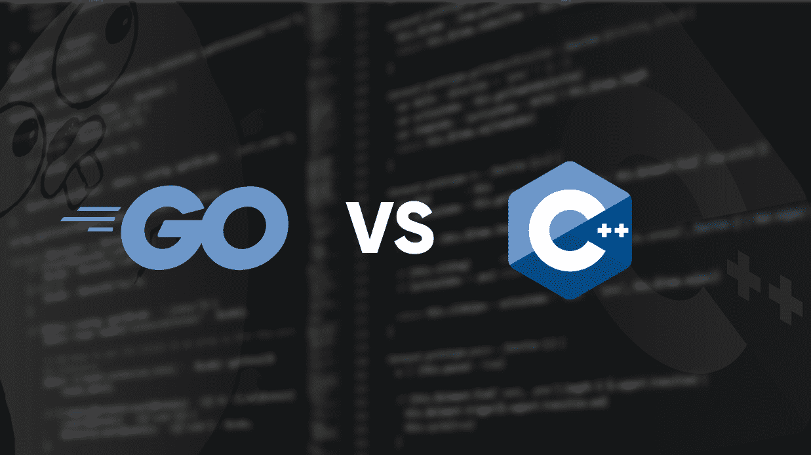

# Go vs C++

> 哎哎哎:# t0]https://www . geeksforgeeks . org/go-vs-c-plus/

[C++](https://www.geeksforgeeks.org/c-plus-plus/) 是一种通用编程语言，如今广泛用于竞技编程。它具有命令式、面向对象和泛型编程特性。C++运行在很多平台上，比如 Windows、Linux、Unix、Mac 等。
[Go](https://www.geeksforgeeks.org/go-programming-language-introduction/) 是一种程序设计语言。它于 2007 年由罗伯特·格里森、罗布·派克和肯·汤普森在谷歌开发，但于 2009 年作为开源编程语言推出。程序通过使用包来组装，以便有效地管理依赖关系。这种语言也支持环境采用与动态语言相似的模式。

***下面是 Golang 和 C++语言的一些区别:***

<figure class="table">

| 

Go

 | 

c++

 |
| --- | --- |
| Go is a programmatic and concurrent programming language. | C++ is an object-oriented programming language. |
| Go does not contain classes with constructors and destructors. | C++ does contain classes with constructors and destructors. |
| Go language provides automatic garbage collection for memory allocation. | C++ language does not provide automatic garbage collection for memory allocation. |
| Go language contains pointers, but not arithmetic pointers. | C++ language contains both pointers and arithmetic pointers. |
| In Go language, maps are passed by reference. | In C++, map is passed by value. |
| It does not use header files. Instead of using header files, use packages. It uses import to import external packages. | Include header file, not package. |
| It does not support implicit type conversion. | Implicit type conversion is supported. |
| Function overloading and user-defined operators are not supported. | Support function overloading and user-defined operators. |
| It does not support const or volatile qualifiers. | Const and volatile qualifiers are supported. |
| Provide zero for invalid pointer. | Provide NULL or 0 or NULL ptr for invalid pointer |
| Use panic and recovery to resolve errors. | C++ uses try, catch and throw to solve errors. |
| It has no while or do-while statement. But the for loop can be used like the while loop. | It has a while or do-while statement. |
| Compared with C++ language, it is more typed. | Compared with Go language, it is less typed. |
| 走吧哎哎哎戈里普斯你好信道。 | C++ has threads. |
| Go does not support inheritance. But it provides another option in the form of embedding. | C++ supports inheritance. |

</figure>