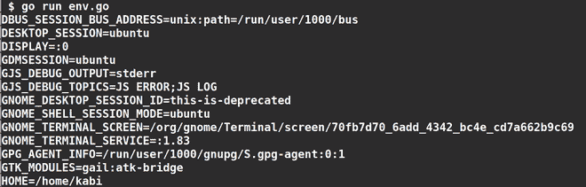

# 戈朗–环境变量

> 原文:[https://www.geeksforgeeks.org/golang-environment-variables/](https://www.geeksforgeeks.org/golang-environment-variables/)

环境变量是操作系统上的动态对象对。这些值对可以在操作系统的帮助下进行操作。这些值对可用于存储文件路径、用户配置文件、身份验证密钥、执行模式等。

***在 Golang 中，我们可以使用 os 包读写环境变量。**T3】*

**1。**用操作系统设置环境变量。Setenv()。此方法接受两个参数作为字符串。它会返回一个错误(如果有)。

```go
os.Setenv(key,value)  
```

**2。**用操作系统获取环境变量值。Getenv()。如果变量存在，此方法返回该变量的值，否则返回空值。

```go
os.Getenv(key)
```

**3。**使用操作系统删除或取消设置单个环境变量。Unsetenv()方法。此方法返回一个错误(如果有)。

```go
os.Unsetenv(key)
```

**4。**获取环境变量值和一个带 os 的布尔值。LookupEnv()。布尔值表示键是否存在。如果密钥不存在，则返回 false。

```go
os.LookupEnv(key)
```

**5。**用操作系统列出所有环境变量及其值。Environ()。此方法返回“**键=值”**格式的字符串副本。

```go
os.Environ()
```

**6。**删除操作系统的所有环境变量。Clearenv()。

```go
os.Clearenv()
```

**例 1:**

## 去

```go
// Golang program to show the usage of
// Setenv(), Getenv and Unsetenv method

package main

import (
    "fmt"
    "os"
)

// Main function
func main() {

    // set environment variable GEEKS
    os.Setenv("GEEKS", "geeks")

    // returns value of GEEKS
    fmt.Println("GEEKS:", os.Getenv("GEEKS"))

    // Unset environment variable GEEKS
    os.Unsetenv("GEEKS")

    // returns empty string and false,
    // because we removed the GEEKS variable
    value, ok := os.LookupEnv("GEEKS")

    fmt.Println("GEEKS:", value, " Is present:", ok)

}
```

**输出:**


**例 2:**

## 去

```go
// Golang program to show the
// usage of os.Environ() Method
package main

import (
    "fmt"
    "os"
)

// Main function
func main() {

    // list all environment variables and their values
    for _, env := range os.Environ() {
        fmt.Println(env)
    }
}
```

**输出:**



**例 3:**

## 去

```go
// Golang program to show the
// usage of os.Clearenv() Method
package main

import (
    "fmt"
    "os"
)

// Main function
func main() {

    // this delete's all environment variables
    // Don't try this in the home environment,
    // if you do so  you will end up deleting
    // all env variables
    os.Clearenv()

    fmt.Println("All environment variables cleared")

}
```

**输出:**

```go
All environment variables cleared
```