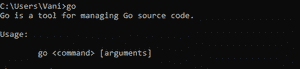
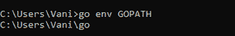
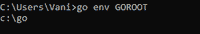

# Golang–GOPATH 和 GOROOT

> 原文:[https://www.geeksforgeeks.org/golang-gopath-and-goroot/](https://www.geeksforgeeks.org/golang-gopath-and-goroot/)

有一套程序来构建和处理围棋源代码。该集合中的程序通常由 go 程序调用，而不是直接运行。 **GOPATH** 和 **GOROOT** 是[环境变量](https://www.geeksforgeeks.org/environment-variables-in-linux-unix/)，它们定义了 Go 源代码的某种安排和组织。如果需要，可以显式修改 gopath 和 goroot 的路径。

#### GOPATH(高路径)

GOPATH，也称为*工作区目录*，是 Go 代码所属的目录。它由 go/build 包实现并记录在其中，用于解析导入语句。 *go get* 工具将包下载到 GOPATH 中的第一个目录。如果环境变量未设置，GOPATH 默认为用户主目录中名为“go”的子目录。要检查这一点，请输入以下命令:

```go
On Windows:
C:\Users\%USERPROFILE%\go
On Linux:
$HOME/go

```



要检查当前的 GOPATH，请输入以下命令:

```go
C:\Users\%USERPROFILE%\go env GOPATH

```



GOPATH 下包含 3 个目录，每个目录下都有特定的功能:

*   **src:** 它保存源代码。该目录下的路径决定了导入路径或可执行文件的名称。
*   **pkg:** 保存已安装的包对象。每个目标操作系统和体系结构对都有自己的 pkg 子目录。
*   **bin:** 保存编译后的命令。每个命令都以其源目录命名。

在 Go 中使用模块时，不再使用 GOPATH 来确定导入。但是，它仍然用于将下载的源代码存储在 *pkg* 和编译命令 *bin 中。*

#### 高福！高福！高福！高福高福高福高福高福高福高福高福高福高福高福高福高福高福高福

GOROOT 是针对来自 go 安装的编译器和工具，用于查找标准库。应该始终将其设置为安装目录。

要检查当前的 GOROOT，请输入以下命令:

```go
C:\Users\%USERPROFILE%\go env GOPATH

```



可以将 Go 工具安装到不同的位置。这可以通过将 GOROOT 环境变量设置为指向安装它的目录来实现，尽管不建议这样做，因为它是工具预先设置的。