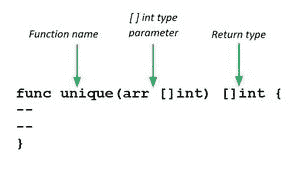

# 从数组中移除重复元素的 Golang 程序

> 原文:[https://www . geesforgeks . org/golang-从数组中移除重复元素的程序/](https://www.geeksforgeeks.org/golang-program-that-removes-duplicate-elements-from-the-array/)

[**Golang**](https://www.geeksforgeeks.org/arrays-in-go/)或 Go 编程语言中的数组与其他编程语言非常相似。在程序中，有时我们需要存储一组相同类型的数据，比如学生成绩列表。这种类型的集合存储在使用数组的程序中。数组是固定长度的序列，用于在内存中存储同类元素。由于它们的固定长度数组不像围棋语言中的切片那样受欢迎。

在数组中，您可以存储零个或零个以上的元素。数组的元素使用[] index 运算符进行索引，其位置从零开始，这意味着第一个元素的索引是数组[0]，最后一个元素的索引是数组[len(array)-1]。

要从数组中移除重复元素，我们将 int 项映射到布尔数据类型，并为元素的第一次出现将其设置为 true，从而将其附加到另一个数组中，以获得移除的重复元素数组

```go
Input : *[7, 3, 6, 1, 8, 1, 1, 3, 4, 5, 12]*
Output : *[7, 6, 4, 8, 5, 12]*
*The elements present more than once, the duplicates are removed*
```

让我们看看 Golang 程序并理解代码:

```go
import "fmt"
```

包 fmt 实现格式化的输入输出，功能类似于 C 的打印和扫描。

```go
func unique(arr []int) []int {
```

我们定义的函数定义，用于删除重复元素，并将参数作为输入数组“arr”并返回类型为“[ ]int”的数组



```go
occurred := map[int]bool{}
result:=[]int{}
```

这里我们创建了一个映射变量，将数组中每个元素的 *int* 数据类型映射到 *boolean* 数据类型。我们创建一个数组“result ”,它将存储给定项目的唯一元素，并将其返回给主函数

```go
 for e:= range arr {
     if occurred[arr[e]] != true {
     occurred[arr[e]] = true
         result = append(result, arr[e])
     }
  }
return result
```

我们遍历 for 循环中的数组，检查映射变量**是否出现【arr[(循环变量)]** 为真。最初，每个索引的映射变量都不为真。因此，当第一次遇到该元素时，我们将该值更改为 **true** ，并将其附加到数组**结果中。**下一次发现重复元素时，它将检查条件**是否发生【arr[e]】**是否为真，这将是真的，因为它之前遇到过，所以块不会被执行，重复元素不会被追加到结果数组中。最后我们返回数组

```go
func main() {
    array1 := []int{1, 5, 3, 4, 1, 6, 6, 6, 8, 7, 13, 5}
    fmt.Println(array1) 
    unique_items := unique(array1)
    fmt.Println(unique_items)
}
```

在函数中，主数组 1 用值初始化，然后我们打印初始数组并调用函数 **unique** 来执行上述函数，并依次返回一个数组，我们将其打印为**“unique _ items”**

## 去

```go
// Golang Program that Removes Duplicate
// Elements From the Array
package main

import "fmt"

func unique(arr []int) []int {
    occurred := map[int]bool{}
    result := []int{}
    for e := range arr {

        // check if already the mapped
        // variable is set to true or not
        if occurred[arr[e]] != true {
            occurred[arr[e]] = true

            // Append to result slice.
            result = append(result, arr[e])
        }
    }

    return result
}

func main() {
    array1 := []int{1, 5, 3, 4, 1, 6, 6, 6, 8, 7, 13, 5}
    fmt.Println(array1)
    unique_items := unique(array1)
    fmt.Println(unique_items)
}
```

**输出:**

```go
[1 5 3 4 1 6 6 6 8 7 13 5]
[1 5 3 4 6 8 7 13]
```