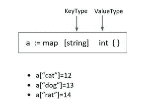

# 删除重复的 Golang 程序，忽略订单

> 原文:[https://www . geesforgeks . org/golang-program-the-remove-replications-忽略-order/](https://www.geeksforgeeks.org/golang-program-that-removes-duplicates-ignores-order/)

在[**【Golang】**](https://www.geeksforgeeks.org/golang/)中，当我们想要移除不考虑任何特定顺序作为初始值的重复项时，我们使用 Golang 中的**映射**。首先迭代循环，并将数组中的每个元素映射到布尔数据类型。Go 提供了实现哈希表的内置映射类型。

**示例:**在本例中，我们将字符串数据类型映射到 int 数据类型，即每个字符串值都与整数值相关联



让我们一行行地理解这个程序:

```go
package main
import "fmt"

```

包 fmt 实现格式化的输入输出，功能类似于 C 的 printf 和 scanf。

```go
func unique(arr []int) []int {

```

我们定义的函数定义，用于删除重复元素，并将参数作为输入数组“arr”并返回类型为“[ ]int”的数组

```go
result:=[]int{}
encountered := map[int]bool{}

```

创建一个存储所有唯一元素的数组结果。“accessed”存储整数变量到布尔数据类型的映射值。

```go
for v:= range arr {
        encountered[arr[v]] = true
    }

```

遍历循环，对于“arr”中出现的每个元素，我们将其设置为 True。多次出现的元素具有相同的散列(或映射)值。

```go
 for key, _ := range encountered {
        result = append(result, key)
    }
    return result
}

```

然后我们遍历映射数组中的键和值对。然后我们将存储唯一值的关键元素附加到结果数组中。

```go
func main() {
    array1 := []int{1, 5, 3, 4, 1, 6, 6, 6, 8, 7, 13, 5}
    fmt.Println(array1) 
    unique_items := unique(array1)
    fmt.Println(unique_items)
}

```

在函数 main 中，我们用一些重复的元素初始化一个整数数组。在调用了 unique()函数后，我们打印了初始数组和更新数组。这给了我们独特的元素，忽略了任何特定的顺序。

## 去

```go
package main

import "fmt"

func unique(arr []int) []int {
    result := []int{}
    encountered := map[int]bool{}

    // Create a map of all unique elements.
    for v := range arr {
        encountered[arr[v]] = true
    }

    // Place all unique keys from 
    // the map into the results array.
    for key, _ := range encountered {
        result = append(result, key)
    }
    return result
}

func main() {
    array1 := []int{2, 4, 5, 7, 2, 3, 4,
             7, 7, 12, 5, 11, 11, 1, 13}
    fmt.Println(array1)
    unique_items := unique(array1)
    fmt.Println(unique_items)
}
```

**输出:**

```go
[2 4 5 7 2 3 4 7 7 12 5 11 11 1 13]
[11 1 13 2 4 5 7 3 12]
```