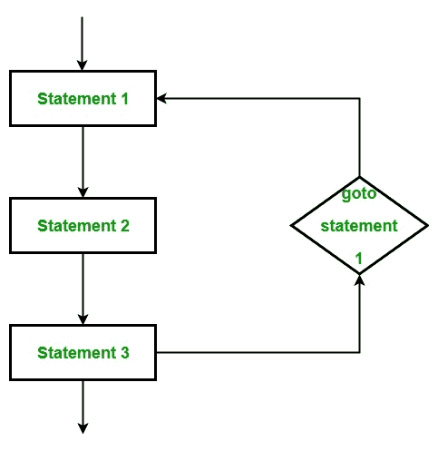
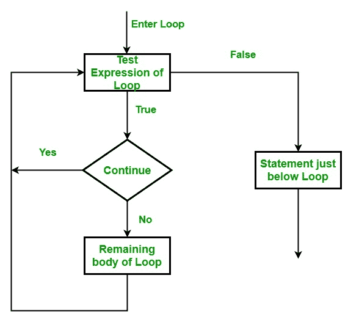

# Golang 教程–学习围棋编程语言

> 原文:[https://www . geesforgeks . org/golang-tutorial-learn-go-programming-language/](https://www.geeksforgeeks.org/golang-tutorial-learn-go-programming-language/)

[Golang](https://www.geeksforgeeks.org/golang/) 或 [Go 编程语言](https://www.geeksforgeeks.org/golang/)是一种静态类型的过程化编程语言，其语法类似于 [**C**](https://www.geeksforgeeks.org/c-programming-language/) 语言。它是由谷歌的罗伯特·格里森、罗布·派克和肯·汤普森于 2007 年开发的。但他们在 2009 年将其作为开源编程语言推出。它提供了丰富的标准库、垃圾收集和动态类型能力，还为采用与动态语言类似的模式的环境提供了支持。最新版本的 Golang 是 2019 年 9 月 3 日 <sup>rd</sup> 发布的 **1.13.1** 。在这里，我们提供了一个完整的 Golang 教程和适当的例子。


**涵盖的主题:**

*   [为什么是格朗](#Why Golang)
*   [关键特性](#Features)
*   [安装格朗](#Installing Golang)
*   [你好世界！程序](#Hello World! Program)
*   [标识符和关键词](#Identifiers and Keywords)
*   [数据类型](#Data Types)
*   [变量](#Variables)
*   [常数](#Constants)
*   [操作员](#Operators)
*   [if-else 语句](#if-else Statement)
*   [为循环](#for loop)
*   [循环控制语句(中断、转到、继续)](#Loop Control Statements)
*   [切换语句](#Switch Statement)

*   [阵列](#Arrays)
*   [切片](#Slices)
*   [功能](#Functions)
*   [结构](#Structures)
*   [包装](#Packages)
*   [延迟关键词](#Defer Keyword)
*   [指针](#Pointers)
*   [方法](#Methods)
*   [方法与功能](#Methods vs Functions)
*   [接口](#Interfaces)
*   [并发–Goroutines](#Concurrency – Goroutines)
*   [通道](#Channels)
*   [选择报表](#Select Statement)

### 为什么是 Golang？

设计 Golang 的主要目的是消除现有语言的问题。让我们看看我们在使用 [Python](https://www.geeksforgeeks.org/python-programming-language/) 、 [Java](https://www.geeksforgeeks.org/java/) 、 [C](https://www.geeksforgeeks.org/c-programming-language/) / [C++](https://www.geeksforgeeks.org/c-plus-plus/) 编程语言时所面临的问题:

*   **Python:** 使用简单，但比 Golang 慢。
*   **Java:** 它有非常复杂的类型系统。
*   **C/C++:** 编译时间慢，类型系统复杂。
*   此外，所有这些语言都是在多线程应用程序很少的时候设计的，因此对于高度可扩展、并发和并行的应用程序来说效率不高。
*   线程消耗 1MB，而 goroutine 消耗 2KB 内存，因此与此同时，我们可以触发数百万个 Goroutine。

### 主要特征


### 下载并安装 Golang

在我们开始安装 Go 之前，最好检查一下它是否已经安装在您的系统上。要检查您的设备是否预装了 Golang，只需进入**命令行**(对于**窗口**，在运行对话框中搜索**cmd**(<link rel="stylesheet" href="https://maxcdn.bootstrapcdn.com/font-awesome/4.6.1/css/font-awesome.min.css">***+R**)。*

*现在运行以下命令:*

```go
***go version***
```

*如果已经安装了 Golang，它将生成一条消息，其中包含 Golang 可用版本的所有细节，否则，如果没有安装 Golang，则会出现一个错误，说明 ***命令不正确或文件名****

*在开始安装过程之前，您需要下载它。为此，所有版本的视窗操作系统都可以在[**【golang.org】**](https://golang.org/dl/)上获得。*

*[](https://media.geeksforgeeks.org/wp-content/uploads/20190627110148/golang-download.png)*

*根据您的系统架构下载 Golang，并按照进一步的说明安装 Golang。*

***第一步:**下载后，解压下载的存档文件。解压缩后，您将在当前目录中获得一个名为**的文件夹。***

**

***步骤 2:** 现在将提取的文件夹复制并粘贴到您想要安装它的任何地方。这里我们安装在 c 盘。*

***步骤 3:** 现在设置环境变量。右键单击*我的电脑*并选择**属性**。从左侧选择*高级系统设置*，点击**环境变量**，如下图截图所示。*

**

**

***第 4 步:**从系统变量中点击**路径**，然后点击**编辑**。然后点击**新建**，在粘贴了 **Go** 文件夹的位置添加带 bin 目录的路径。这里我们正在编辑路径 **C:\go\bin** 点击*确定*，如下图截图所示。*

**

**

***步骤 5:** 现在创建一个新的用户变量，告诉 Go 命令 Golang 库在哪里。点击用户变量的**新增**，如下图所示。*

**

*现在将变量名填充为 **GOROOT** ，变量值就是你的 Golang 文件夹的路径。所以这里的变量值是 **C:\go\** 。填充后，单击确定。*

**

*之后，单击环境变量上的确定，您的设置就完成了。现在让我们使用命令提示符下的命令 **`go version`** 来检查 Golang 版本。*

**

*完成安装过程后，可以使用任何 IDE 或文本编辑器编写 Golang 代码，并使用命令在 IDE 或命令提示符下运行这些代码:*

```go
*go run filename.go*
```

### *执行 Hello World！程序*

*要运行围棋程序，你需要一个围棋编译器。在 Go 编译器中，首先你创建一个程序，用扩展名**保存你的程序。走**，比如**先走**。*

```go
*// First Go program
package main

import "fmt"

// Main function
func main() {

    fmt.Println("!... Hello World ...!")
}*
```

***输出:***

```go
*!... Hello World ...!*
```

*现在我们使用以下命令在 go 编译器中运行这个 **first.go** 文件，即:*

```go
*$ go run first.go*
```

*[](https://media.geeksforgeeks.org/wp-content/uploads/20190816180514/Hello-World-Golang.png)*

*关于本节目使用的不同术语的更多详情，可以访问 **[Hello World！](https://www.geeksforgeeks.org/hello-world-in-golang/)在戈朗***

### *标识符和关键词*

*[标识符](https://www.geeksforgeeks.org/identifiers-in-go-language/)是用户定义的程序组件名称。在 Go 语言中，标识符可以是变量名、函数名、常量、语句标签、包名或类型。*

***示例:***

```go
*// Valid identifiers:
_geeks23
geeks
gek23sd
Geeks
geeKs
geeks_geeks

// Invalid identifiers:
212geeks
if
default* 
```

*[关键词](https://www.geeksforgeeks.org/go-keywords/)或保留词是一种语言中用于某些内部过程或代表某些预定义动作的词。因此，不允许将这些单词用作标识符。这样做会导致编译时错误。围棋语言中共有 ***共 25 个关键词*** 如下:*

**

***示例:***

```go
*// Go program to illustrate 
// the use of keywords

// Here package keyword is used to 
// include the main package
// in the program
package main

// import keyword is used to 
// import "fmt" in your package
import "fmt"

// func is used to
// create function
func main() {

    // Here, var keyword is used 
    // to create variables
    // Pname, Lname, and Cname 
    // are the valid identifiers
    var Pname = "GeeksforGeeks" 
    var Lname = "Go Language" 
    var Cname = "Keywords"

    fmt.Printf("Portal name: %s", Pname)
    fmt.Printf("\nLanguage name: %s", Lname)
    fmt.Printf("\nChapter name: %s", Cname)

}*
```

***输出:***

```go
*Portal name: GeeksforGeeks
Language name: Go Language
Chapter name: Keywords* 
```

### *数据类型*

*数据类型指定有效的 [Go 变量](https://www.geeksforgeeks.org/go-variables/)可以保存的数据类型。在 Go 语言中，类型分为以下四类:*

1.  ***基本类型:**数字、字符串和布尔值都属于这一类。*
2.  ***聚合类型:**数组和结构属于这一类。*
3.  ***引用类型:**指针、切片、映射、函数和通道都属于这一类。*
4.  ***界面类型***

*在这里，我们将讨论 Go 语言中的*基本数据类型*。 ***基础数据类型*** 进一步分为三个子类别:*

1.  ***数字***
2.  ***布尔人***
3.  ***琴弦***

***数字:**在围棋语言中，数字分为*三个*子类，分别是:*

*   ***Integers:** In Go language, both signed and unsigned integers are available in four different sizes as shown in the below table. The signed int is represented by int and the unsigned integer is represented by uint.

    * 
*   ***Floating-Point Numbers:** In Go language, floating-point numbers are divided into ***two*** categories as shown in the below table:

    * 
*   ***Complex Numbers:** The complex numbers are divided into two parts are shown in the below table. float32 and float64 are also part of these complex numbers. The in-built function creates a complex number from its imaginary and real part and in-built imaginary and real function extract those parts.

    

    **示例:**

    ```go
    // Golang program to illustrate
    // the use of integers, floating
    // and complex numbers
    package main

    import "fmt"

    func main() {

        // Using 8-bit unsigned int
        var X uint8 = 225
        fmt.Println(X+1, X)

        // Using 16-bit signed int
        var Y int16 = 32767
        fmt.Println(Y+2, Y-2)

        a := 20.45
        b := 34.89

        var m complex128 = complex(6, 2)
        var n complex64 = complex(9, 2)

        // Subtraction of two
        // floating-point number
        c := b - a

        // Display the result
        fmt.Printf("Result is: %f\n", c)

        // Display the type of c variable
        fmt.Printf("The type of c is : %T\n", c)

        fmt.Println(m)
        fmt.Println(n)

        // Display the type
        fmt.Printf("The type of m is %T and "+
            "the type of n is %T", m, n)

    }
    ```

    **输出:**

    ```go
    226 225
    -32767 32765
    Result is: 14.440000
    The type of c is : float64
    (6+2i)
    (9+2i)
    The type of m is complex128 and the type of n is complex64

    ```

    **布尔和字符串:**

    ***布尔*** 数据类型只代表一位信息的真或假。布尔类型的值不会隐式或显式转换为任何其他类型。
    ***[字符串](https://www.geeksforgeeks.org/strings-in-golang/)*** 数据类型代表一系列 Unicode 代码点。或者换句话说，我们可以说一个字符串是一系列不可变的字节，这意味着一旦一个字符串被创建，你就不能改变这个字符串。字符串可能包含任意数据，包括人类可读形式的零值字节。

    **示例:**

    ```go
    // Go program to illustrate
    // the use of booleans and
    // strings
    package main

    import "fmt"

    func main() {

        // variables
        str1 := "GeeksforGeeks"
        str2 := "geeksForgeeks"
        result1 := str1 == str2

        // Display the result
        fmt.Println(result1)

        // Display the type of
        // result1
        fmt.Printf("The type of result1 is %T\n", result1)

        // str variable which stores strings
        str := "GeeksforGeeks"

        // Display the length of the string
        fmt.Printf("Length of the string is: %d", len(str))

        // Display the string
        fmt.Printf("\nString is: %s", str)

        // Display the type of str variable
        fmt.Printf("\nType of str is: %T", str)

    }
    ```

    **输出:**

    ```go
    false
    The type of result1 is bool
    Length of the string is: 13
    String is: GeeksforGeeks
    Type of str is: string

    ```

    ### 变量

    变量是可以在运行时更改的信息的占位符。和变量允许检索和操作存储的信息。

    **变量命名规则:**

    *   变量名必须以字母或下划线(_)开头。并且名称可以包含字母“a-z”或“A-Z”或数字 0-9 以及字符“_”。

        ```go
        Geeks, geeks, _geeks23  // valid variable
        123Geeks, 23geeks      // invalid variable

        ```

    *   变量名不应以数字开头。

        ```go
        234geeks  // illegal variable 
        ```

    *   变量的名称区分大小写。

        ```go
        geeks and Geeks are two different variables
        ```

    *   关键字不允许用作变量名。
    *   变量名称的长度没有限制，但建议仅使用 4-15 个字母的最佳长度。

    在 Golang 中有两种方法可以声明变量，如下所示:

    **1。使用 var 关键字:**在 Go 语言中，变量是使用特定类型的 *var* 关键字创建的，与名称关联并提供其初始值。

    **语法:**

    ```go
    var variable_name type = expression
    ```

    **示例:**

    ```go
    // Go program to illustrate 
    // the use of var keyword
    package main

    import "fmt"

    func main() {

    // Variable declared and 
    // initialized without the 
    // explicit type
    var myvariable1 = 20

    // Display the value and the
    // type of the variables
    fmt.Printf("The value of myvariable1 is : %d\n",
                                      myvariable1)

    fmt.Printf("The type of myvariable1 is : %T\n",
                                      myvariable1)

    }
    ```

    **输出:**

    ```go
    The value of myvariable1 is : 20
    The type of myvariable1 is : int

    ```

    想了解更多关于 var 关键字的内容，可以参考 Golang 中的文章 **[var 关键字](https://www.geeksforgeeks.org/var-keyword-in-go/)**

    **2。使用短变量声明:**函数中声明和初始化的局部变量使用短变量声明进行声明。

    **语法:**

    ```go
    variable_name:= expression
    ```

    **注意:**请不要混淆 *:=* 和 *=* 因为 *:=* 是声明， *=* 是赋值。

    **示例:**

    ```go
    // Go program to illustrate the
    // short variable declaration 
    package main
    import "fmt"

    func main() {

    // Using short variable declaration
    myvar1 := 39 

    // Display the value and type of the variable
    fmt.Printf("The value of myvar1 is : %d\n", myvar1)
    fmt.Printf("The type of myvar1 is : %T\n", myvar1)

    }
    ```

    **输出:**

    ```go
    The value of myvar1 is : 39
    The type of myvar1 is : int

    ```

    想了解更多关于短变量声明关键字的内容，可以参考 Golang 中的文章 **[短变量声明运算符(:=)](https://www.geeksforgeeks.org/short-variable-declaration-operator-in-go/)**

    ### 常数

    由于名称*常量*意味着固定的，在编程语言中也是一样的，即一旦常量的值被定义，它就不能被进一步修改。可以有任何基本的常量数据类型，如整数常量、浮点常量、字符常量或字符串。

    **如何申报？**
    常量像变量一样声明，但是在使用 ***常量*** 关键字作为前缀来声明具有特定类型的常量时。不能使用 **:=** 语法声明。

    **示例:**

    ```go
    // Golang program to illustrate 
    // the constants
    package main

    import "fmt"

    const PI = 3.14

    func main() {
        const GFG = "GeeksforGeeks"
        fmt.Println("Hello", GFG)

        fmt.Println("Happy", PI, "Day")

        const Correct = true
        fmt.Println("Go rules?", Correct)
    }
    ```

    **输出:**

    ```go
    Hello GeeksforGeeks
    Happy 3.14 Day
    Go rules? true

    ```

    想了解更多关于格朗常量的内容，可以参考《格朗中的[常量》一文。](https://www.geeksforgeeks.org/constants-go-language/)

    ### 操作员

    运算符是任何编程语言的基础。因此，如果不使用运算符，Go 语言的功能是不完整的。运算符允许我们对操作数执行不同类型的操作。在 Go 语言中，操作员可以根据其不同的功能进行分类:* 
*   ***[算术运算符](https://www.geeksforgeeks.org/go-operators/#Arithmetic%20Operators)***
*   ***[关系运算符](https://www.geeksforgeeks.org/go-operators/#Relational%20Operators)***
*   ***[逻辑运算符](https://www.geeksforgeeks.org/go-operators/#Logical%20Operators)***
*   ***[按位运算符](https://www.geeksforgeeks.org/go-operators/#Bitwise%20Operators)***
*   ***[分配操作员](https://www.geeksforgeeks.org/go-operators/#Assignment%20Operators)***
*   ***[其他操作员](https://www.geeksforgeeks.org/go-operators/#Misc%20Operators)***

*****示例:*****

```go
***// Golang program to illustrate
// the use of operators
package main

import "fmt"

func main() {
    p := 23
    q := 60

    // Arithmetic Operator - Addition
    result1 := p + q
    fmt.Printf("Result of p + q = %d\n", result1)

    // Relational Operators - ‘=='(Equal To)
    result2 := p == q
    fmt.Println(result2)

    // Relational Operators - ‘!='(Not Equal To)
    result3 := p != q
    fmt.Println(result3)

    // Logical Operators
    if p != q && p <= q {
        fmt.Println("True")
    }

    if p != q || p <= q {
        fmt.Println("True")
    }

    if !(p == q) {
        fmt.Println("True")
    }

    // Bitwise Operators - & (bitwise AND)
    result4 := p & q
    fmt.Printf("Result of p & q = %d\n", result4)

    // Assignment Operators - “=”(Simple Assignment)
    p = q
    fmt.Println(p)

}***
```

*****输出:*****

```go
***Result of p + q = 83
false
true
True
True
True
Result of p & q = 20
60*** 
```

### ***控制流***

*****决策声明*****

***编程中的决策类似于现实生活中的决策。当满足给定条件时，执行一段代码。有时这些也被称为控制流语句。编程语言使用控制语句根据某些条件来控制程序的执行流程。这些用于使执行流程前进，并根据程序状态的变化进行转移。***

*   ***[if](https://www.geeksforgeeks.org/go-decision-making-if-if-else-nested-if-if-else-if/#if) : It is used to decide whether a certain statement or block of statements will be executed or not i.e if a certain condition is *true* then a block of statement is executed otherwise not.

    **语法:**

    ```go
    if(condition) {

       // Statements to execute if
       // condition is true
    }

    ```

    **流程图:**

    [](https://media.geeksforgeeks.org/wp-content/uploads/if-1.jpg)*** 
*   ***[if-else](https://www.geeksforgeeks.org/go-decision-making-if-if-else-nested-if-if-else-if/#if%20else) : if we want to do something else if the condition is false. Here comes the else statement. We can use the else statement with if statement to execute a block of code when the condition is false.

    **语法:**

    ```go

    if (condition) {

        // Executes this block if
        // condition is true
    } else {

        // Executes this block if
        // condition is false
    }

    ```

    **流程图:**

    [](https://media.geeksforgeeks.org/wp-content/uploads/if-else-2-1.jpg)*** 
*   ***[Nested if](https://www.geeksforgeeks.org/go-decision-making-if-if-else-nested-if-if-else-if/#nested%20if) : Nested if statements mean an if statement inside an if statement. Yes, Golang allows us to nest if statements within if statements. i.e, we can place an if statement inside another if statement.

    **语法:**

    ```go
    if (condition1) {

       // Executes when condition1 is true

       if (condition2) {

          // Executes when condition2 is true
       }
    }

    ```

    **流程图:**

    [](https://media.geeksforgeeks.org/wp-content/uploads/Nested_if.jpg)*** 
*   ***[if-else-if Ladder](https://www.geeksforgeeks.org/go-decision-making-if-if-else-nested-if-if-else-if/#if%20else%20if) : Here, a user can decide among multiple options. The if statements are executed from the top down. As soon as one of the conditions controlling the if is true, the statement associated with that if is executed, and the rest of the ladder is bypassed. If none of the conditions is true, then the final else statement will be executed.

    **要点:**

    *   if 语句可以有零个或一个其他的，它必须在任何其他 if 之后。
    *   if 语句可以有零到多个其他 if，并且它必须在其他 if 之前。
    *   如果成功，其余的 *if 的*或*if 的*都不会被测试。

    **语法:**

    ```go
    if(condition_1) {

         // this block will execute 
         // when condition_1 is true

    } else if(condition_2) {

        // this block will execute 
        // when condition2 is true
    }
    .
    .
    . else {

          // this block will execute when none
         // of the condition is true
    }

    ```

    **流程图:**

    [](https://media.geeksforgeeks.org/wp-content/uploads/if-else-if-ladder-4.jpg)*** 

*****示例 1:** 演示 if 和 if-else 语句***

```go
***// Golang program to illustrate
// the use of if and if-else
// statement
package main

import "fmt"

func main() {

    // taking local variables
    var a int = 100
    var b int = 175

    // using if statement for
    // checking the condition
    if a%2 == 0 {

        // print the following if
        // condition evaluates to true
        fmt.Printf("Even Number\n")

    }

    if b%2 == 0 {

        fmt.Printf("Even Number")

    } else {

        fmt.Printf("Odd Number")
    }
}***
```

*****输出:*****

```go
***Even Number
Odd Number*** 
```

*****示例 2:** 演示嵌套 if 和 if-else-if 梯形语句***

```go
***// Golang program to illustrate
// the use of nested if and
// if-else-if ladder statement
// statement
package main

import "fmt"

func main() {

    // taking two local variable
    var v1 int = 400
    var v2 int = 700

    // ----- Nested if Statement -------

    // using if statement
    if v1 == 400 {

        // if condition is true then
        // check the following
        if v2 == 700 {

            // if condition is true
            // then display the following
            fmt.Printf("Value of v1 is 400 and v2 is 700\n")
        }
    }

    // ----------- if-else-if ladder

    // checking the condition
    if v1 == 100 {

        // if condition is true then
        // display the following */
        fmt.Printf("Value of v1 is 100\n")

    } else if v1 == 200 {

        fmt.Printf("Value of a is 20\n")

    } else if v1 == 300 {

        fmt.Printf("Value of a is 300\n")

    } else {

        // if none of the conditions is true
        fmt.Printf("None of the values is matching\n")
    }

}***
```

*****输出:*****

```go
***Value of v1 is 400 and v2 is 700
None of the values is matching*** 
```

*****为回路*****

***Go 语言只包含一个 for 循环。for 循环是一种重复控制结构，它允许我们编写一个执行特定次数的循环。循环的简单*类似于我们在其他编程语言中使用的 [C](https://www.geeksforgeeks.org/c-programming-language/) 、 [C++](https://www.geeksforgeeks.org/c-plus-plus/) 、 [Java](https://www.geeksforgeeks.org/java/) 、 [C#](https://www.geeksforgeeks.org/csharp-programming-language/) 等。
*语法:*****

```go
***for initialization; condition; post{
       // statements....
}*** 
```

****这里，****

*   ****初始化*语句是可选的，在 for 循环开始之前执行。初始化语句总是在一个简单的语句中，如变量声明、增量或赋值语句或函数调用。***
*   ****条件*语句保存一个布尔表达式，在循环的每次迭代开始时进行计算。如果条件语句的值为真，则循环执行。***
*   ***在 for 循环的主体之后执行 *post* 语句。在 post 语句之后，条件语句再次求值。如果条件语句的值为 false，则循环结束。***

*****示例:*****

```go
***// Go program to illustrate the  
// use of simple for loop 
package main

import "fmt"

// Main function
func main() {

    // for loop 
    // This loop starts when i = 0 
    // executes till i<4 condition is true
    // post statement is i++
    for i := 0; i < 4; i++{
      fmt.Printf("GeeksforGeeks\n")  
    }

}***
```

*****输出:*****

```go
***GeeksforGeeks
GeeksforGeeks
GeeksforGeeks
GeeksforGeeks*** 
```

*****注:**此 for 循环可用作无限循环和 while 循环。要了解更多关于 loop 的信息，你可以参考文章[Golang 的 Loops](https://www.geeksforgeeks.org/loops-in-go-language/)。***

### ***循环控制语句***

***Go 语言中的循环控制语句用于更改程序的执行。当给定循环的执行离开其范围时，在该范围内创建的对象也将被拆除。Go 语言支持 3 种循环控制语句:***

1.  *****断开*****
2.  *****转到*****
3.  *****继续*****

#### ***break 语句***

***break 语句用于终止它所在的循环或语句。之后，控件将传递给 break 语句之后的语句(如果可用)。如果 break 语句出现在嵌套循环中，那么它只终止那些包含 break 语句的循环。***

*****流程图:*****

******

*****示例:*****

```go
***// Go program to illustrate 
// the use of break statement
package main

import "fmt"

// Main function
func main() {
   for i:=0; i<5; i++{

   fmt.Println(i)

   // For loop breaks when the value of i = 3
   if i == 3{
         break;
  }
   }

}***
```

*****输出:*****

```go
***0
1
2
3*** 
```

#### ***goto 语句***

***此语句用于将控制转移到程序中标记的语句。标签是有效的标识符，放在传递控件的语句之前。一般来说，goto 语句不被程序员使用，因为很难跟踪程序的控制流。***

*****流程图:*****

******

*****示例:*****

```go
***// Go program to illustrate 
// the use of goto statement
package main

import "fmt"

func main() {
   var x int = 0

   // for loop work as a while loop
  Lable1: for x < 8 {
      if x == 5 {

         // using goto statement
         x = x + 1;
         goto Lable1
      }
      fmt.Printf("value is: %d\n", x);
      x++;     
   }  
}***
```

*****输出:*****

```go
***value is: 0
value is: 1
value is: 2
value is: 3
value is: 4
value is: 6
value is: 7*** 
```

#### ***连续语句***

***此语句用于在特定条件下跳过循环的执行部分。之后，它将控制转移到循环的开始。它跳过后面的语句，继续循环的下一次迭代。***

*****流程图:*****

******

*****示例:*****

```go
***// Go program to illustrate 
// the use of continue statement
package main

import "fmt"

func main() {
   var x int = 0

   // for loop work as a while loop
   for x < 8 {
      if x == 5 {

         // skip two iterations
         x = x + 2;
         continue;
      }
      fmt.Printf("value is: %d\n", x);
      x++;     
   }  
}***
```

*****输出:*****

```go
***value is: 0
value is: 1
value is: 2
value is: 3
value is: 4
value is: 7*** 
```

### ***切换语句***

***switch 语句是多路分支语句。它提供了一种基于表达式的值(也称为大小写)将执行转移到代码不同部分的有效方法。甚至我们可以通过使用逗号在 case 语句中添加多个值。***

*****语法:*****

```go
***switch expression {
    case value_1:
        statement......1
    case value_2:
        statement......2
    case value_n:
        statement......n
    default:
        statement......default
    }*** 
```

*****示例:*****

```go
***// Go program to illustrate the  
// concept of switch statement 
package main 

import "fmt"

func main() { 
    var value string = "five"

    // Switch statement without default statement 
    // Multiple values in case statement 
   switch value { 
       case "one": 
       fmt.Println("C#") 
       case "two", "three": 
       fmt.Println("Go") 
       case "four", "five", "six": 
       fmt.Println("Golang") 
   }   
} ***
```

*****输出:*****

```go
***Golang*** 
```

***想了解更多关于 switch 语句的内容，可以参考 Golang 中的文章 [Switch 语句](https://www.geeksforgeeks.org/switch-statement-in-go/)***

### ***阵列***

***数组是固定长度的序列，用于在内存中存储同类元素。由于它们的固定长度数组不太受欢迎，像围棋语言中的切片。在数组中，您可以存储零个或零个以上的元素。数组的元素通过使用[]索引操作符以其从零开始的位置进行索引，这意味着第一个元素的索引是*数组【0】*，最后一个元素的索引是*数组【len(array)-1】*。***

******

***在 Golang 中创建数组有两种方法，如下所示:***

*****1。使用 var 关键字:**在 Go 语言中，使用具有名称、大小和元素的特定类型的 var 关键字创建数组。***

*****语法:*****

```go
***Var array_name[length]Type
or
var array_name[length]Typle{item1, item2, item3, ...itemN}*** 
```

***在 Go 语言中，数组是可变的，因此您可以在赋值的左侧使用 array[index]语法在给定的索引处设置数组的元素。***

```go
***Var array_name[index] = element***
```

******

*****2。使用速记声明:**在 Go 语言中，数组也可以使用速记声明进行声明。它比上面的声明更灵活。***

*****语法:*****

```go
***array_name:= [length]Type{item1, item2, item3, ...itemN}***
```

******

*****示例:*****

```go
***// Golang program to illustrate the arrays
package main

import "fmt"

func main() {

    // Creating an array of string type
    // Using var keyword
    var myarr [2]string

    // Elements are assigned using index
    myarr[0] = "GFG"
    myarr[1] = "GeeksforGeeks"

    // Accessing the elements of the array
    // Using index value
    fmt.Println("Elements of Array:")
    fmt.Println("Element 1: ", myarr[0])
    fmt.Println("Element 2: ", myarr[1])

    // Shorthand declaration of array
    arr := [4]string{"geek", "gfg", "Geeks1231", "GeeksforGeeks"}

    // Accessing the elements of
    // the array Using for loop
    fmt.Println("\nElements of the array:")

    for i := 0; i < 3; i++ {
        fmt.Println(arr[i])

    }

}***
```

*****输出:*****

```go
***Elements of Array:
Element 1:  GFG
Element 2:  GeeksforGeeks

Elements of the array:
geek
gfg
Geeks1231*** 
```

***想了解更多关于数组的内容，可以参考《格朗中的[数组》一文](https://www.geeksforgeeks.org/arrays-in-go/)***

### ***切片***

***切片比数组更强大、更灵活、更方便，是一种轻量级的数据结构。切片是存储相似类型元素的可变长度序列，不允许在同一切片中存储不同类型的元素。它就像一个有索引值和长度的数组，但是切片的大小被调整，它们不像数组那样是固定大小的。在内部，切片和数组是相连的，切片是对底层数组的引用。允许在切片中存储重复的元素。*切片中的第一个索引位置始终为 0，最后一个索引位置将为(切片长度–1)。****

*****声明语法:*****

```go
***[]T
or 
[]T{}
or 
[]T{value1, value2, value3, ...value n}*** 
```

***这里，T 是元素的类型。例如:***

```go
***var my_slice[]int***
```

******指针、长度和容量*** 是切片的三个主要组成部分。***

*****示例:*****

```go
***// Golang program to illustrate
// the working of the slice
package main

import "fmt"

func main() {

    // Creating an array
    arr := [7]string{"This", "is", "the", "tutorial",
                         "of", "Go", "language"}

    // Display array
    fmt.Println("Array:", arr)

    // Creating a slice
    myslice := arr[1:6]

    // Display slice
    fmt.Println("Slice:", myslice)

    // Display length of the slice
    fmt.Printf("Length of the slice: %d", len(myslice))

    // Display the capacity of the slice
    fmt.Printf("\nCapacity of the slice: %d", cap(myslice))
}***
```

*****输出:*****

```go
***Array: [This is the tutorial of Go language]
Slice: [is the tutorial of Go]
Length of the slice: 5
Capacity of the slice: 6*** 
```

*****解释:**在上面的例子中，我们从给定的数组中创建一个切片。这里，切片的指针指向索引 1，因为切片的下限设置为 1，所以它开始从索引 1 访问元素。切片的长度是 5，这意味着切片中存在的元素总数是 5，切片 6 的容量意味着它最多可以在其中存储 6 个元素。***

******

***想了解更多关于切片的信息，可以参考《格朗切片》一文***

### ***功能***

***函数通常是程序中的代码或语句块，它使用户能够重用相同的代码，最终节省了过多的内存使用，节省了时间，更重要的是，提供了更好的代码可读性。所以基本上，一个函数是执行特定任务并将结果返回给调用者的语句的集合。一个函数也可以在不返回任何东西的情况下执行一些特定的任务。***

*****语法:*****

```go
***func function_name(Parameter-list)(Return_type){
    // function body.....
}*** 
```

***您可以从函数中返回多个值。此外，参数和返回类型是可选的。***

*****示例:*****

```go
***// Go program to illustrate the
// use of function
package main
import "fmt"

// area() is used to find the 
// area of the rectangle
// area() function two parameters,
// i.e, length and width
func area(length, width int)int{

    Ar := length* width
    return Ar
}

// Main function
func main() {

   // Display the area of the rectangle
   // with method calling
   fmt.Printf("Area of rectangle is : %d", area(12, 10))
}***
```

*****输出:*****

```go
***Area of rectangle is : 120***
```

***要了解更多关于函数的信息，你可以参考文章【戈朗中的[函数。](https://www.geeksforgeeks.org/functions-in-go-language/)***

### ***结构***

***它是一种用户定义的类型，允许将可能不同类型的项目组合成一个类型。它可以被称为不支持继承但支持合成的轻量级类。***

***首先，您需要使用以下语法声明一个结构类型:***

```go
***type struct_name struct {
   variable_1 type_of_variable_1
   variable_2 type_of_variable_2
   variable_n type_of_variable_3
}*** 
```

***其次，您必须创建该类型的变量来存储值。***

```go
***var variable_name struct_name*** 
```

*****示例:*****

```go
***// Golang program to show how to
// declare and define the struct

package main

import "fmt"

// Defining a struct type
type Address struct {
    Name    string
    city    string
    Pincode int
}

func main() {

    // Declaring a variable of a `struct` type
    // All the struct fields are initialized 
    // with their zero value
    var a Address 
    fmt.Println(a)

    // Declaring and initializing a
    // struct using a struct literal
    a1 := Address{"Akshay", "Dehradun", 3623572}

    fmt.Println("Address1: ", a1)

    // Naming fields while 
    // initializing a struct
    a2 := Address{Name: "Anikaa", city: "Ballia",
                                 Pincode: 277001}

    fmt.Println("Address2: ", a2)

    // Uninitialized fields are set to
    // their corresponding zero-value
    a3 := Address{Name: "Delhi"}
    fmt.Println("Address3: ", a3)
}***
```

*****输出:*****

```go
***{  0}
Address1:  {Akshay Dehradun 3623572}
Address2:  {Anikaa Ballia 277001}
Address3:  {Delhi  0}*** 
```

***要访问结构的单个字段，必须使用点(。)运算符。要阅读更多关于结构的内容，可以参考《格朗》中的文章[结构](https://www.geeksforgeeks.org/structures-in-golang/)。***

### ***包装***

***包的目的是通过将相关功能组合成单个单元来设计和维护大量程序，以便它们易于维护和理解，并且独立于其他包程序。在 Go 语言中，每个包都用不同的名称定义，这个名称与它们的功能很接近，就像“字符串”包一样，它包含只与字符串相关的方法和函数。***

*****示例:*****

```go
***// Go program to illustrate the
// concept of packages
// Package declaration
package main

// Importing multiple packages
import (
    "bytes"
    "fmt"
    "sort"
)

func main() {

    // Creating and initializing slice
    // Using shorthand declaration
    slice_1 := []byte{'*', 'G', 'e', 'e', 'k', 's', 'f',
        'o', 'r', 'G', 'e', 'e', 'k', 's', '^', '^'}
    slice_2 := []string{"Gee", "ks", "for", "Gee", "ks"}

    // Displaying slices
    fmt.Println("Original Slice:")
    fmt.Printf("Slice 1 : %s", slice_1)
    fmt.Println("\nSlice 2: ", slice_2)

    // Trimming specified leading
    // and trailing Unicode points
    // from the given slice of bytes
    // Using Trim function
    res := bytes.Trim(slice_1, "*^")
    fmt.Printf("\nNew Slice : %s", res)

    // Sorting slice 2
    // Using Strings function
    sort.Strings(slice_2)
    fmt.Println("\nSorted slice:", slice_2)
}***
```

*****输出:*****

```go
***Original Slice:
Slice 1 : *GeeksforGeeks^^
Slice 2:  [Gee ks for Gee ks]

New Slice : GeeksforGeeks
Sorted slice: [Gee Gee for ks ks]*** 
```

### ***延期***

***关键字是延迟[函数](https://www.geeksforgeeks.org/functions-in-go-language/)或方法或[匿名方法](https://www.geeksforgeeks.org/anonymous-function-in-go-language/)的执行，直到附近的函数返回。或者换句话说，延迟函数或方法调用参数立即求值，但是它们会一直执行到附近的函数返回。***

*****示例:*****

```go
***// Go program to illustrate the
// concept of the defer statement
package main

import "fmt"

// Functions
func mul(a1, a2 int) int {

    res := a1 * a2
    fmt.Println("Result: ", res)
    return 0
}

func show() {
    fmt.Println("Hello!, GeeksforGeeks")
}

// Main function
func main() {

    // Calling mul() function
    // Here mul function behaves
    // like a normal function
    mul(23, 45)

    // Calling mul()function
    // Using defer keyword
    // Here the mul() function
    // is defer function
    defer mul(23, 56)

    // Calling show() function
    show()
}***
```

*****输出:*****

```go
***Result:  1035
Hello!, GeeksforGeeks
Result:  1288*** 
```

*****说明:**在上面的例子中，我们有两个名为 *mul()* 和 *show()* 的函数。其中*在 *main()* 函数中显示()*函数调用正常，但是我们以两种不同的方式调用 *mul()* 函数:***

*   ***首先，我们像普通函数一样调用 *mul* 函数，即 mul(23，45)并在函数被调用时执行(输出:结果:1035)。***
*   ***其次，我们使用 delay 关键字调用 *mul()* 函数作为 delay 函数，即 delay*mul(23，56)* 并在周围所有方法返回时执行(输出:结果:1288)。***

***要了解更多信息，您可以参考 Golang 中的关键字[延期关键字。](https://www.geeksforgeeks.org/defer-keyword-in-golang/)***

### ***指针***

***它是一个变量，用于存储另一个变量的内存地址。Golang 中的指针也被称为特殊变量。在开始之前，我们将在指针中使用两个重要的运算符，即***

******运算符**也称为解引用运算符，用于声明指针变量和访问存储在地址中的值。***

*****&运算符**被称为地址运算符，用于返回变量的地址或访问指向指针的变量的地址。***

******声明指针*** :***

```go
***var pointer_name *Data_Type***
```

****示例:*下面是字符串类型的指针，只能存储*字符串*变量的内存地址。***

```go
***var s *string***
```

******指针的初始化:*** 要做到这一点，您需要使用地址运算符用另一个变量的内存地址初始化指针，如下例所示:***

```go
***// normal variable declaration
var a = 45

// Initialization of pointer s with 
// memory address of variable a
var s *int = &a*** 
```

*****示例:*****

```go
***// Golang program to demonstrate the declaration
// and initialization of pointers
package main

    import "fmt"

    func main()
{

    // taking a normal variable
    var x int = 5748

        // declaration of pointer
        var p* int

        // initialization of pointer
        p
        = &x

           // displaying the result
           fmt.Println("Value stored in x = ", x)
               fmt.Println("Address of x = ", &x)
                   fmt.Println("Value stored in variable p = ", p)
}***
```

*****输出:*****

```go
***Value stored in x =  5748
Address of x =  0x414020
Value stored in variable p =  0x414020*** 
```

***想了解更多关于指针的信息，可以参考《格朗中的[指针》一文。](https://www.geeksforgeeks.org/pointers-in-golang/)***

### ***方法***

***方法在 Golang 中不是函数。方法中包含一个接收器参数，用于访问接收器的属性。接收器可以是结构类型或非结构类型。在代码中创建方法时，接收器和接收器类型必须出现在同一个包中。并且不允许创建这样的方法，其中接收者类型已经在另一个包中定义，包括像 int、string 等内置类型。如果你试图这样做，那么编译器会给出一个错误。***

*****语法:*****

```go
***func(reciver_name Type) method_name(parameter_list)(return_type){
// Code
}*** 
```

***这里，可以在方法中访问接收器。***

*****示例:*****

```go
***// Go program to illustrate the
// method
package main

import "fmt"

// Author structure
type author struct {
    name      string
    branch    string
    particles int
    salary    int
}

// Method with a receiver
// of author type
func (a author) show() {

    fmt.Println("Author's Name: ", a.name)
    fmt.Println("Branch Name: ", a.branch)
    fmt.Println("Published articles: ", a.particles)
    fmt.Println("Salary: ", a.salary)
}

// Main function
func main() {

    // Initializing the values
    // of the author structure
    res := author{
        name:      "Sona",
        branch:    "CSE",
        particles: 203,
        salary:    34000,
    }

    // Calling the method
    res.show()
}***
```

*****输出:*****

```go
***Author's Name:  Sona
Branch Name:  CSE
Published articles:  203
Salary:  34000*** 
```

*****方法与功能*****

| 方法 | 功能 |
| 它包含接收器。 | 它不包含接收器。 |
| 它可以接受指针和值。 | 它不能同时接受指针和值。 |
| 程序中可以定义同名但不同类型的方法。 | 程序中不允许定义同名但不同类型的函数。 |

***想了解更多的方法，可以参考 Golang 中的文章[方法。](https://www.geeksforgeeks.org/methods-in-golang/)***

### ***接口***

***Go 语言接口不同于其他语言。在 Go 语言中，接口是一种自定义类型，用于指定一组一个或多个方法签名，并且接口是抽象的，因此不允许您创建接口的实例。但是您可以创建一个接口类型的变量，并且可以为这个变量分配一个具体的类型值，该值具有接口所需的方法。***

*****语法:*****

```go
***type interface_name interface{

// Method signatures

}*** 
```

*****示例:*****

```go
***// Golang program illustrates how
// to implement an interface
package main

import "fmt"

// Creating an interface
type tank interface {

    // Methods
    Tarea() float64
    Volume() float64
}

type myvalue struct {
    radius float64
    height float64
}

// Implementing methods of
// the tank interface
func (m myvalue) Tarea() float64 {

    return 2*m.radius*m.height +
        2*3.14*m.radius*m.radius
}

func (m myvalue) Volume() float64 {

    return 3.14 * m.radius * m.radius * m.height
}

// Main Method
func main() {

    // Accessing elements of
    // the tank interface
    var t tank
    t = myvalue{10, 14}
    fmt.Println("Area of tank :", t.Tarea())
    fmt.Println("Volume of tank:", t.Volume())
}***
```

*****输出:*****

```go
***Area of tank : 908
Volume of tank: 4396*** 
```

***更多阅读请参考《格朗中的[界面》一文。](https://www.geeksforgeeks.org/interfaces-in-golang/)***

### ***并发性–Goroutines***

***Goroutine 是一个[函数](https://www.geeksforgeeks.org/functions-in-go-language/)或方法，它与程序中的任何其他 Goroutine 同时独立执行。换句话说，Go 语言中的每个并发执行的活动都被称为 Goroutines。你可以把戈鲁丁线看作是一根重量轻的线。每个程序至少包含一个戈鲁丁，而那个戈鲁丁被称为**主戈鲁丁**。所有的戈鲁汀都在主戈鲁汀下工作，如果主戈鲁汀终止，那么程序中的所有戈鲁汀也终止。Goroutine 总是在后台工作。***

***您可以创建自己的 Goroutine，只需使用 go 关键字作为函数或方法调用的前缀，如下语法所示:***

*****语法:*****

```go
***func name(){
// statements
}

// using go keyword as the 
// prefix of your function call
go name()*** 
```

*****示例:*****

```go
***// Go program to illustrate
// the concept of Goroutine
package main

import "fmt"

func display(str string) {
    for w := 0; w < 6; w++ {
        fmt.Println(str)
    }
}

func main() {

    // Calling Goroutine
    go display("Welcome")

    // Calling normal function
    display("GeeksforGeeks")
}***
```

*****输出:*****

```go
***GeeksforGeeks
GeeksforGeeks
GeeksforGeeks
GeeksforGeeks
GeeksforGeeks
GeeksforGeeks*** 
```

***在上面的例子中，我们简单地创建了一个 *display()* 函数，然后以两种不同的方式调用这个函数首先一个是 Goroutine，即 *go display(【欢迎】)*，另一个是普通函数，即*display(【geeks forgeeks】)*。但是有一个问题，它只显示正常函数的结果，不显示 Goroutine 的结果，因为当一个新的 Goroutine 执行时，Goroutine 调用会立即返回。控件不会像正常函数一样等待 Goroutine 完成它们的执行，它们总是在 Goroutine 调用后前进到下一行，并忽略 Goroutine 返回的值。因此，为了正确执行 Goroutine，我们在程序中做了一些更改，如下面的代码所示:***

*****修改例:*****

```go
***// Go program to illustrate the concept of Goroutine
package main

import (
    "fmt"
    "time"
)

func display(str string) {
    for w := 0; w < 6; w++ {
        time.Sleep(1 * time.Second)
        fmt.Println(str)
    }
}

func main() {

    // Calling Goroutine
    go display("Welcome")

    // Calling normal function
    display("GeeksforGeeks")
}***
```

*****输出:*****

```go
***Welcome
GeeksforGeeks
GeeksforGeeks
Welcome
Welcome
GeeksforGeeks
GeeksforGeeks
Welcome
Welcome
GeeksforGeeks
GeeksforGeeks*** 
```

***我们在程序中增加了 *Sleep()方法*，使主 Goroutine 在新 Goroutine 执行的 1 秒之间休眠 1 秒，在屏幕上显示*欢迎*，1 秒后终止主 Goroutine 重新调度并执行其操作。这个过程一直持续到 *z < 6* 的值，之后主戈罗廷终止。在这里，Goroutine 和正常功能同时工作。***

***要了解更多关于戈鲁蒂尼的信息，你可以参考文章[戈鲁蒂尼](https://www.geeksforgeeks.org/goroutines-concurrency-in-golang/)***

### ***渠道***

***信道是一种允许一个路由器向另一个路由器发送数据的技术。默认情况下，通道是双向的，这意味着 goroutines 可以通过同一通道发送或接收数据，如下图所示:***

******

***在 Go 语言中，通道是使用 chan 关键字创建的，它只能传输相同类型的数据，不同类型的数据不允许从同一通道传输。***

*****语法:*****

```go
***var Channel_name chan Type***
```

***您也可以使用 make()函数通过简写声明创建一个通道。***

*****语法:*****

```go
***channel_name:= make(chan Type)***
```

***下面的语句表示数据(元素)在一个 **< -** 操作符的帮助下发送到通道(我的通道)。***

```go
***Mychannel <- element***
```

***下面的语句表示元素从通道(我的通道)接收数据。***

```go
***element := <-Mychannel***
```

***如果收到的语句的结果不打算使用也是有效的语句。您也可以将 receive 语句写成:***

```go
***<-Mychannel***
```

*****示例:*****

```go
***// Go program to illustrate send
// and receive operation
package main

import "fmt"

func myfunc(ch chan int) {

    fmt.Println(234 + <-ch)
}
func main() {
    fmt.Println("start Main method")
    // Creating a channel
    ch := make(chan int)

    go myfunc(ch)
    ch <- 23
    fmt.Println("End Main method")
}***
```

*****输出:*****

```go
***start Main method
257
End Main method*** 
```

***想了解更多，可以参考《Golang 中的[频道》一文。](https://www.geeksforgeeks.org/channel-in-golang/)***

### ***选择语句***

***select 语句就像 [switch 语句](https://www.geeksforgeeks.org/switch-statement-in-go/)一样，但是在 select 语句中，case 语句是指通信，即在信道上发送或接收操作。***

*****语法:*****

```go
***select{

case SendOrReceive1: // Statement
case SendOrReceive2: // Statement
case SendOrReceive3: // Statement
.......
default: // Statement*** 
```

*****示例:*****

```go
***// Go program to illustrate the
// concept of select statement
package main

import("fmt"
 "time")

    // function 1
    func portal1(channel1 chan string) {

        time.Sleep(3*time.Second)
        channel1 <- "Welcome to channel 1"
    }

    // function 2
     func portal2(channel2 chan string) {

        time.Sleep(9*time.Second)
        channel2 <- "Welcome to channel 2"
    }

// main function
func main(){

    // Creating channels
   R1:= make(chan string)
   R2:= make(chan string)

   // calling function 1 and 
   // function 2 in goroutine
   go portal1(R1)
   go portal2(R2)

   select{

        // case 1 for portal 1
       case op1:= <- R1:
       fmt.Println(op1)

       // case 2 for portal 2
       case op2:= <- R2:
       fmt.Println(op2)
   }

}***
```

*****输出:*****

```go
***Welcome to channel 1***
```

*****说明:**在上面的程序中，传送门 1 睡眠 3 秒，传送门 2 睡眠 9 秒，在他们的睡眠时间结束后，他们将准备继续进行。现在，select 语句一直等到它们的睡眠时间，当入口 2 醒来时，它选择案例 2 并打印“欢迎来到频道 1”。如果入口 1 在入口 2 之前醒来，那么输出是“欢迎来到频道 2”。***