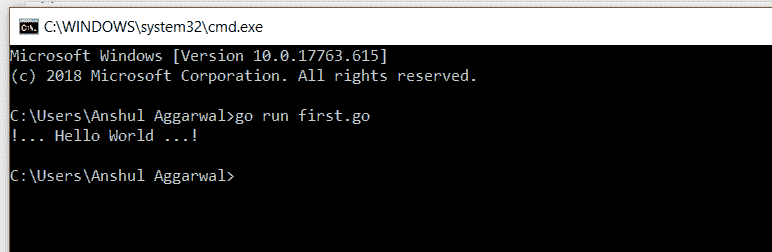

# 格朗 Hello World

> 原文:[https://www.geeksforgeeks.org/hello-world-in-golang/](https://www.geeksforgeeks.org/hello-world-in-golang/)

你好,世界是任何编程语言中的第一个基本程序。让我们按照以下步骤编写 [Go 语言](https://www.geeksforgeeks.org/go-programming-language-introduction/)中的第一个程序:

*   首先打开 Go 编译器。在 Go 语言中，程序用**保存。转到**扩展名，它是一个 UTF-8 文本文件。
*   Now, first add the package main in your program:

    ```go
    package main
    ```

    每个程序都必须从包声明开始。在 Go 语言中，包用于组织和重用代码。在 Go 中，有两种类型的程序可用一种是可执行的，另一种是库。可执行程序是我们可以直接从终端运行的程序，库是我们可以在程序中重用它们的程序包。这里，package main 告诉编译器，包必须在可执行程序中编译，而不是在共享库中编译。它是程序的起点，也包含程序的主要功能。

*   After adding main package import “fmt” package in your program:

    ```go
    import(
    "fmt"
    )

    ```

    在这里， **import** 关键字用于导入程序中的包， **fmt** 包用于实现带函数的格式化输入输出。

*   Now write the code in the main function to print hello world in Go language:

    ```go
    func main() {
        fmt.Println("!... Hello World ...!")
    }

    ```

    在上面几行代码中，我们有:

    *   **func:** 用于在 Go 语言中创建函数。
    *   **main:** 是 Go 语言中的主函数，不包含参数，不返回任何东西，执行程序时调用。
    *   **Println():** 此方法存在于 fmt 包中，用于显示”！……你好世界……！”字符串。这里，Println 是打印行的意思。

**示例:**

```go
// First Go program
package main

import "fmt"

// Main function
func main() {

    fmt.Println("!... Hello World ...!")
}
```

**输出:**

```go
!... Hello World ...!
```

#### 如何运行 Golang 程序？

要运行围棋程序，你需要一个围棋编译器。在 Go 编译器中，首先你创建一个程序，用扩展名**保存你的程序。走**，比如**先走**。现在我们使用以下命令在 go 编译器中运行这个 **first.go** 文件，即:

```go
$ go run first.go
```

[](https://media.geeksforgeeks.org/wp-content/uploads/20190816180514/Hello-World-Golang.png)