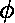
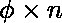
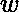
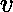
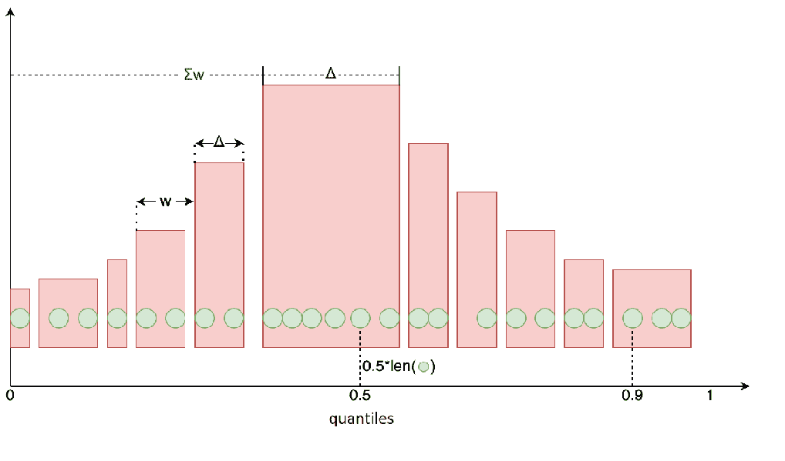
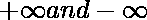
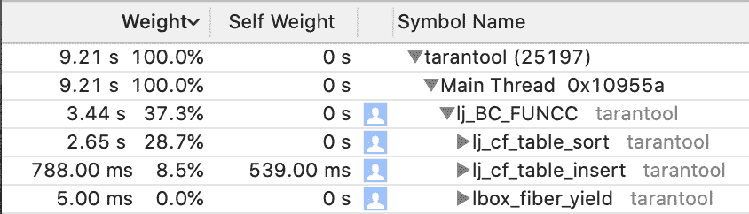

# 如何计算监控数据密集型系统的百分位数？

> 原文:[https://www . geeksforgeeks . org/如何计算数据密集型系统的监控百分比/](https://www.geeksforgeeks.org/how-to-calculate-percentiles-for-monitoring-data-intensive-systems/)

监测经常涉及百分位数的使用。与受异常值严重影响的平均值不同，百分位数有助于了解系统在大多数情况下是如何工作的。如果 10 个请求中有 9 个在 1 秒内执行，最后一个需要 10 秒，则平均值为 1.9 秒，而第 50 个百分点为 1 秒。这只是平均值不适合监控的一个例子。因此，需要计算百分位数，正因为如此，我们在 taran tol/metrics 中添加了一个汇总收集器。汇总收集器计算监控数据的分位数。让我告诉你我们用来计算分位数的算法，以及我们是如何实现 taran tol/metrics 的。

### 汇总收集器

**算法**

a-分位数是随机变量以的概率不超过的值。例如，在 HTTP 请求监控中，等于 1 秒的 0.5 分位数(基本上是第 50 个百分位数)意味着 50%的请求在不到一秒的时间内得到处理。要为大小为 n 的排序数组计算，您需要找到索引为的元素。这种方法需要存储所有受监控的数据，并且度量中可能有大量数据。如果有 10 亿个请求需要处理，它们将需要 10 亿个数组元素，这将构成大约 1 GB 的数据。

这个问题可以通过许多计算数据流近似分位数的算法来解决。我们采用了普罗米修斯中使用的算法。它压缩原始数据，将它们表示为一组数据段。每一段用三个数字的结构来描述:是前一段开始到当前段开始的距离；是当前段的长度；是细分市场的大概分位数。



上图显示了绿色的原始数组元素和红色的压缩数组元素。为了找到压缩数据的分位数，我们需要迭代这些段，将它们的距离相加，直到总和足够接近，并识别相应的段。例如，0.5 分位数将位于图中绿色数组的中间，近似值将属于相应的红色段。整个压缩过程在原文章中有详细描述。

### 履行

我们遵循了这个算法的 Go 实现的例子。让我们创建两个数组。一个用作监控值的缓冲区，另一个用作存储段结构的观察数组:

## 去

```go
typedef struct {int Delta, Width; double Value; } sample;
```

该算法只对排序后的值进行运算。让我们将缓冲区大小限制为 500 个值，并将观察数组的大小定义为 2 × 500 + 2 。由于压缩将数组大小减少了大约一半，我们将需要前一步中未压缩数组的平均 500 个元素+当前步骤中添加到数组中的 500 个元素+类似的元素，以简化数组中的搜索。

### 发展

我们迭代地进行我们的实现:创建一个版本，用分析器检查它的性能，将其与 Go 版本进行比较，然后寻找改进它的方法。我们使用一个简单的基准来评估我们的结果:10 个 <sup>8 个</sup>样本，这对于 Go 版本来说需要大约 8 秒钟。现在让我们深入了解每一次迭代的细节。

**1。** **纯 Lua 版本**相当糟糕，因为插入平均需要大约 100 秒。探查器数据如下所示:



代码在将观察值插入相应数组(` table.insert` call)和缓冲区排序(` table.sort `)方面表现不佳。这就是 ffi(对外函数接口)出手相救的地方。Ffi 允许从 C 标准库中访问函数，并在 Lua 中使用它们，就像它们是常规 Lua 对象一样(嗯，差不多；例如，虽然 Lua 中的表索引以 1 开头，但是用 C 创建的数组仍然以 0 开头)。

**2。Lua + ffi** 版本涉及构建一个双精度值数组，而不是创建一个缓冲区:

## 去

```go
local ffi = require('ffi')
…
array = ffi.new('double[?]', max_samples)
for i = 0, max_samples - 1 do
    array[i] = math.huge
end
```

我们将使用 C 标准库对这个数组进行排序:

## 去

```go
ffi.cdef[[
```

## 去

```go
void qsort(void *base, size_t nitems, size_t size, int (*compare)(const void *, const void*));
int cmpfunc (const void * a, const void * b);
```

让我们为 C 语言中的“double”值编写一个比较器函数，并将其作为动态库。以下是比较器功能:

## 去

```go
int cmpfunc (const void * a, const void * b) {
    if (*(double*)a > *(double*)b)
        return 1;
    else if (*(double*)a < *(double*)b)
        return -1;
    else
        return 0;
}
```