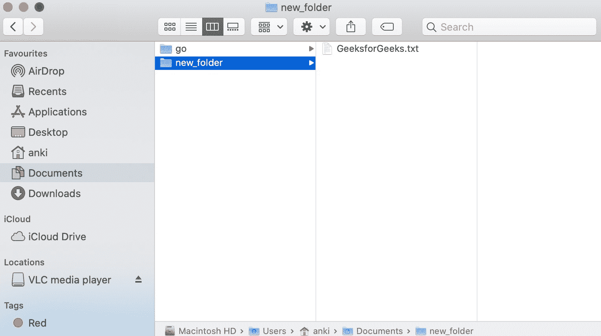

# 如何在 Golang 创建空文件？

> 原文:[https://www . geesforgeks . org/如何在 golang 中创建空文件/](https://www.geeksforgeeks.org/how-to-create-an-empty-file-in-golang/)

像其他编程语言一样，Go 语言也允许您创建文件。为了创建文件，它提供了 **Create()函数**，该函数用于创建或截断给定的命名文件。

*   如果给定文件已经存在，此方法将截断该文件。
*   如果给定文件不存在，此方法将创建一个模式为 0666 的文件。
*   如果给定的路径不正确，那么这个方法将抛出一个*PathError 类型的错误。
*   这个方法返回一个文件描述符，该描述符可以用于读取和写入。
*   它是在操作系统包下定义的，所以您必须在程序中导入操作系统包才能访问 Create()函数。

**语法:**

```go
func Create(file_name string) (*File, error)
```

**例 1:**

```go
// Golang program to illustrate how to create
// an empty file in the default directory
package main

import (
    "log"
    "os"
)

func main() {

    // Creating an empty file
    // Using Create() function
    myfile, e := os.Create("GeeksforGeeks.txt")
    if e != nil {
        log.Fatal(e)
    }
    log.Println(myfile)
    myfile.Close()
}
```

**输出:**


**实施例 2:**

```go
// Golang program to illustrate how to create
// an empty file in the new directory
package main

import (
    "log"
    "os"
)

func main() {

    // Creating an empty file
    // Using Create() function
    myfile, e := os.Create("/Users/anki/Documents/new_folder/GeeksforGeeks.txt")
    if e != nil {
        log.Fatal(e)
    }
    log.Println(myfile)
    myfile.Close()
}
```

**输出:**

