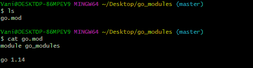
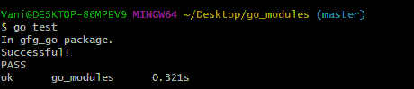
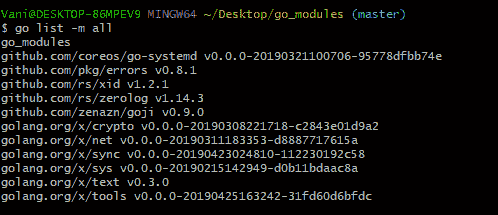
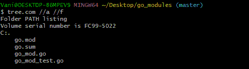

# 如何在 Golang 创建模块？

> 原文:[https://www . geesforgeks . org/如何创建模块 in-golang/](https://www.geeksforgeeks.org/how-to-create-modules-in-golang/)

Go 从 1.11 开始就支持版本化模块，最初的原型是 **vgo** 。Go 中模块的概念是为了处理 Go 应用程序中的依赖性问题而引入的。几个包被收集并组合成一个模块，该模块以树状结构存储在一个文件中，文件的根目录是 *go.mod* 。

**注意:**将系统中当前版本的 Go 更新到最新版本，以便使用 Go 模块。

现在让我们看看如何在 Golang 中创建模块。要创建模块，首先创建一个目录，然后使用以下命令进入该目录:

```go
mkdir go_modules
cd go_modules

```

要将当前目录初始化为允许我们管理依赖关系的模块的根目录，请使用以下命令:

```go
go mod init go_modules

```

由于我们在 *$GOPATH/src* 模块之外工作，我们需要在初始化过程中明确指定模块的名称。


我们现在可以检查 **go.mod** 文件是否被创建，如果存在，它的内容。



下一步是用以下代码创建一个简单的 Go 文件:

```go
// file inside the current module
package gfg_go

import("fmt")

func initialiser() string {

       fmt.Printf("In gfg_go package. \n")

       // returns the current module
       // and the package name
       return_string := "Module : go_modules."
       return return_string

}
```

为了测试上述函数，我们用以下代码创建另一个 Go 文件:

```go
package gfg_go

import (
       "testing"
       "fmt"
       "strings"
)

// function to test if the original
// go program is working
func TestFunction(test *testing.T){

       test_string1 := "go_modules"

       // calling the function from
       // the previous go file
       res := strings.Split(initialiser(), ":")

       // removing spaces and line-ending
       // punctuation before comparing
       test_string2 := strings.Trim(res[1], " .")

       if test_string1 == test_string2 {
               fmt.Printf("Successful!\n")

       } else {
                // this prints error message if
                // strings do not match
               test.Errorf("Error!\n")
       }

}
```

运行 *go test* 命令后，我们应该看到我们的测试构建通过了！



### 向 Go 模块添加依赖项

为了给我们的模块添加依赖项，我们将使用 **require()** 函数以及正在使用的模块版本:

```go
module go_modules

go 1.14

require github.com/rs/zerolog v1.14.3
```

我们包中的所有依赖项如下所示:



我们目录中的所有文件如下所示:



**注意:**go 命令使用 *go.sum* 文件来确保这些模块的未来下载将检索与第一次下载相同的位，并且您的项目所依赖的模块不会意外更改。