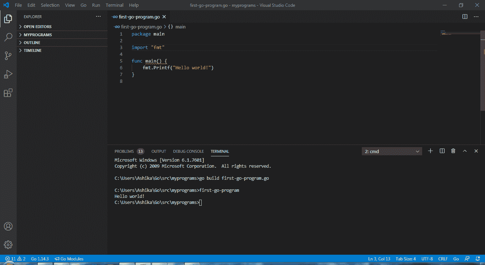

# 如何在格朗打造自己的套餐？

> 原文:[https://www . geesforgeks . org/如何创建自己的 golang 包/](https://www.geeksforgeeks.org/how-to-create-your-own-package-in-golang/)

Go 语言是 Google Inc .开发的高级编程语言，高级语言就是简单的文字，人类为了人类理解而创造的编程语言类别。在我们跳到高术语如包、模块、函数等之前。让我们用 Golang 编写最基本的程序。编程界最基础的程序是 **Hello 世界**。

## 去

```go
package main

import "fmt"

// Main function
func main() {

    fmt.Printf("Hello World!")
}
```

由于 Go lang run 在这个 IDLE 上不被支持，我在下面附上了输出的截图。



第一个在控制台上打印 hello world 的程序。如果在 Windows 平台上使用 Visual Studio，输出屏幕很可能与图像中的一样。

这个节目到现在我们肯定已经看了一百万遍了，但是我们真的明白里面有什么吗？或者我们只是扫描写在代码中的关键词并复制粘贴，然后在我们的程序中进一步实现？我们都知道答案！但是现在让我们试着理解代码。

```go
package main
```

该语句使包作为程序的可执行代码可用。一个包可以简单地解释为一个将多段代码绑定在一起的胶囊，它可以包含多个库、多个功能，所有这些都包含在一个胶囊中，用户只需导入或提及该包，就可以在任何程序中轻松使用。

```go
import "fmt"
```

这里 fmt 是 Go lang 提供的内置包。所有基本的打印操作、扫描操作等都属于这个包。

```go
func main()
```

它是保存可执行驱动程序代码的函数 main 的简单声明。

```go
fmt.Printf("Hello world!")
```

在这一行，它可能看起来很简单，但在这个简单的点('.'后面有一个逻辑)位于 fmt 和 Printf 之间。**点**是执行重要搜索的中介。点前面的术语是**包名**，点后面的名称是属于点前面提到的包的**功能集**。 **Printf 是一个位于 fmt 包下的功能**，它提供“在控制台上一行打印输入字符串(在这种情况下)”。

如前所述，fmt 是一个预先构建的包，由其他人开发。我们在这些预先构建的代码中发现了许多东西，但是为什么我们不能尝试构建自己的包呢？好吧，构建我们自己的包增加了我们工作组织的可读性、可重用性和效率，因为它将是关于我们所做的工作的细节，而不是世界其他地方！让我们来看看**如何构建一个简单的新包**的演示。

在您继续之前，您需要确保以下步骤，这些步骤对于确保工作流程顺畅至关重要:

1.  在环境变量中检查您的 GOPATH，并将其设置为包含所有 Go 文件的目录。
2.  用要创建的包的名称创建一个新文件夹。
3.  在步骤 2 中创建的文件夹中，创建您的 go 文件，其中包含您希望创建的 Go 包代码。
4.  建议您将您的文件命名为与您的包名相同的名称，这不是强制性的，只是确保不那么混乱的导入。
5.  观看下面的详细演示，了解事情是如何运作的！🙂

## 去

```go
package calculator
// I'm creating a simple calculator that
// performs one calculator operation as per the
// user's choice. For readability of code,
// I named the package as "calculator"
// And remember, the first executable line
// must always be as mentioned above:
// the keyword package followed by a name
// that you wish to give to your package*
//* indicates very very important

import "fmt"
// importing fmt package for basic
// printing & scan operations

func Calc() {

    // a simple Calc function that contains
    // all code within and has no return
    // type mentioned
    // Println prints the input string in new line
    fmt.Println("Welcome to calculator")
    fmt.Println("********************MAIN MENU*************************")
    fmt.Println("1\. Add")
    fmt.Println("2\. Subtract")
    fmt.Println("3\. Multiply")
    fmt.Println("4\. Divide")
    fmt.Println("******************************************************")
    var choice int

    // choice will store the user's
    // input as per the menu shown above
    fmt.Scan(&choice)
    var a, b int

    // After the choice of operation, user
    // will be asked to enter 2 int
    // values one by one to perform
    // the operation on
    fmt.Println("Enter value of a: ")
    fmt.Scan(&a)
    fmt.Println("Enter value of b: ")
    fmt.Scan(&b)
    if( choice == 1 ){
        // choice 1 activates this part --> addition
        ans := a + b
        fmt.Println("Answer = ", ans)
    } else if( choice == 2 ){
        // choice 2 activates this part --> subtraction
        ans := a - b
        fmt.Println("Answer = ", ans)
    } else if( choice == 3 ){
        // choice 3 activates this part --> multiplication
        ans := a * b
        fmt.Println("Answer = ", ans)
    } else {
        // choice 4 activates this part --> division
        // remember not to enter second value as 0
        // as that would raise a DivideByZero error
        // or may display infinity
        ans := a / b
        fmt.Println("Answer = ", ans)
    }
    fmt.Println("******************************************************")
    fmt.Println("Thank you for using calculator! Have a nice day ahead. ^-^")
    fmt.Println("******************************************************")
}
```