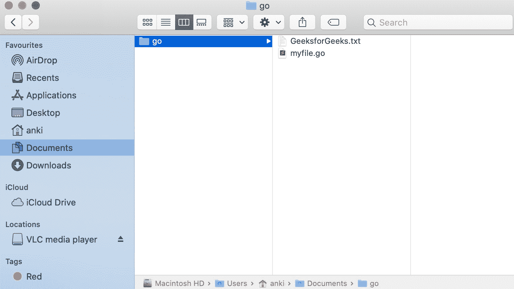
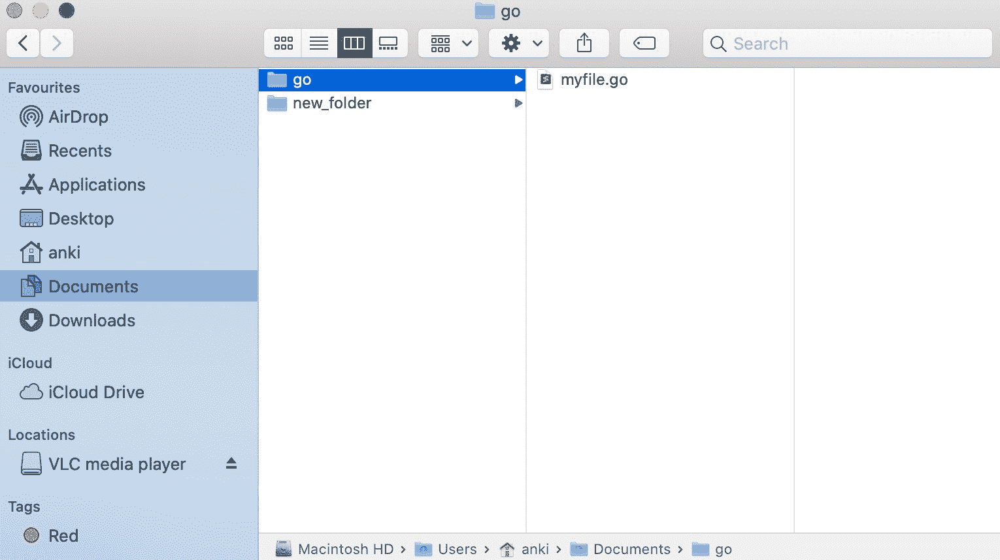
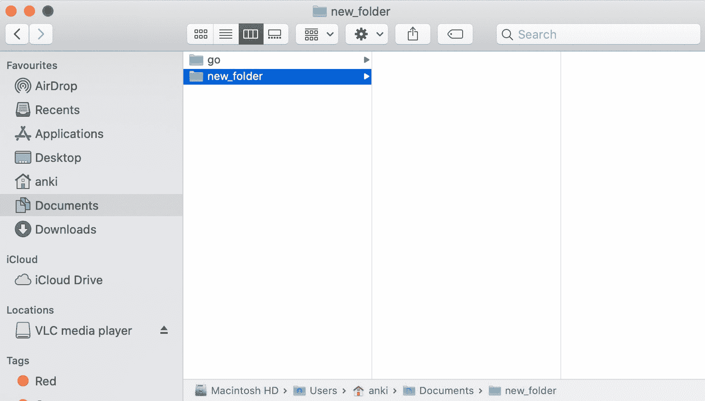

# 如何删除或移除 Golang 中的文件？

> 原文:[https://www . geesforgeks . org/如何删除或移除 golang 中的文件/](https://www.geeksforgeeks.org/how-to-delete-or-remove-a-file-in-golang/)

在 Go 语言中，您可以借助 **Remove()方法**删除现有文件。此方法从控制器中删除指定的文件，或者也删除空目录。如果给定的路径不正确，那么它将抛出一个*PathError 类型的错误。它是在操作系统包下定义的，所以您必须在程序中导入操作系统包才能访问 Remove()函数。

**语法:**

```go
func Remove(file_name string) error
```

**例 1:**

```go
// Golang program to illustrate how to 
// remove files from the default directory
package main

import (
    "log"
    "os"
)

func main() {

    // Removing file from the directory
    // Using Remove() function
     e := os.Remove("GeeksforGeeks.txt")
    if e != nil {
        log.Fatal(e)
    }
}
```

**输出:**

*之前:*



*之后:*



**例 2:**

```go
// Golang program to illustrate how to remove
// files from the specified directory
package main

import (
    "log"
    "os"
)

func main() {

    // Removing file
    // Using Remove() function
    e := os.Remove("/Users/anki/Documents/new_folder/GeeksforGeeks.txt")
    if e != nil {
        log.Fatal(e)

   } 
}
```

**输出:**

*之前:*


*之后:*

