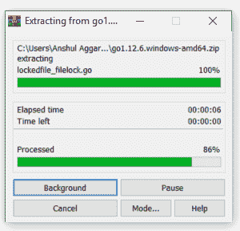
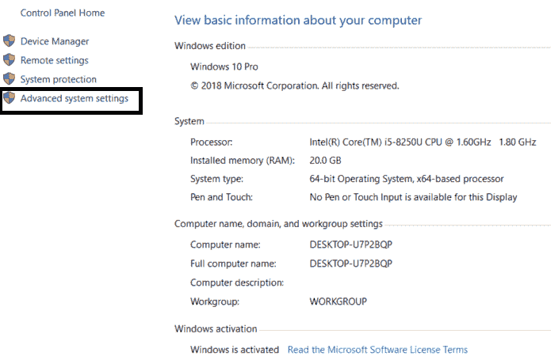
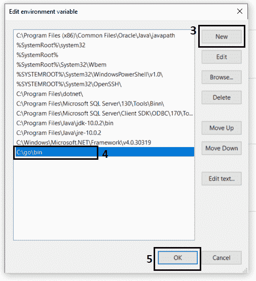
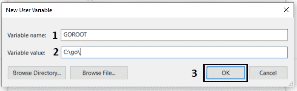

# 如何在 Windows 上安装 Go？

> 原文:[https://www.geeksforgeeks.org/how-to-install-go-on-windows/](https://www.geeksforgeeks.org/how-to-install-go-on-windows/)

#### 先决条件:[围棋编程语言介绍](https://www.geeksforgeeks.org/go-programming-language-introduction/)

之前，我们从在系统上安装 Golang 的过程开始。我们必须对围棋语言是什么以及它实际上做什么有第一手的了解。Go 是一种开源的静态类型编程语言，由罗伯特·格里森、罗布·派克和肯·汤普森于 2007 年在谷歌开发，但于 2009 年推出。也称为 *Golang* ，支持过程编程语言。它最初是为了提高大型代码库、多核和网络机器的编程效率而开发的。

Golang 程序可以写在任何纯文本编辑器上，如**记事本**、**记事本++** 或任何类似的东西。人们也可以使用在线的 **IDE** 来编写 Golang 代码，或者甚至可以在他们的系统上安装一个，使编写这些代码更加可行。使用 ide 使编写 Golang 代码变得更加容易，因为 IDE 提供了许多功能，如直观的代码编辑器、调试器、编译器等。
首先，编写 Golang 代码并执行各种有趣且有用的操作，必须在他们的系统上安装 Go 语言。这可以通过遵循下面提供的逐步说明来完成:

#### 如何检查预装的 Go 语言版本？

在我们开始安装 Go 之前，最好检查一下它是否已经安装在您的系统上。要检查您的设备是否预装了 Golang，只需进入**命令行**(对于**窗口**，在运行对话框中搜索**cmd**(<link rel="stylesheet" href="https://maxcdn.bootstrapcdn.com/font-awesome/4.6.1/css/font-awesome.min.css">***+R**)。*

*现在运行以下命令:*

```go
***go version***
```

*如果已经安装了 Golang，它将生成一条消息，其中包含 Golang 可用版本的所有细节，否则，如果没有安装 Golang，则会出现一个错误，说明 ***命令不正确或文件名****

#### *下载和安装 Go*

*在开始安装过程之前，您需要下载它。为此，所有版本的视窗操作系统都可以在[**【golang.org】**](https://golang.org/dl/)上获得。*

**

*根据您的系统架构下载 Golang，并按照进一步的说明安装 Golang。*

***第一步:**下载后，解压下载的存档文件。解压缩后，您将在当前目录中获得一个名为**的文件夹。***

**

***步骤 2:** 现在将提取的文件夹复制并粘贴到您想要安装它的任何地方。这里我们安装在 c 盘。*

***步骤 3:** 现在设置环境变量。右键单击*我的电脑*并选择**属性**。从左侧选择*高级系统设置*，点击**环境变量**，如下图截图所示。*

**

**

***第 4 步:**从系统变量中点击**路径**，然后点击**编辑**。然后点击**新建**，在粘贴了 **Go** 文件夹的位置添加带 bin 目录的路径。这里我们正在编辑路径 **C:\go\bin** 点击*确定*，如下图截图所示。*

**

**

***步骤 5:** 现在创建一个新的用户变量，告诉 Go 命令 Golang 库在哪里。点击用户变量的**新增**，如下图所示。*

**

*现在将变量名填充为 **GOROOT** ，变量值就是你的 Golang 文件夹的路径。所以这里的变量值是 **C:\go\** 。填充后，单击确定。*

**

*之后，单击环境变量上的确定，您的设置就完成了。现在让我们使用命令提示符下的命令 **`go version`** 来检查 Golang 版本。*

**

*完成安装过程后，可以使用任何 IDE 或文本编辑器编写 Golang 代码，并使用命令在 IDE 或命令提示符下运行这些代码:*

```go
*go run filename.go*
```