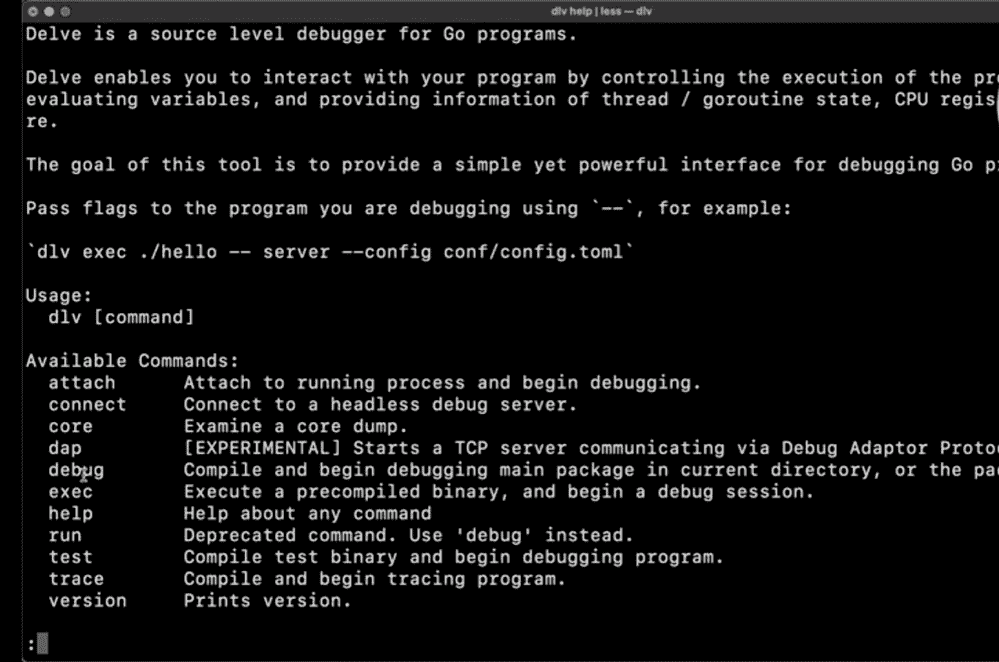

# 如何安装 Golang 调试器？

> 原文:[https://www . geesforgeks . org/how-install-golang-debugger/](https://www.geeksforgeeks.org/how-to-install-golang-debugger/)

安装 *golang* 调试器是检测或分析并消除任何软件类型代码中现有和潜在错误(bug)的有力步骤，这些错误甚至会导致其异常行为或导致崩溃。

为了防止我们的软件/系统出现这些不正确的操作和异常工作，我们使用调试工具来发现和解决这些类型的错误。因此，*Go-develop*是一个调试工具(称为调试器)，用于在开发的各个阶段查找编码错误。我们推荐您使用*深究 golang* *调试器*，因为它是最好的、功能强大的调试器工具，并且使用简单。Delve 是第三方调试器，用于*至*编程语言，可在 [*GitHub*](https://github.com/go-delve/delve) 上获得。


**如何下载安装** ***去深究 golang*** **调试器:**

我们下面提到的命令在 *Linux、Windows* 和 *OSX* 中工作。

**第一步:** *Go 吕德* e 只需在工作区内使用 *go get* 命令即可轻松下载并安装，但如果您使用的是 *go 模块*，则可能需要在项目目录外执行此命令(如下图所示)，以避免 *Delve* 被添加到现在已经执行的 *go mod* 文件中。


```go
devel go get github.com/go-devel/devel/cmd/dlv
```

运行上述命令后，delve 调试器将安装在您的工作区中，您的屏幕如下所示:


**第二步。**调试完 delve 命令后，您可以从‘help’命令选项中获取帮助。如果您将键入命令列表的帮助(用于进一步调试)。

```go
(dlv)help
```

将出现在屏幕上的命令列表如下所示:



**第三步。**如果你想获得帮助命令选项，那么你可以使用 *dlv 退出/清除命令*，该命令将带你回到你之前所在的地方。

由于您有一个正在运行的 go 安装，因此应该已经设置了以下内容:

始终确保全局环境变量设置正确，因为这将指示命令 *dlv dalvi* 的存储目录。你也可以通过输入*进入*来检查。

并且还要确保包含 *GOV IN* 的路径使得 run go 二进制可执行文件没有绝对路径规范。

在 OSX 安装时，您可能还需要通过运行以下命令来启用开发人员工具:

```go
xcode-select --install
```

那么我们需要安装的遗产包括:

```go
/Library/Developer/CommandLineTools/Packages/macOS_SDK_headers_for_macOS_10.14.pkg
```

将存储库克隆到:

```go
$GOPATH/src/github.com/go-delve/delve
```

运行以下命令来安装:

```go
make run
```

该命令将允许您在 OSX 内部安装*深究 gola* ng 调试器。

要检查 Delve golang 调试器的安装，您可以遵循给定的步骤:

要在完成安装的所有步骤后检查是否安装了开发人员，请按照开发人员的版本检查安装的方法。

```go
$dlv version
```

```go
Delve debugger
Version 1.5.1
Build: $ Id: bca418ea7ae2a4dcda985e623625da727d4525d5 $
```

使用此命令，您可以检查调试器的版本。因此，安装也将得到验证。

Delve golang 调试器中安装时使用的一些有用命令:

*   **(dlv)调试和(dlv)执行命令:**

现在对我们来说重要的命令是

```go
***dlv debug*** and
```

```go
***dlv exec*** 
```

这些命令用于启动开发会话，唯一的区别是一个( *dlv debug* )可以轻松地从源代码编译二进制文件，而另一个( *dlv exec* )可能已经编译了二进制文件。

*   **测试命令:**

如果我们想在工作区内调试 go 文本，test 命令也是一个非常有用和需要的命令。

```go
dlv(test)
```

*   **清除命令:**

此命令用于从指定位置的调试会话或工作区中移除特定断点。

```go
dlv clear 1
```

```go
Breakpoint 1 cleared at 0 ×10d155d for main.main( ). /main. Go.10
```

如果您想删除错误添加的给定断点，或者只需要从会话或程序的其他区域中删除该断点，则此命令非常有用。

*   **清除所有命令:**

此命令用于清除手动添加的所有断点。它会清除之前在工作区或调试会话中完成的所有命令或工作，您可以再次从一个清晰的页面开始。

```go
dlv(clear all)
```

*   **退出命令:**

如果您被困在调试会话中，那么您可以使用此命令退出。该命令将清除所有正在运行的命令。

```go
dlv(exit)
```

**结论:**

对于安装和进一步处理 go 应用程序来说，这些命令集已经足够了。我们已经列出了安装 delve *golang* 调试器的方法，安装调试器时有用的命令以及安装它的用途。它还将帮助您更容易地使用遵循相同概念和版本的其他编辑器集成版本。