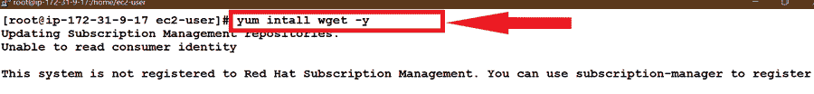
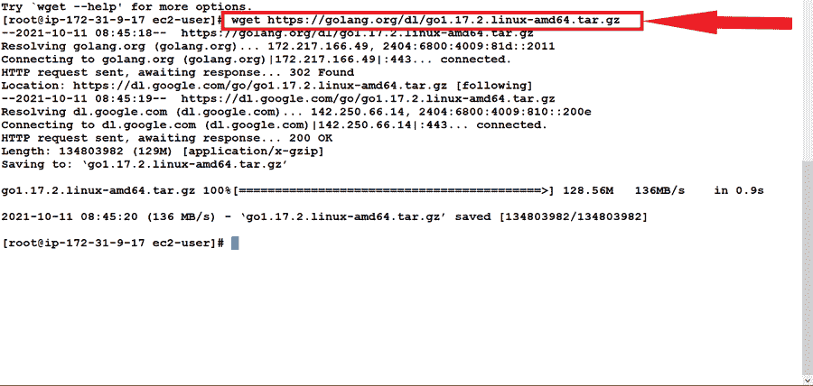
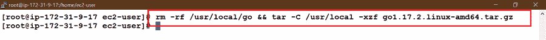

# 如何在 CentOS 7 上安装 Golang？

> 原文:[https://www . geesforgeks . org/how-install-golang-on-centos-7/](https://www.geeksforgeeks.org/how-to-install-golang-on-centos-7/)

Go 编程语言是一个开源项目，旨在提高程序员的工作效率。
Go 富有表现力，简洁，干净，高效。它的并发机制使编写最大限度利用多核和网络机器的程序变得容易，而它的新型系统支持灵活的模块化程序构建。Go 可以快速编译成机器代码，但具有垃圾收集的便利性和运行时反射的能力。这是一种快速、静态类型的编译语言，感觉像是动态类型的解释语言。

## 先决条件:

本教程中使用的用户(Linux 用户)是 root 用户或拥有 root 权限的用户，即在每个命令开始时添加 sudo。

## 在 Centos 7 上安装 Go:

按照以下步骤在 Centos 7 上安装 Go 编程语言:

**步骤 1:** 首先使用以下命令下载 Wget 软件:

```go
yum install wget -y
```



然后使用 wget 命令安装 GO:

```go
wget https://golang.org/dl/go1.17.2.linux-amd64.tar.gz3
```



**步骤 2:** 现在删除之前的安装(如果有)，并使用以下命令解压缩下载的 tar 文件:

```go
rm -rf /usr/local/go && tar -C /usr/local -xzf go1.17.2.linux-amd64.tar.gz
```



**步骤 3:** 现在使用以下命令在 path 变量中添加 Go 的路径:

```go
export PATH=$PATH:/usr/local/go/bin
```


**步骤 4:** 要验证 go 是否正确安装，请运行以下命令:

```go
go version
```


如果出现这种情况，那么你们都准备好开始了，如果不是重复以上所有步骤。