# 如何在 MacOS 上安装 Golang？

> 原文:[https://www . geesforgeks . org/how-install-golang-on-macos/](https://www.geeksforgeeks.org/how-to-install-golang-on-macos/)

之前，我们从在系统上安装 [Golang](https://www.geeksforgeeks.org/golang/) 的过程开始。我们必须对围棋语言是什么以及它实际上做什么有第一手的了解。Go 是一种开源的静态类型编程语言，由罗伯特·格里森、罗布·派克和肯·汤普森于 2007 年在谷歌开发，但于 2009 年推出。它也被称为 Golang，支持过程编程语言。它最初是为了提高大型代码库、多核和网络机器的编程效率而开发的。
Golang 程序可以用任何纯文本编辑器编写，如*文本编辑*、*崇高文本*或任何类似编辑器。人们也可以使用在线集成开发环境来编写 Golang 代码，甚至可以在他们的系统上安装一个集成开发环境，使编写这些代码更加可行。使用 ide 使编写 Golang 代码变得更加容易，因为 IDE 提供了许多功能，如直观的代码编辑器、调试器、编译器等。在本文中，我们讨论了以下主题:

*   [在 MacOS 上安装 Golang 的步骤](#Installing-Golang-on-MacOS)
*   [设置开始工作区](#Golang-WorkSpace-on-MacOS)
*   [执行第一个 Golang 程序](#First-Golang-program)

**步骤 1:** 检查是否安装了 Go。在我们开始安装 Go 之前，最好检查一下它是否已经安装在您的系统上。要检查您的设备是否预装了 Golang，只需转到终端并运行以下命令:

```go
go version
```

如果已经安装了 Golang，它将生成一条消息，其中包含 Golang 版本的所有可用细节，如下所示，否则，它将给出一个错误。

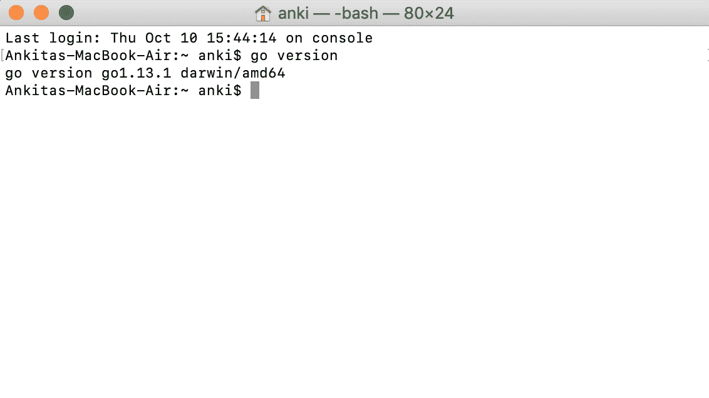

**第二步:**在开始安装过程之前，需要下载。因此，所有版本的苹果电脑都可以在[https://golang.org/dl/](https://golang.org/dl/)上获得

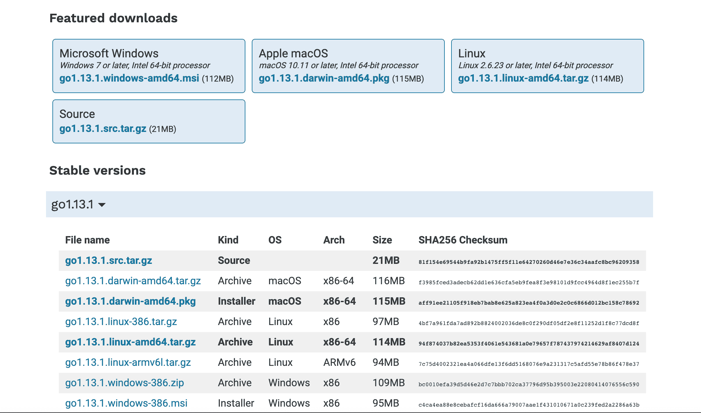

根据你的系统架构下载 Golang。这里我们已经为系统下载了 *go1.13.1drawin-amd64.pkg* 。

**第三步:**下载过程结束后，在系统上安装软件包:

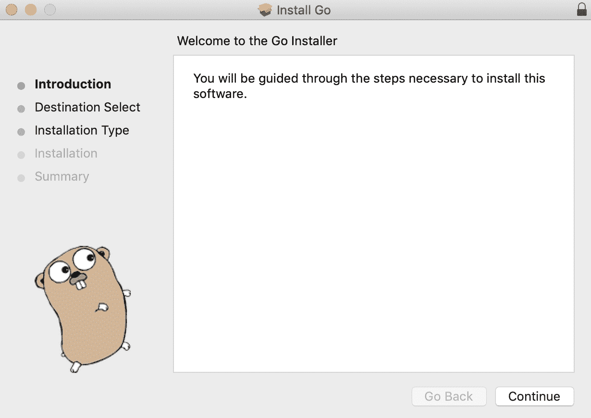

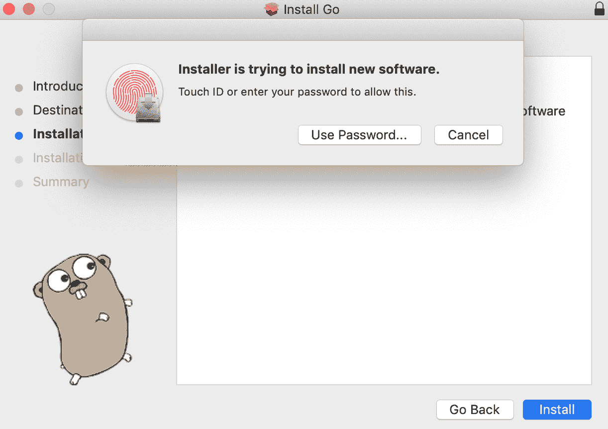

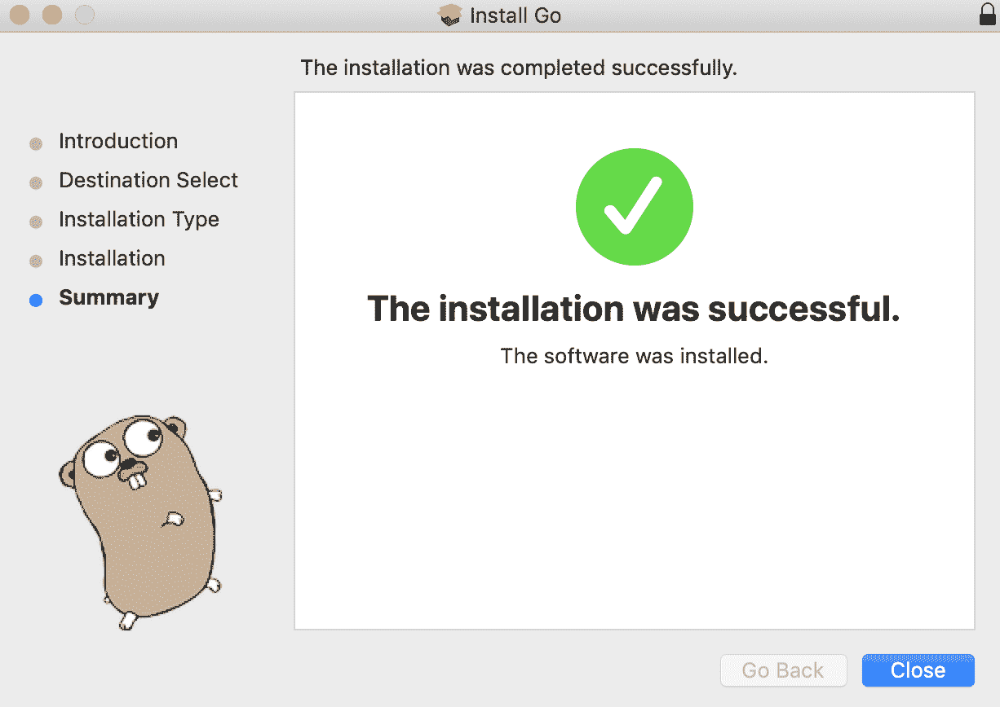

**步骤 4:** 安装过程完成后。打开一个名为终端的程序(它是 macOS 的命令行界面)，使用 Golang 版本命令检查 Go 安装是否正确。如下图所示，这里显示了 Golang 的版本信息，这意味着在您的系统中成功安装 Go。


在您的系统上成功安装 Go 后，现在我们将设置 Go 工作区。Go workspace 是您计算机上的一个文件夹，您所有的 Go 代码都将存储在其中。

**步骤 1:** 创建一个名为“进入文档”的文件夹(或系统中的任意位置)，如下图所示:

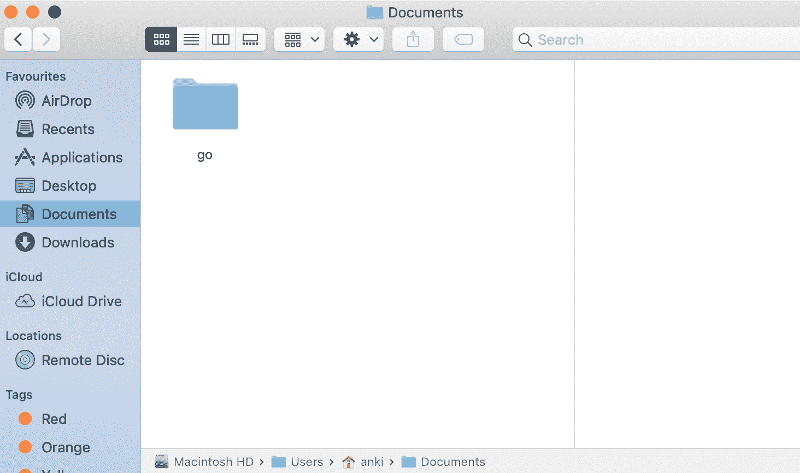

**步骤 2:** 现在告诉 Go 工具在哪里可以找到这个文件夹。首先，使用以下命令进入主目录:

```go
cd ~
```

之后，使用以下命令设置文件夹路径:

```go
echo "export GOPATH=/Users/anki/Documents/go" >> .bash_profile
```

这里，我们添加*导出 GOPATH =/user/anki/Documents/go*到。bash_profile。那个。bash_profile 是一个在您登录 Mac 帐户时自动加载的文件，它包含您的命令行界面(CLI)的所有启动配置和首选项。

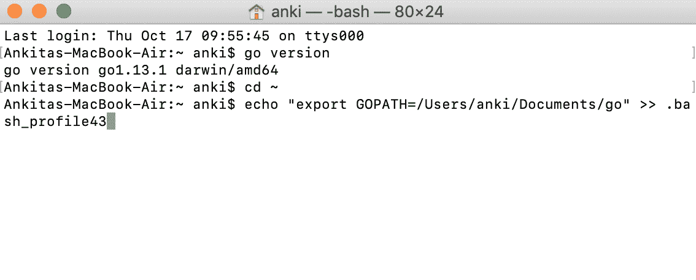

**第三步:**现在检查检查你的。bash_profile 使用以下命令连接到以下路径:

```go
cat .bash_profile
```

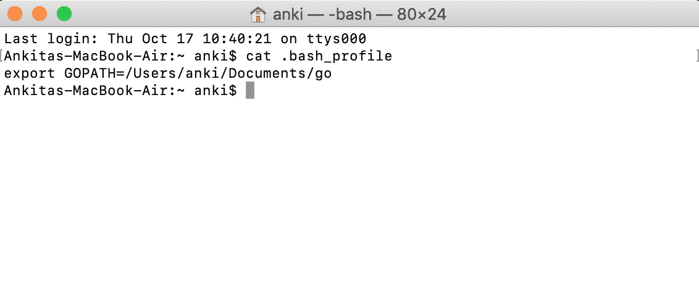

**第 4 步:**现在我们将使用以下命令检查我们的 go 路径。如果你想跳过这一步，你也可以这样做。

```go
echo $GOPATH
```

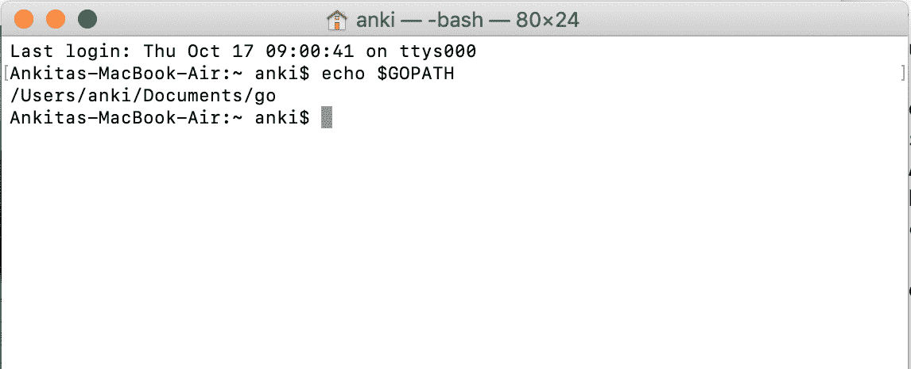

**第一步:**根据自己的选择下载安装一个文本编辑器。安装后，在“文档”中(或系统中的任何位置)创建一个名为*的文件夹，并转到*(或任何您想要的名称)。在这个文件夹中，创建另一个名为*源*的文件夹，并在这个源文件夹中创建另一个名为*欢迎*的文件夹。在这个文件夹中，您所有的 go 程序都将被存储。

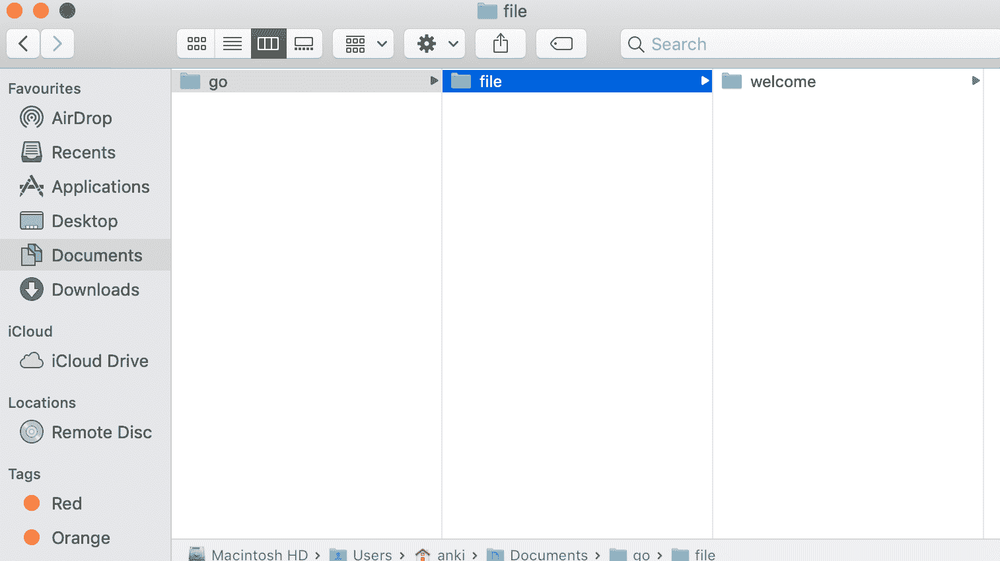

**第二步:**我们来创建一个先行程序。打开文本编辑器，编写如下所示的 go 程序:

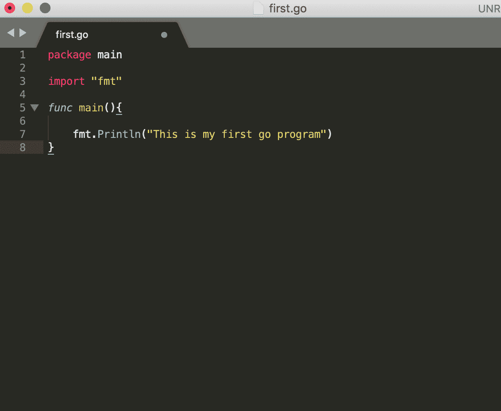

**第 3 步:**创建围棋程序后，用扩展名*保存该程序。去*。

**第四步:**现在打开终端运行你的第一个围棋程序。

**第 5 步:**更改存储程序的目录。

**步骤 6:** 更改目录后，使用以下命令运行 go 程序:

```go
go run name_of_the_program.go
```

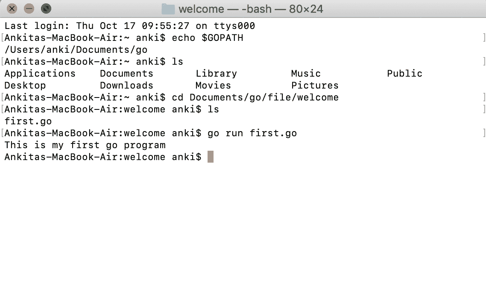