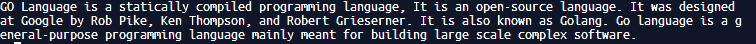

# 如何在 Golang 中逐行逐串读取文件？

> 原文:[https://www . geesforgeks . org/如何逐行逐串读取文件/golang/](https://www.geeksforgeeks.org/how-to-read-a-file-line-by-line-to-string-in-golang/)

使用 **bufio 包扫描仪**逐行读取文件。让文本文件命名为 sample.txt，文件内部内容如下:

> GO 语言是一种静态编译的编程语言，它是一种开源语言。它是由罗布·派克、肯·汤普森和罗伯特·格里斯纳在谷歌设计的。它也被称为 Golang。Go 语言是一种通用编程语言，主要用于构建大型复杂软件。

```go
package main

import (
    "bufio"
    "fmt"
    "log"
    "os"
)

func main() {

    // os.Open() opens specific file in 
    // read-only mode and this return 
    // a pointer of type os.
    file, err := os.Open("sample.txt")

    if err != nil {
        log.Fatalf("failed to open")

    }

    // The bufio.NewScanner() function is called in which the
    // object os.File passed as its parameter and this returns a
    // object bufio.Scanner which is further used on the
    // bufio.Scanner.Split() method.
    scanner := bufio.NewScanner(file)

    // The bufio.ScanLines is used as an 
    // input to the method bufio.Scanner.Split()
    // and then the scanning forwards to each
    // new line using the bufio.Scanner.Scan()
    // method.
    scanner.Split(bufio.ScanLines)
    var text []string

    for scanner.Scan() {
        text = append(text, scanner.Text())
    }

    // The method os.File.Close() is called
    // on the os.File object to close the file
    file.Close()

    // and then a loop iterates through 
    // and prints each of the slice values.
    for _, each_ln := range text {
        fmt.Println(each_ln)
    }
}
```

**输出:**

