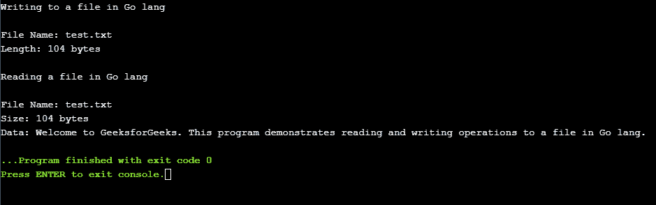
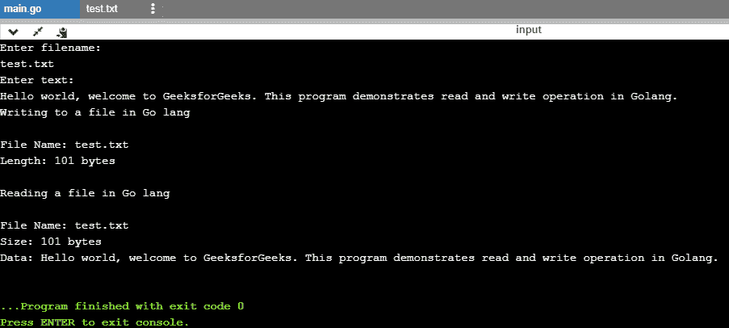

# 如何读写 Golang 的文件？

> 原文:[https://www . geesforgeks . org/如何读写 golang 中的文件/](https://www.geeksforgeeks.org/how-to-read-and-write-the-files-in-golang/)

Golang 提供了一个巨大的内置库，可用于对文件执行读写操作。为了读取本地系统上的文件， **io/ioutil** 模块投入使用。 **io/ioutil** 模块也用于将内容写入文件。
**fmt**模块实现格式化输入/输出，功能是从标准输入读取输入，并将输出打印到标准输出。**日志**模块实现简单的日志包。它定义了一个类型，Logger，以及格式化输出的方法。**操作系统**模块提供了访问本机操作系统功能的能力。 **bufio** 模块实现缓冲输入输出，有助于提高中央处理器性能。

*   **os。Create() :** 操作系统。Create()方法用于创建具有所需名称的文件。如果同名文件已经存在，则 create 函数会截断该文件。
*   **ioutil。ReadFile():**iou til。ReadFile()方法获取要读取的文件的路径，因为它是唯一的参数。此方法返回文件的数据或错误。
*   **ioutil。write file():**iou til。WriteFile()用于将数据写入文件。WriteFile()方法接受 3 个不同的参数，第一个是我们希望写入的文件的位置，第二个是数据对象，第三个是 FileMode，它表示文件的模式和权限位。
*   **日志。宿命论:**宿命论会在打印日志消息后导致程序终止。它相当于 Printf()，后跟对 os 的调用。出口(1)。
*   **日志。恐慌:恐慌就像运行时可能出现的异常。Panicln 相当于 Println()，后跟一个对 panic()的调用。当程序终止时，将打印传递给死机()的参数。**
*   **bufio。NewReader(os。Stdin) :** 此方法返回一个新的 Reader，其缓冲区具有默认大小(4096 字节)。
*   **输入踏板。ReadString('\n') :** 此方法用于从 stdin 读取用户输入，并一直读取到输入中第一次出现分隔符，返回一个包含分隔符之前的数据的字符串。如果在找到分隔符之前遇到错误，它将返回在错误之前读取的数据和错误本身。

**示例 1:** 使用离线编译器获得更好的结果。用*保存文件。转*分机。使用命令下面的命令来执行程序。

```go
go run filename.go
```

## C

```go
// Golang program to read and write the files
package main

// importing the packages
import (
    "fmt"
    "io/ioutil"
    "log"
    "os"
)

func CreateFile() {

    // fmt package implements formatted
    // I/O and has functions like Printf
    // and Scanf
    fmt.Printf("Writing to a file in Go lang\n")

    // in case an error is thrown it is received
    // by the err variable and Fatalf method of
    // log prints the error message and stops
    // program execution
    file, err := os.Create("test.txt")

    if err != nil {
        log.Fatalf("failed creating file: %s", err)
    }

    // Defer is used for purposes of cleanup like
    // closing a running file after the file has
    // been written and main //function has
    // completed execution
    defer file.Close()

    // len variable captures the length
    // of the string written to the file.
    len, err := file.WriteString("Welcome to GeeksforGeeks."+
            " This program demonstrates reading and writing"+
                         " operations to a file in Go lang.")

    if err != nil {
        log.Fatalf("failed writing to file: %s", err)
    }

    // Name() method returns the name of the
    // file as presented to Create() method.
    fmt.Printf("\nFile Name: %s", file.Name())
    fmt.Printf("\nLength: %d bytes", len)
}

func ReadFile() {

    fmt.Printf("\n\nReading a file in Go lang\n")
    fileName := "test.txt"

    // The ioutil package contains inbuilt
    // methods like ReadFile that reads the
    // filename and returns the contents.
    data, err := ioutil.ReadFile("test.txt")
    if err != nil {
        log.Panicf("failed reading data from file: %s", err)
    }
    fmt.Printf("\nFile Name: %s", fileName)
    fmt.Printf("\nSize: %d bytes", len(data))
    fmt.Printf("\nData: %s", data)

}

// main function
func main() {

    CreateFile()
    ReadFile()
}
```

**输出:**



**例 2:** 接受用户输入读写文件的 Golang 程序代码。

## C

```go
// Golang program to read and write the files
package main

// importing the requires packages
import (
    "bufio"
    "fmt"
    "io/ioutil"
    "log"
    "os"
)

func CreateFile(filename, text string) {

    // fmt package implements formatted I/O and
    // contains inbuilt methods like Printf
    // and Scanf
    fmt.Printf("Writing to a file in Go lang\n")

    // Creating the file using Create() method
    // with user inputted filename and err
    // variable catches any error thrown
    file, err := os.Create(filename)

    if err != nil {
        log.Fatalf("failed creating file: %s", err)
    }

    // closing the running file after the main
    // method has completed execution and
    // the writing to the file is complete
    defer file.Close()

    // writing data to the file using
    // WriteString() method and the
    // length of the string is stored
    // in len variable
    len, err := file.WriteString(text)
    if err != nil {
        log.Fatalf("failed writing to file: %s", err)
    }

    fmt.Printf("\nFile Name: %s", file.Name())
    fmt.Printf("\nLength: %d bytes", len)
}

func ReadFile(filename string) {

    fmt.Printf("\n\nReading a file in Go lang\n")

    // file is read using ReadFile()
    // method of ioutil package
    data, err := ioutil.ReadFile(filename)

    // in case of an error the error
    // statement is printed and
    // program is stopped
    if err != nil {
        log.Panicf("failed reading data from file: %s", err)
    }
    fmt.Printf("\nFile Name: %s", filename)
    fmt.Printf("\nSize: %d bytes", len(data))
    fmt.Printf("\nData: %s", data)

}

// main function
func main() {

    // user input for filename
    fmt.Println("Enter filename: ")
    var filename string
    fmt.Scanln(&filename)

    // user input for file content
    fmt.Println("Enter text: ")
    inputReader := bufio.NewReader(os.Stdin)
    input, _ := inputReader.ReadString('\n')

    // file is created and read
    CreateFile(filename, input)
    ReadFile(filename)
}
```

**输出:**

