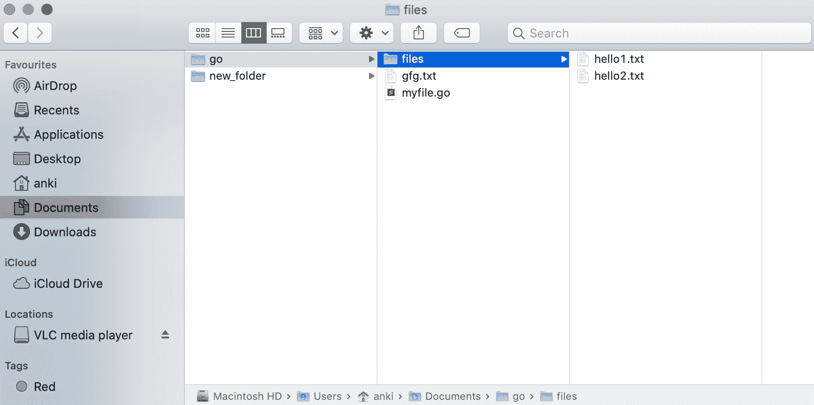
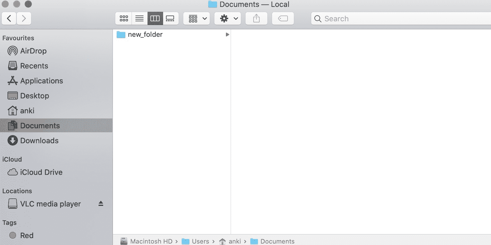
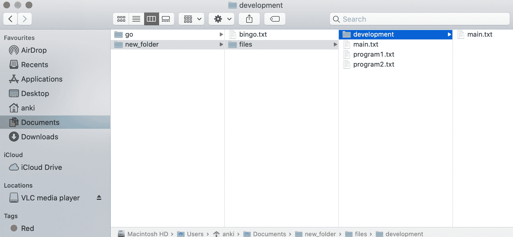
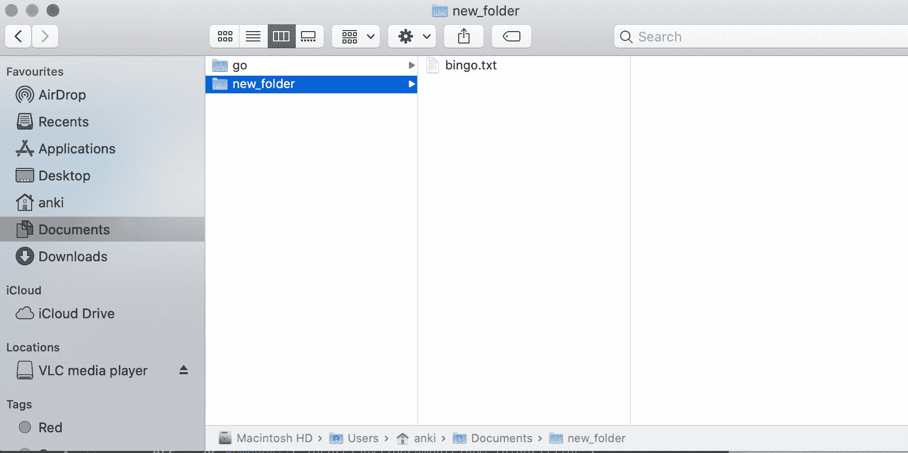

# 如何删除 Golang 中的所有目录和文件？

> 原文:[https://www . geesforgeks . org/如何删除 golang 中的所有目录和文件/](https://www.geeksforgeeks.org/how-to-remove-all-directories-and-files-in-golang/)

在 Go 语言中，您可以借助 **RemoveAll()功能**从一个目录或文件夹中删除所有目录和文件。此函数将从传递给此函数的路径中删除所有目录和文件。它将删除指定路径中的所有内容，但返回遇到的第一个错误。如果指定的路径不存在，则此方法返回零。如果这个方法抛出一个错误，那么它的类型将是*PathError。它是在 os 包下定义的，所以您必须在程序中导入 os 包才能访问 RemoveAll()函数。

**语法:**

```go
func RemoveAll(path string) error
```

**例 1:**

```go
// Golang program to illustrate how to 
// remove all the files and directories
// from the default directory
package main

import (
    "log"
    "os"
)

func main() {

    // Remove all the directories and files
    // Using RemoveAll() function
    err := os.RemoveAll("/Users/anki/Documents/go")
    if err != nil {
        log.Fatal(err)
    }
}
```

**输出:**

*之前:*



*之后:*



**例 2:**

```go
// Golang program to illustrate how to remove
// all the files and directories from the
// new directory
package main

import (
    "log"
    "os"
)

func main() {

    // Remove all the directories and files
    // Using RemoveAll() function
    err := os.RemoveAll("/Users/anki/Documents/new_folder/files")
    if err != nil {
        log.Fatal(err)
    }
}
```

**输出:**

*之前:*



*之后:*

