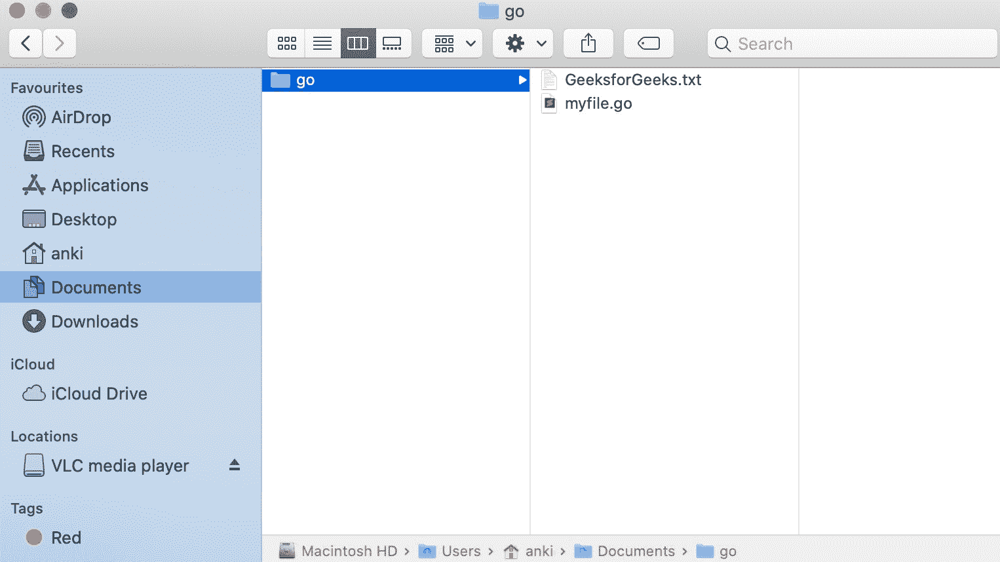
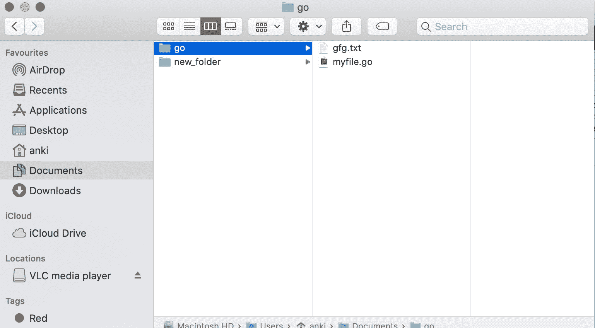
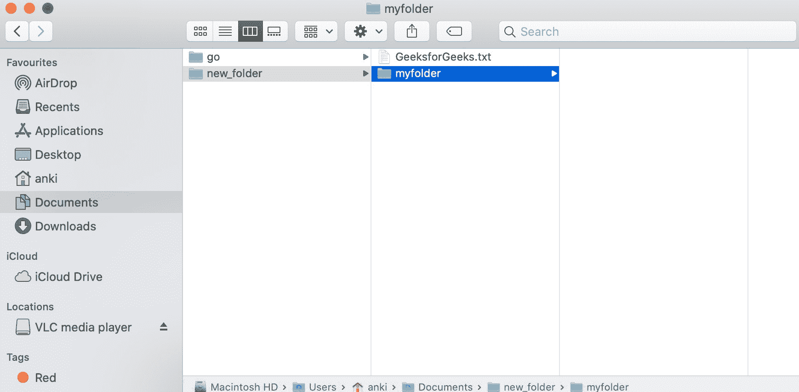
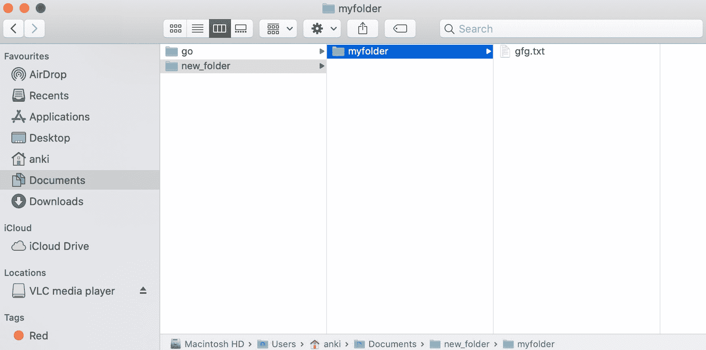

# 如何在 Golang 中重命名和移动文件？

> 原文:[https://www . geesforgeks . org/如何重命名和移动 golang 中的文件/](https://www.geeksforgeeks.org/how-to-rename-and-move-a-file-in-golang/)

在 Go 语言中，您可以在 **Rename()** 方法的帮助下重命名现有文件并将其移动到新路径。此方法用于重命名文件并将文件从旧路径移动到新路径。

*   如果给定的新路径已经存在，并且不在目录中，则此方法将替换它。但是，当给定的旧路径和新路径位于不同的目录中时，可能会应用特定于操作系统的限制。
*   如果给定的路径不正确，那么它将抛出一个*LinkError 类型的错误。
*   它是在操作系统包下定义的，所以您必须在程序中导入操作系统包才能访问 Remove()函数。

**语法:**

```go
func Rename(old_path, new_path string) error
```

**例 1:**

```go
// Go program to illustrate how to rename
// and move a file in default directory
package main

import (
    "log"
    "os"
)

func main() {

    // Rename and Remove a file
    // Using Rename() function
    Original_Path := "GeeksforGeeks.txt"
    New_Path := "gfg.txt"
    e := os.Rename(Original_Path, New_Path)
    if e != nil {
        log.Fatal(e)
    }

}
```

**输出:**

*之前:*



*之后:*



**例 2:**

```go
// Go program to illustrate how to rename 
// and remove a file in the new directory
package main

import (
    "log"
    "os"
)

func main() {

    // Rename and Remove a file
    // Using Rename() function
    Original_Path := "/Users/anki/Documents/new_folder/GeeksforGeeks.txt"
    New_Path := "/Users/anki/Documents/new_folder/myfolder/gfg.txt"
    e := os.Rename(Original_Path, New_Path)
    if e != nil {
        log.Fatal(e)
    }
}
```

**输出:**

*之前:*



*之后:*

