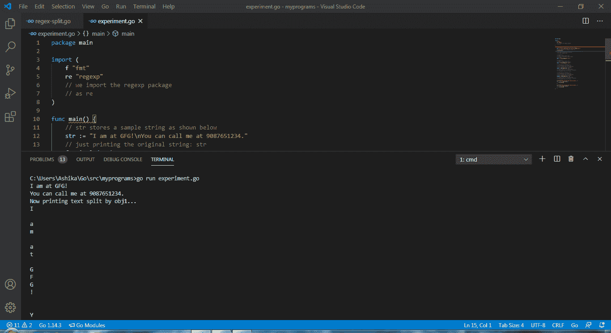
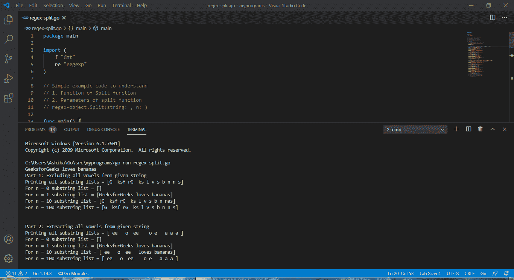

# 如何在 Golang 使用 Regex 拆分文本？

> 原文:[https://www . geeksforgeeks . org/如何使用-regex-in-golang/](https://www.geeksforgeeks.org/how-to-split-text-using-regex-in-golang/) 拆分文本

什么是正则表达式？Regex 是著名的动漫角色吗？哎呀，如果你这样想，你可能会失望。围棋编程语言使用术语**正则表达式**来表示 ***正则表达式**。*正则表达式在字符串处理领域非常重要。Go 中的“***【regexp】***”包保存了所有必要的预构建函数，这些函数实现了正则表达式搜索，并保证了所提供输入大小的线性时间搜索。想了解更多什么是 regex，请阅读 [*在 Golang 什么是 Regexp？*](https://www.geeksforgeeks.org/what-is-regex-in-golang/)

### 如何使用正则表达式(或 regex)拆分输入文本？

Regexp 包包含有助于分割输入文本字符串的分割函数。在我们深入 regexp split 函数之前，让我们向您简要介绍一些在使用 split 函数时值得记住的基本正则表达式:

<figure class="table">

| [Character] | What does it mean? | Example grammar | 正则表达式的结果 |
| --- | --- | --- | --- |
| [] | []可用于包含或
排除给定范围，甚至
专门提到我们想要包含或排除的字符
。
[ ]表示在一个范围内包括两者。 | “【B- f】an”

 | ban、can、dan、
ean、fan |
| { } | 当
一个人需要匹配任意给定
表达式出现的频率
时，就会用到花括号。 | “gf { 1，} g” | gfg、gffg、gfffg、…… |
| ) | () can be used to include or
exclude a given range, and even
specifically mentions that we want the
character
() to represent the capture group with
number. | ”(B- f)an“ | ban、can、dan、
ean、fan

 |
| * | *匹配位于
星之前的字符的 0/0+出现次数
(*)。 | “gee * k” | 盖奇奇奇… |
| + | +匹配位于
加号(“+”)之前的字符的 1/1+出现次数
。 | 【gee+k】 | geek、…… |
| ？ | ? Match question mark ('?' 0-1 times of the previous character
). | “啧啧？k" | gek，geek

 |
| 。 | 除了换行符(\n)之外，任何东西都可以代替点
字符。 | 【g . g】 | gfg、gbg、gcg、…… |
| ^ | 任何以'^'.之后提到的字符串
开头的文本也用作组内否定
或其他正则表达式(NOT)。 | 【^ge】【^0-8]*】 | ge、geek、geek、… |
| $ | It indicates that the string is in a | “$ de” | 编码、解码、…… |
| &#124; | &#124; is the or operator. | [geek &#124; principle] | Geek, geek,
principle, principle .. |
| \ | This is the escape character
. If you need to mention what
likes "\s", then you need
to use "\\s", so that the system
can understand that it is "\s". | " \ A "
" \ \ n "
" \ \ s "
等.. |  |
| \ S | Select all spaces only. | “\ \ S” | “，”、“，……

 |
| 2、3、4、5、
6、7、8、9 |
| \ D | Extract all text except numbers. | " \ \ D " |  |

</figure>

***语法:***

```go
***func*** Split(s: string, n: int) []string

```

该函数接受一个字符串和一个整数，并返回所有子字符串的一部分。输入字符串“ **s** 是将被进一步分割的字符串，根据**分割**函数给出的正则表达式分割为子字符串。 **n** 表示决定要返回的子字符串数量的值。

*   如果 **n > 0** :表示最多有 n 个子串经过正则化运算，将被返回。
*   如果 **n = 1** ，则不会执行正则表达式操作，因此将返回原始字符串。
*   如果 **n = 0** :表示不返回子串，返回一个 nill。
*   如果 **n < 0** :这意味着所有创建的子字符串都将被函数返回。

**例 1:**

## 去

```go
package main

import (
    f "fmt"
    re "regexp"
    // we import the regexp package
    // as re
)

// SPLIT function hacks
// In layman terms, whenever the
// string (given to split as argument)
// occurs, the string is split into
// a substring.

func main() {

    // str stores a sample string as shown below
    str := "I am at GFG!\nYou can call me at 9087651234."

    // just printing the original string: str
    f.Println(str)

    // We shall consider two scenarios
    // in this example code

    // Scenario 1:
    // Store a regex object that
    // contains digits only
    // in obj1.
    obj1 := re.MustCompile("\\d*")

    // Scenario 2:
    // Store a regex object that
    // contains everything except digits
    // in obj2.
    obj2 := re.MustCompile("\\D*")

    // Using obj1 as reference, we
    // are splitting the string: str
    // and -1 denotes that all substrings
    // ever created will be included.
    first := obj1.Split(str, -1)

    // "first" holds all the substrings
    // split from str w.r.t obj1 in a container
    // A container like, say a list.

    // Using obj2 as reference, we
    // are splitting the string: str
    // and -1 denotes that all substrings
    // ever created will be included.
    second := obj2.Split(str, -1)
    // "second" holds all the substrings
    // split from str w.r.t obj2 in a container
    // A container like, say a list.

    f.Println("Now printing text split by obj1...")
    for _, p := range first {
        f.Println(p)
    }

    f.Println("Now printing text split by obj2...")
    for _, q := range second {
        f.Println(q)
    }
}
```

**要执行的命令:**

```go
> go run (your_file_name).go

```

**输出:**

```go
I am at GFG!
You can call me at 9087651234.
Now printing text split by obj1...
I

a
m

a
t

G
F
G
!

Y
o
u

c
a
n

c
a
l
l

m
e

a
t

.
Now printing text split by obj2...

9
0
8
7
6
5
1
2
3
4

```

**Visual Studio 代码上的可视化 I/O 演示:**



运行上面编写的代码时，屏幕上的代码输出。

**例 2:**

## 去

```go
package main

import (
    f "fmt"
    re "regexp"
)

// Simple example code to understand
// 1\. Function of Split function
// 2\. Parameters of split function
// regex-object.Split(string: , n: )

func main() {

    // Sample string that will be used in this
    // example "GeeksforGeeks loves bananas"
    str := "GeeksforGeeks loves bananas"
    f.Println(str)

    f.Println("Part-1: Excluding all vowels from given string")

    // a regexp object (geek) for storing all vowels
    geek := re.MustCompile("[aeiou]")
    f.Print("Printing all substring lists = ")

    // Checking split for n = -1
    f.Println(geek.Split(str, -1))
    f.Print("For n = 0 substring list = ")

    // Checking split for n = 0
    f.Println(geek.Split(str, 0))
    f.Print("For n = 1 substring list = ")

    // Checking split for n = 1
    f.Println(geek.Split(str, 1))
    f.Print("For n = 10 substring list = ")

    // Checking split for n = 10
    f.Println(geek.Split(str, 10))
    f.Print("For n = 100 substring list = ")

    // Checking split for n = 100
    f.Println(geek.Split(str, 100))

    f.Println("\n\nPart-2: Extracting all vowels from given string")

    // a regexp object (geek) for storing all consonants
    geek = re.MustCompile("[^aeiou]")

    f.Print("Printing all substring lists = ")

    // Checking split for n = -1
    f.Println(geek.Split(str, -1))
    f.Print("For n = 0 substring list = ")

    // Checking split for n = 0
    f.Println(geek.Split(str, 0))
    f.Print("For n = 1 substring list = ")

    // Checking split for n = 1
    f.Println(geek.Split(str, 1))
    f.Print("For n = 10 substring list = ")

    // Checking split for n = 10
    f.Println(geek.Split(str, 10))
    f.Print("For n = 100 substring list = ")

    // Checking split for n = 100
    f.Println(geek.Split(str, 100))

    // Did you notice that split function
    // does not modify the original regex
    // matching object?
}
```

**要执行的命令:**

```go
> go run (your_file_name).go

```

**输出:**

```go
GeeksforGeeks loves bananas
Part-1: Excluding all vowels from given string
Printing all substring lists = [G  ksf rG  ks l v s b n n s]
For n = 0 substring list = []
For n = 1 substring list = [GeeksforGeeks loves bananas]
For n = 10 substring list = [G  ksf rG  ks l v s b n nas]
For n = 100 substring list = [G  ksf rG  ks l v s b n n s]

Part-2: Extracting all vowels from given string
Printing all substring lists = [ ee   o  ee    o e   a a a ]
For n = 0 substring list = []
For n = 1 substring list = [GeeksforGeeks loves bananas]
For n = 10 substring list = [ ee   o  ee   loves bananas]
For n = 100 substring list = [ ee   o  ee    o e   a a a ]

```

**Visual Studio 代码上的可视化 I/O 演示:**



运行上面编写的代码时，屏幕上的代码输出。