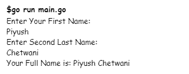

# 如何在 Golang 获取用户输入？

> 原文:[https://www . geesforgeks . org/如何从 golang 用户那里获取输入/](https://www.geeksforgeeks.org/how-to-take-input-from-the-user-in-golang/)

**Scanln** 功能可用于在 Golang 中接受用户的输入。下面是从用户处获取输入的示例:

```go
// Golang program to show how
// to take input from the user
package main

import "fmt"

// main function
func main() {

    // Println function is used to
    // display output in the next line
    fmt.Println("Enter Your First Name: ")

    // var then variable name then variable type
    var first string

    // Taking input from user
    fmt.Scanln(&first)
    fmt.Println("Enter Second Last Name: ")
    var second string
    fmt.Scanln(&second)

    // Print function is used to
    // display output in the same line
    fmt.Print("Your Full Name is: ")

    // Addition of two string
    fmt.Print(first + " " + second)
}
```

现在保存该文件并执行，如下图所示:



**关于节目的描述:**

*   **主包:**当我们构建可重用的代码片段时，我们将开发一个包作为共享库。但是当我们开发一个可执行程序时，我们将使用包“main”来使包成为一个可执行程序。包“main”告诉 Golang 编译器，包应该编译为可执行程序，而不是共享库。包“main”中的主要功能将是我们的可执行程序的入口点。请记住，当我们构建共享库时，包中不会有任何主包和主函数。
*   **fmt。Println** 是打印功能，用于打印下一行的输出。而 **fmt。打印**用于显示同一行的输出。任何需要打印的东西都必须用引号括起来**。**
*   ****var 第一个字符串**是字符串类型的变量 first 的声明。要声明变量，需要遵循以下语法:

    ```go
     var var_name data_type 
    ```** 
*   ****fmt。Scanln( &优先)**用于从下一行的用户处获取输入。而 **fmt。扫描**用于接收同一行用户的输入。“与”符号是必要的，以给出我们必须在哪个变量中存储该变量的参考。**
*   **最后一行将简单地添加名字和姓氏两个字符串，并将输出全名。**