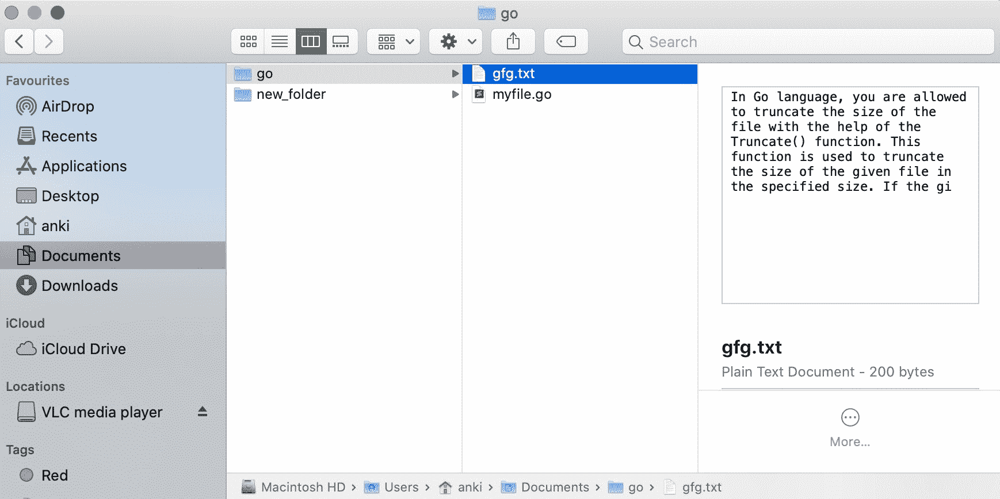

# 如何在 Golang 中截断文件？

> 原文:[https://www . geesforgeks . org/如何截断 golang 中的文件/](https://www.geeksforgeeks.org/how-to-truncate-a-file-in-golang/)

在 Go 语言中，您可以借助 **Truncate()函数**来截断文件的大小。该函数用于以指定的大小截断给定文件的大小。

*   如果给定的文件是一个符号链接，那么它会改变链接目标的大小。
*   如果这个方法抛出一个错误，那么它的类型将是*PathError。
*   它是在 os 包下定义的，所以您必须在程序中导入 os 包才能访问 Truncate()函数。
*   假设截断文件 if 为 100 字节，而原始文件小于 100 字节，则原始内容保留在开头，剩余空间用空字节填充。而如果原始文件大于 100 字节，那么被截断的文件在 100 字节后就会丢失内容。
*   如果在 Truncate()函数中传递 0，那么将得到一个空文件。

**语法:**

```go
func Truncate(name string, size int64) error
```

**例 1:**

```go
// Golang program to illustrate how to
// truncate the size of the given file
package main

import (
    "log"
    "os"
)

var (
    myfile *os.FileInfo
    e      error
)

func main() {
  // Truncate the size of the 
  // given file to 200 bytes 
  // Using Truncate() function
    err := os.Truncate("gfg.txt", 200)
    if err != nil {
        log.Fatal(err)

    }
}
```

**输出:**

*之前:*


*之后:*



**例 2:**

```go
// Golang program to illustrate how to
// truncate the size of the given file
package main

import (
    "log"
    "os"
)

var (
    myfile *os.FileInfo
    e      error
)

func main() {
  // Truncate the size of the given 
  // file to 0 bytes or empty file
  // Using Truncate() function
    err := os.Truncate("gfg.txt",0)
    if err != nil {
        log.Fatal(err)

    }
}
```

**输出:**

*之前:*


*之后:*


**例 3:**

```go
// Golang program to illustrate how to 
// truncate the size of the given file
package main

import (
    "log"
    "os"
)

var (
    myfile *os.FileInfo
    e      error
)

func main() {
  // Truncate the size of the 
  // given file to 300 bytes 
  // Using Truncate() function
    err := os.Truncate("/Users/anki/Documents/new_folder/bingo.txt", 300)
    if err != nil {
        log.Fatal(err)

    }
}
```

**输出:**

*之前:*


*之后:*
