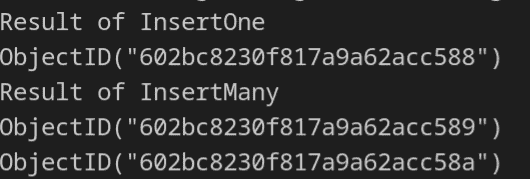
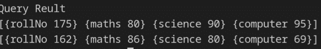
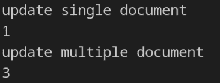
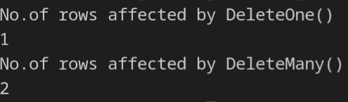

# 如何使用 Go With MongoDB？

> 原文:[https://www.geeksforgeeks.org/how-to-use-go-with-mongodb/](https://www.geeksforgeeks.org/how-to-use-go-with-mongodb/)

[MongoDB](https://www.geeksforgeeks.org/mongodb-an-introduction/) 是一个开源的 NoSQL 数据库。它是一个面向文档的数据库，使用一个类似 JSON 的叫做 BSON 的结构来存储文档(即键值对)。MongoDB 提供了集合的概念来对文档进行分组。在本文中，我们将讨论谁将 MongoDB 与 Golang 连接起来。

**先决条件:**需要安装 MongoDB，并在默认端口(即 27017)上启动。

**安装:** Package mongo 为 go 提供了一个 MongoDB 驱动 API，可以用来和 MongoDB API 进行交互。使用下面的命令安装软件包 mongo。

```go
go get go.mongodb.org/mongo-driver/mongo
```

**包上下文:**包上下文是上下文类型，它保存截止日期、取消信号和其他请求范围的值，跨越应用编程接口边界和进程之间。

### 将 Go 驱动程序与 MongoDB 连接

现在，要将 Go 驱动程序与 MongoDB 连接，您需要执行以下步骤:

1.  创造蒙戈。蒙戈的客户。连接功能。蒙古人。客户端处理与 MongoDB 的连接。
2.  蒙戈。客户端有一个名为 Ping 的方法，在成功连接时返回 pong。
3.  最后，使用 mongo。客户端。断开连接以关闭数据库连接。

## 去

```go
package main

import (
    "context"
    "fmt"
    "time"

    "go.mongodb.org/mongo-driver/mongo"
    "go.mongodb.org/mongo-driver/mongo/options"
    "go.mongodb.org/mongo-driver/mongo/readpref"
)

// This is a user defined method to close resources.
// This method closes mongoDB connection and cancel context.
func close(client *mongo.Client, ctx context.Context,
           cancel context.CancelFunc){

    // CancelFunc to cancel to context
    defer cancel()

    // client provides a method to close
    // a mongoDB connection.
    defer func(){

        // client.Disconnect method also has deadline.
        // returns error if any,
        if err := client.Disconnect(ctx); err != nil{
            panic(err)
        }
    }()
}

// This is a user defined method that returns mongo.Client,
// context.Context, context.CancelFunc and error.
// mongo.Client will be used for further database operation.
// context.Context will be used set deadlines for process.
// context.CancelFunc will be used to cancel context and
// resource associtated with it.

func connect(uri string)(*mongo.Client, context.Context,
                          context.CancelFunc, error) {

    // ctx will be used to set deadline for process, here
    // deadline will of 30 seconds.
    ctx, cancel := context.WithTimeout(context.Background(),
                                       30 * time.Second)

    // mongo.Connect return mongo.Client method
    client, err := mongo.Connect(ctx, options.Client().ApplyURI(uri))
    return client, ctx, cancel, err
}

// This is a user defined method that accepts
// mongo.Client and context.Context
// This method used to ping the mongoDB, return error if any.
func ping(client *mongo.Client, ctx context.Context) error{

    // mongo.Client has Ping to ping mongoDB, deadline of
    // the Ping method will be determined by cxt
    // Ping method return error if any occurred, then
    // the error can be handled.
    if err := client.Ping(ctx, readpref.Primary()); err != nil {
        return err
    }
    fmt.Println("connected successfully")
    return nil
}

func main(){

    // Get Client, Context, CalcelFunc and
    // err from connect method.
    client, ctx, cancel, err := connect("mongodb://localhost:27017")
    if err != nil
    {
        panic(err)
    }

    // Release resource when the main
    // function is returned.
    defer close(client, ctx, cancel)

    // Ping mongoDB with Ping method
    ping(client, ctx)
}
```

**输出:**


### 插入文档

要插入文档，您需要遵循以下步骤:

1.  创造蒙戈。蒙戈的客户。连接功能。蒙古人。客户端处理与 MongoDB 的连接。
2.  蒙戈。数据库返回一个指向数据库的指针类型。
3.  指向数据库的指针有一个方法集合来选择要使用的集合。
4.  集合类型提供了两种将文档插入 MongoDB 的方法。
5.  *收藏。InsertOne()* 方法可以向数据库中插入一个文档。
6.  *收藏。insertmulti()*方法可以插入文档列表。
7.  然后最后使用 mongo。客户端。断开连接以关闭数据库连接。

## 去

```go
package main

import (
    "context"
    "fmt"
    "time"
    "go.mongodb.org/mongo-driver/bson"
    "go.mongodb.org/mongo-driver/mongo"
    "go.mongodb.org/mongo-driver/mongo/options"
    "go.mongodb.org/mongo-driver/mongo/readpref"
)

// This is a user defined method to close resources.
// This method closes mongoDB connection and cancel context.
func close(client *mongo.Client, ctx context.Context,
           cancel context.CancelFunc){

    defer cancel()

    defer func() {
        if err := client.Disconnect(ctx); err != nil {
            panic(err)
        }
    }()
}

// This is a user defined method that returns mongo.Client,
// context.Context, context.CancelFunc and error.
// mongo.Client will be used for further database operation.
// context.Context will be used set deadlines for process.
// context.CancelFunc will be used to cancel context and
// resource associated with it.
func connect(uri string)
(*mongo.Client, context.Context, context.CancelFunc, error) {

    ctx, cancel := context.WithTimeout(context.Background(),
                                       30 * time.Second)
    client, err := mongo.Connect(ctx, options.Client().ApplyURI(uri))
    return client, ctx, cancel, err
}

// insertOne is a user defined method, used to insert
// documents into collection returns result of InsertOne
// and error if any.
func insertOne
(client *mongo.Client, ctx context.Context, dataBase, col string, doc interface{})
(*mongo.InsertOneResult, error) {

    // select database and collection ith Client.Database method
    // and Database.Collection method
    collection := client.Database(dataBase).Collection(col)

    // InsertOne accept two argument of type Context
    // and of empty interface  
    result, err := collection.InsertOne(ctx, doc)
    return result, err
}

// insertMany is a user defined method, used to insert
// documents into collection returns result of
// InsertMany and error if any.
func insertMany
(client *mongo.Client, ctx context.Context, dataBase, col string, docs []interface{})
(*mongo.InsertManyResult, error) {

    // select database and collection ith Client.Database
    // method and Database.Collection method
    collection := client.Database(dataBase).Collection(col)

    // InsertMany accept two argument of type Context
    // and of empty interface  
    result, err := collection.InsertMany(ctx, docs)
    return result, err
}

func main() {

    // get Client, Context, CancelFunc and err from connect method.
    client, ctx, cancel, err := connect("mongodb://localhost:27017")
    if err != nil {
        panic(err)
    }

    // Release resource when main function is returned.
    defer close(client, ctx, cancel)

    // Create  a object of type interface to  store
    // the bson values, that  we are inserting into database.
    var document interface{}

    document = bson.D{
        {"rollNo", 175},
        {"maths", 80},
        {"science", 90},
        {"computer", 95},
    }

    // insertOne accepts client , context, database
    // name collection name and an interface that
    // will be inserted into the  collection.
    // insertOne returns an error and aresult of
    // insertina single document into the collection.
    insertOneResult, err := insertOne(client, ctx, "gfg",
                                      "marks", document)

    // handle the error
    if err != nil {
        panic(err)
    }

    // print the insertion id of the document,
    // if it is inserted.
    fmt.Println("Result of InsertOne")
    fmt.Println(insertOneResult.InsertedID)

    // Now will be inserting multiple documents into
    // the collection. create  a object of type slice
    // of interface to store multiple  documents
    var documents []interface{}

    // Storing into interface list.
    documents = []interface{}{
        bson.D{
            {"rollNo", 153},
            {"maths", 65},
            {"science", 59},
            {"computer", 55},
        },
        bson.D{
            {"rollNo", 162},
            {"maths", 86},
            {"science", 80},
            {"computer", 69},
        },
    }

    // insertMany insert a list of documents into
    // the collection. insertMany accepts client,
    // context, database name collection name
    // and slice of interface. returns error
    // if any and result of multi document insertion.
    insertManyResult, err := insertMany(client, ctx, "gfg",
                                        "marks", documents)

    // handle the error
    if err != nil {
        panic(err)
    }

    fmt.Println("Result of InsertMany")

    // print the insertion ids of the multiple
    // documents, if they are inserted.
    for id := range insertManyResult.InsertedIDs {
        fmt.Println(id)
    }
}
```

**输出:**



图 1.2

### 查找文档

要查找文档，您需要遵循以下步骤:

1.  创造蒙戈。蒙戈的客户。连接功能。蒙古人。客户端处理与 MongoDB 的连接。
2.  蒙戈。数据库返回一个指向数据库的指针类型。
3.  指向数据库的指针有一个方法集合来选择要使用的集合。
4.  集合提供 *Find()* 方法查询数据库。
5.  然后最后使用 mongo。客户端。断开连接以关闭数据库连接。

## 去

```go
package main

import (
    "context"
    "fmt"
    "time"
    "go.mongodb.org/mongo-driver/bson"
    "go.mongodb.org/mongo-driver/mongo"
    "go.mongodb.org/mongo-driver/mongo/options"
    "go.mongodb.org/mongo-driver/mongo/readpref"
)

// This is a user defined method to close resources.
// This method closes mongoDB connection and cancel context.
func close(client *mongo.Client, ctx context.Context,
           cancel context.CancelFunc) {
    defer cancel()
    defer func() {
        if err := client.Disconnect(ctx); err != nil {
            panic(err)
        }
    }()
}

// This is a user defined method that returns
// a mongo.Client, context.Context,
// context.CancelFunc and error.
// mongo.Client will be used for further database
// operation. context.Context will be used set
// deadlines for process. context.CancelFunc will
// be used to cancel context and resource
// assositated with it.
func connect(uri string) (*mongo.Client, context.Context,
                          context.CancelFunc, error) {
    ctx, cancel := context.WithTimeout(context.Background(),
                                       30 * time.Second)
    client, err := mongo.Connect(ctx, options.Client().ApplyURI(uri))
    return client, ctx, cancel, err
}

// query is user defined method used to query MongoDB,
// that accepts mongo.client,context, database name,
// collection name, a query and field.

//  database name and collection name is of type
// string. query is of type interface.
// field is of type interface, which limts
// the field being returned.

// query method returns a cursor and error.
func query(client *mongo.Client, ctx context.Context,
dataBase, col string, query, field interface{})
(result *mongo.Cursor, err error) {

    // select database and collection.
    collection := client.Database(dataBase).Collection(col)

    // collection has an method Find,
    // that returns a mongo.cursor
    // based on query and field.
    result, err = collection.Find(ctx, query,
                                  options.Find().SetProjection(field))
    return
}

func main() {

    // Get Client, Context, CalcelFunc and err from connect method.
    client, ctx, cancel, err := connect("mongodb://localhost:27017")
    if err != nil {
        panic(err)
    }

    // Free the resource when main function is  returned
    defer close(client, ctx, cancel)

    // create a filter an option of type interface,
    // that stores bjson objects.
    var filter, option interface{}

    // filter  gets all document,
    // with maths field greater that 70
    filter = bson.D{
        {"maths", bson.D{{"$gt", 70}}},
    }

    //  option remove id field from all documents
    option = bson.D{{"_id", 0}}

    // call the query method with client, context,
    // database name, collection  name, filter and option
    // This method returns momngo.cursor and error if any.
    cursor, err := query(client, ctx, "gfg",
                         "marks", filter, option)
    // handle the errors.
    if err != nil {
        panic(err)
    }

    var results []bson.D

    // to get bson object  from cursor,
    // returns error if any.
    if err := cursor.All(ctx, &results); err != nil {

        // handle the error
        panic(err)
    }

    // printing the result of query.
    fmt.Println("Query Reult")
    for _, doc := range results {
        fmt.Println(doc)
    }
}
```

**输出:**



图 1.3

### 更新文档

要更新文档，您需要遵循以下步骤:

1.  创造蒙戈。蒙戈的客户。连接功能。蒙古人。客户端处理与 MongoDB 的连接。
2.  蒙戈。数据库返回一个指向数据库的指针类型。
3.  指向数据库的指针有一个方法集合来选择要使用的集合。
4.  集合提供了两种更新文档的方法。
5.  *UpdateOne()* 方法修改与查询匹配的单个文档
6.  *updateMulty()*方法修改与查询匹配的每个文档。
7.  然后最后使用 mongo。客户端。断开连接以关闭数据库连接。

## 去

```go
package main

import (
    "context"
    "fmt"
    "time"
    "go.mongodb.org/mongo-driver/bson"
    "go.mongodb.org/mongo-driver/mongo"
    "go.mongodb.org/mongo-driver/mongo/options"
    "go.mongodb.org/mongo-driver/mongo/readpref"
)

// This is a user defined method to close resources.
// This method closes mongoDB connection and cancel context.
func close(client *mongo.Client, ctx context.Context,
           cancel context.CancelFunc) {

    defer cancel()
    defer func() {
        if err := client.Disconnect(ctx); err != nil {
            panic(err)
        }
    }()
}

// This is a user defined method that returns
// mongo.Client, context.Context,
// context.CancelFunc and error.
// mongo.Client will be used for further database
// operation.context.Context will be used set
// deadlines for process. context.CancelFunc will
// be used to cancel context and resource
// assositated with it.
func connect(uri string)
(*mongo.Client, context.Context, context.CancelFunc, error) {

    ctx, cancel := context.WithTimeout(context.Background(), 30*time.Second)
    client, err := mongo.Connect(ctx, options.Client().ApplyURI(uri))
    return client, ctx, cancel, err
}

// UpdateOne is a user defined method, that update
// a single document matching the filter.
// This methods accepts client, context, database,
// collection, filter and update filter and update
// is of type interface this method returns
// UpdateResult and an error if any.
func UpdateOne(client *mongo.Client, ctx context.Context, dataBase,
               col string, filter, update interface{})
               (result *mongo.UpdateResult, err error) {

    // select the database and the collection
    collection := client.Database(dataBase).Collection(col)

    // A single document that match with the
    // filter will get updated.
    // update contains the filed which should get updated.
    result, err = collection.UpdateOne(ctx, filter, update)
    return
}

// UpdateMany is a user defined method, that update
// a multiple document matching the filter.
// This methods accepts client, context, database,
// collection, filter and update filter and update
// is of type interface this method returns
// UpdateResult and an error if any.
func UpdateMany(client *mongo.Client, ctx context.Context,
                dataBase, col string, filter, update interface{})
                (result *mongo.UpdateResult, err error) {

    // select the database and the collection
    collection := client.Database(dataBase).Collection(col)

    // All the documents that match with the filter will
    // get updated.
    // update contains the filed which should get updated.
    result, err = collection.UpdateMany(ctx, filter, update)
    return
}

func main() {

    // get Client, Context, CalcelFunc and err from connect method.
    client, ctx, cancel, err := connect("mongodb://localhost:27017")
    if err != nil {
        panic(err)
    }

    // Free the resource when main function in returned
    defer close(client, ctx, cancel)

    // filter object is used to select a single
    // document matching that matches.
    filter := bson.D{
        {"maths", bson.D{{"$lt", 100}}},
    }

    // The field of the document that need to updated.
    update := bson.D{
        {"$set", bson.D{
            {"maths", 100},
        }},
    }

    // Returns result of updated document and a error.
    result, err := UpdateOne(client, ctx, "gfg",
                             "marks", filter, update)

    // handle error
    if err != nil {
        panic(err)
    }

    // print count of documents that affected
    fmt.Println("update single document")
    fmt.Println(result.ModifiedCount)

    filter = bson.D{
        {"computer", bson.D{{"$lt", 100}}},
    }
    update = bson.D{
        {"$set", bson.D{
            {"computer", 100},
        }},
    }

    // Returns result of updated document and a error.
    result, err = Update(client, ctx, "gfg",
                         "marks", filter, update)

    // handle error
    if err != nil {
        panic(err)
    }

    // print count of documents that affected
    fmt.Println("update multiple document")
    fmt.Println(result.ModifiedCount)
}
```

**输出:**



图 1.4

### 删除文档

要删除文档，您需要遵循以下步骤:

1.  创造蒙戈。蒙戈的客户。连接功能。蒙古人。客户端处理与 MongoDB 的连接。
2.  蒙戈。数据库返回一个指向数据库的指针类型。
3.  指向数据库的指针有一个方法集合来选择要使用的集合。
4.  集合提供两种方法来删除集合中的文档。
5.  *DeleteOne()* 函数删除与查询匹配的单个文档。
6.  *删除许多()*函数删除所有与查询匹配的文档。
7.  然后最后使用 mongo。客户端。断开连接以关闭数据库连接。

## 去

```go
package main

import (
    "context"
    "fmt"
    "time"
    "go.mongodb.org/mongo-driver/bson"
    "go.mongodb.org/mongo-driver/mongo"
    "go.mongodb.org/mongo-driver/mongo/options"
    "go.mongodb.org/mongo-driver/mongo/readpref"
)

// This is a user defined method to close resources.
// This method closes mongoDB connection and cancel context.
func close(client *mongo.Client, ctx context.Context,
           cancel context.CancelFunc) {

    defer cancel()
    defer func() {
        if err := client.Disconnect(ctx); err != nil {
            panic(err)
        }
    }()
}

// This is a user defined method that returns
// mongo.Client, context.Context,
//context.CancelFunc and error.
// mongo.Client will be used for further
// database operation. context.Context will be
// used set deadlines for process.
// context.CancelFunc will be used to cancel
// context and resource assositated with it.
func connect(uri string) (*mongo.Client, context.Context,
                          context.CancelFunc, error) {

    ctx, cancel := context.WithTimeout(context.Background(),
                                       30 * time.Second)
    client, err := mongo.Connect(ctx, options.Client().ApplyURI(uri))
    return client, ctx, cancel, err
}

// deleteOne is a user defined function that delete,
// a single document from the collection.
// Returns DeleteResult and an  error if any.
func deleteOne(client *mongo.Client, ctx context.Context,
dataBase, col string, query interface{})
(result *mongo.DeleteResult, err error) {

    // select document and collection
    collection := client.Database(dataBase).Collection(col)

    // query is used to match a document  from the collection.
    result, err = collection.DeleteOne(ctx, query)
    return
}

// deleteMany is a user defined function that delete,
// multiple documents from the collection.
// Returns DeleteResult and an  error if any.
func deleteMany(client *mongo.Client, ctx context.Context,
dataBase, col string, query interface{})
(result *mongo.DeleteResult, err error) {

    // select document and collection
    collection := client.Database(dataBase).Collection(col)

     // query is used to match  documents  from the collection.
    result, err = collection.DeleteMany(ctx, query)
    return
}

func main() {

    // get Client, Context, CalcelFunc and err from connect method.
    client, ctx, cancel, err := connect("mongodb://localhost:27017")

    if err != nil {
        panic(err)
    }

    //  free resource when main function is returned
    defer close(client, ctx, cancel)

    // This query delete document when the maths
    // field is greater than  60
    query := bson.D{
        {"maths", bson.D{{"$gt", 60}}},
    }

    // Returns result of deletion and error
    result, err := deleteOne(client, ctx, "gfg", "marks", query)

    // print the count of affected documents
    fmt.Println("No.of rows affected by DeleteOne()")
    fmt.Println(result.DeletedCount)

    // This query deletes deletes documts that has
    // science field greater that 0
    query = bson.D{
        {"science", bson.D{{"$gt", 0}}},
    }

    // Returns result of deletion and error
    result, err = deleteMany(client, ctx, "gfg", "marks", query)

    // print the count of affected documents
    fmt.Println("No.of rows affected by DeleteMany()")
    fmt.Println(result.DeletedCount)
}
```

**输出:**



图 1.5