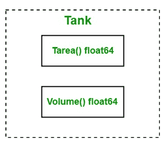

# 戈朗界面

> 原文:[https://www.geeksforgeeks.org/interfaces-in-golang/](https://www.geeksforgeeks.org/interfaces-in-golang/)

Go 语言接口不同于其他语言。在 Go 语言中，接口是一种自定义类型，用于指定一组一个或多个方法签名，并且接口是抽象的，因此不允许您创建接口的实例。但是您可以创建一个接口类型的变量，并且可以为这个变量分配一个具体的类型值，该值具有接口所需的方法。或者换句话说，接口是方法的集合，也是自定义类型。

#### 如何创建界面？

在 Go 语言中，您可以使用以下语法创建接口:

```go
type interface_name interface{

// Method signatures

}

```

**例如:**

```go
// Creating an interface
type myinterface interface{

// Methods
fun1() int
fun2() float64
}

```

这里，接口名称包含在类型和接口关键字之间，方法签名包含在大括号之间。

#### 如何实现接口？

在 Go 语言中，需要实现接口中声明的所有方法来实现接口。go 语言接口是隐式实现的。它不像其他语言那样包含任何特定的关键字来实现接口。如下例所示:



**示例:**

```go
// Golang program illustrates how
// to implement an interface
package main

import "fmt"

// Creating an interface
type tank interface {

    // Methods
    Tarea() float64
    Volume() float64
}

type myvalue struct {
    radius float64
    height float64
}

// Implementing methods of
// the tank interface
func (m myvalue) Tarea() float64 {

    return 2*m.radius*m.height +
        2*3.14*m.radius*m.radius
}

func (m myvalue) Volume() float64 {

    return 3.14 * m.radius * m.radius * m.height
}

// Main Method
func main() {

    // Accessing elements of
    // the tank interface
    var t tank
    t = myvalue{10, 14}
    fmt.Println("Area of tank :", t.Tarea())
    fmt.Println("Volume of tank:", t.Volume())
}
```

**输出:**

```go
Area of tank : 908
Volume of tank: 4396

```

#### 要点

*   接口的零值为零。
*   When an interface contains zero methods, such types of interface is known as the empty interface. So, all the types implement the empty interface.

    **语法:**

    ```go
    interface{}
    ```

*   **Interface Types:** The interface is of two types one is static and another one is dynamic type. The static type is the interface itself, for example, tank in the below example. But interface does not have a static value so it always points to the dynamic values.
    A variable of the interface type containing the value of the Type which implements the interface, so the value of that Type is known as dynamic value and the type is the dynamic type. It is also known as concrete value and concrete type.

    **示例:**

    ```go
    // Go program to illustrate the concept
    // of dynamic values and types
    package main

    import "fmt"

    // Creating an interface
    type tank interface {

        // Methods
        Tarea() float64
        Volume() float64
    }

    func main() {

        var t tank
        fmt.Println("Value of the tank interface is: ", t)
        fmt.Printf("Type of the tank interface is: %T ", t)
    }
    ```

    **输出:**

    ```go
    Value of the tank interface is:  <nil>
    Type of the tank interface is: <nil> 

    ```

    在上面的例子中，我们有一个名为坦克的界面。在本例中，
    *fmt。Println("坦克界面的值为: "，t)* 语句返回界面的动态值和 *fmt。Printf(“坦克接口的类型是:%T”，t)* 语句返回动态类型，即 nil，因为这里接口不知道谁在实现它。

*   **Type Assertions:** In Go language, type assertion is an operation applied to the value of the interface. Or in other words, type assertion is a process to extract the values of the interface.

    **语法:**

    ```go
    a.(T)
    ```

    这里，a 是接口的值或表达式，T 是类型，也称为断言类型。类型断言用于检查其操作数的动态类型是否与断言的类型匹配。如果 T 是具体类型，那么类型断言检查给定的 a 的动态类型是否等于 T，这里如果检查成功，那么类型断言返回 a 的动态值。或者如果检查失败，那么操作将会死机。如果 T 是接口类型，那么类型断言检查给定的 a 的动态类型是否满足 T，这里，如果检查成功进行，则不提取动态值。

    **示例:**

    ```go
    // Go program to illustrate
    // the type assertion
    package main

    import "fmt"

    func myfun(a interface{}) {

        // Extracting the value of a
        val := a.(string)
        fmt.Println("Value: ", val)
    }
    func main() {

        var val interface {
        } = "GeeksforGeeks"

        myfun(val)
    }
    ```

    **输出:**

    ```go
    Value:  GeeksforGeeks
    ```

    在上例中，如果我们将这个 *val := a.(string)* 语句改为 *val := a.(int)* ，那么程序就会死机。为了克服这个问题，我们使用以下语法:

    ```go
    value, ok := a.(T)
    ```

    这里如果 a 的类型等于 T，那么该值包含 a 的动态值，ok 将设置为 true。如果 a 的类型不等于 T，那么 ok 设置为 false，值包含零值，程序不会死机。如下图所示的程序:

    **示例:**

    ```go
    // Go program to illustrate type assertion
    package main

    import "fmt"

    func myfun(a interface{}) {
        value, ok := a.(float64)
        fmt.Println(value, ok)
    }
    func main() {

        var a1 interface {
        } = 98.09

        myfun(a1)

        var a2 interface {
        } = "GeeksforGeeks"

        myfun(a2)
    }
    ```

    **输出:**

    ```go
    98.09 true
    0 false

    ```

*   **Type Switch:** In Go interface, type switch is used to compare the concrete type of an interface with the multiple types provide in the case statements. It is similar to type assertion with only one difference, i.e, case specifies types, not the values. You can also compare a type to the interface type. As shown in the below example:

    **示例:**

    ```go
    // Go program to illustrate type switch
    package main

    import "fmt"

    func myfun(a interface{}) {

        // Using type switch
        switch a.(type) {

        case int:
            fmt.Println("Type: int, Value:", a.(int))
        case string:
            fmt.Println("\nType: string, Value: ", a.(string))
        case float64:
            fmt.Println("\nType: float64, Value: ", a.(float64))
        default:
            fmt.Println("\nType not found")
        }
    }

    // Main method
    func main() {

        myfun("GeeksforGeeks")
        myfun(67.9)
        myfun(true)
    }
    ```

    **输出:**

    ```go
    Type: string, Value:  GeeksforGeeks

    Type: float64, Value:  67.9

    Type not found

    ```

*   **接口的使用:**在方法或函数中想要传递不同类型的参数时，可以使用接口，就像 Println()函数一样。或者，当多个类型实现相同的接口时，也可以使用接口。