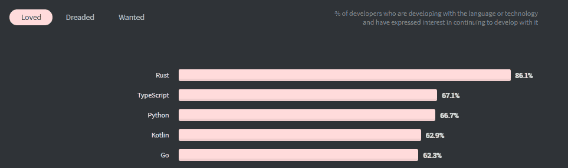
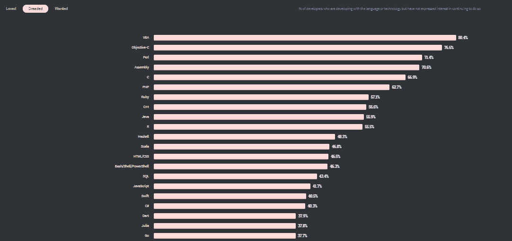

# 是否值得学习咕噜？

> Original: [https://www.geeksforgeeks.org/is-it-worth-learning-golang/](https://www.geeksforgeeks.org/is-it-worth-learning-golang/)

在这个大流行的时代，Golang 是一个非常流行的术语。 如果你平分这个学期，你会得到的结果是 Go+Lang。 简而言之，Go 在这里表示 Google，而 lang 表示语言。 因此，简而言之，**[Golang](https://www.geeksforgeeks.org/go-programming-language-introduction/)**是与 C 具有相同语法的 Google 语言。如果按照统计，Golang 是在**2009**11 月发布的，它的**1.0**版本是在**2012**上市的。 然后，随着时间的推移，它在设计草案、体系结构**[32 和 64 位]**以及生成代码例程的准确性方面进行了修改。

现在，在这个 COVID 时代，Golang 的**未来不仅光明，而且强大。 在这里，您可能会想，“*尽管有 Python、Ruby on Rails、Core 和 Advanced Java 以及 C/C++，为什么这种语言被讨论得这么多？*”问这样的问题不会让您看起来很愚蠢。 相反，这将使个人的头脑做好准备，说*，“是的，这是值得学习的”*，并提示您将其应用于正在进行的项目中。 让我们来讨论一下为什么你应该学习这门语言的一些原因：**

### 1.戈朗正在吸引大量就业机会

工作机会不仅会让你负起责任，还会为你的自尊、繁荣和幸福敞开大门。 有了 Golang，你可以期待已经为你的成功率奠定了坚实的基础。 此外，阿里巴巴、英特尔(Intel)、Medium 甚至优步(Uber)等公司都在全心全意地接受它。 如果围棋语言越来越受欢迎，这一点可能会被夸大，但根据各种标准的调查报告，这确实是真的。 也有其他公司对提供 Golang 开发人员、分析师或 Golang 实习生等职位非常有信心。 此外，这种语言之所以越来越受欢迎，是因为它成功地创造了这样一种景观，让那些渴望技术的人可以通过投入生活中的一小部分时间来达到里程碑。

### 2.咕噜可以让你成为一名高薪的自由职业者

高薪自由职业者是指那些实际上不受**9-5**时间表约束的人。 在网络开发或任何其他领域都有各种各样的自由职业机会，在较短的时间内变得更富有是可能的。 现在，你可能会想，如果戈朗能让我成为一名真正优秀的自由职业者，我会怎么做呢？ 在这里，你必须看一看 Upwork 的门户网站，像开发人员或分析师这样的 Golang 自由职业者平均每小时可以获得超过**40 美元**[**]。**

**此外，Stack Overflow 还对数千名开发人员进行了调查。 根据他们的反应，我们现在可以看到，他们中有多少人属于“被爱”、“害怕”和“被通缉”的类别。**

*   **对于“被爱”：百分比为**62.3****

**

图片来源：https://insights.stackoverflow.com/survey/2020#technology-most-loved-dreaded-and-wanted-languages-loved** 

*   **对于“恐惧”：百分比为**37.7****

**

图片来源：https://insights.stackoverflow.com/survey/2020#technology-most-loved-dreaded-and-wanted-languages-dreaded** 

*   **通缉：百分比为**17.9****

**

图片来源：https://insights.stackoverflow.com/survey/2020#technology-most-loved-dreaded-and-wanted-languages-wanted** 

### **3.Golang 正在强化 Google Cloud 的基础**

**我们中的许多人都没有意识到，Golang(或围棋语言)对 Google 来说就是*“变得更好”*。 这表明，Google 发明的云平台的设计、开发和维护都可以通过 Golang 来管理。 更可取的是，Google Cloud 是大家都知道的东西，这对我们来说已经成为强制性的，无论是为了与客户合作，还是为了简化各种指定项目的流程。 从保持项目的格式样式更简单到大规模扩展它们的性能，所有这些都得到了 Golang 开发人员的很好满足。**

**Golang 让谷歌员工对其健壮性和省时机制有了更多的了解。 带着这样的渴望，这家著名的搜索引擎现在正计划招聘更多能够管理谷歌云的候选人。 这项工作将类似于重用现有代码或扩展现有资产，从而可以扩展业务维度。**

### **4、句法简单，不强加复杂结构**

**虽然 Golang 的基本原理继承自 C 语言，但是您不会因为编写代码而感到沮丧。 令人信服的是，GO 代码严格反对接受复杂的设计结构，因为没有像 C 这样的类。您可以随时随地修改代码，因为继承在其源代码文档中既不适用也不被期望。 许多有技术抱负的人可能会对这样一个事实感到困惑：“**Golang 值得学习**吗？” 对于他们来说，有必要注意到这样一个事实，即围棋语言是正确的选择。 它的代码是干净的，相当容易的，并且在增强项目的可读性方面高度专门化，这些项目有可能推动以结果为导向的结果。**

### **5.Golang 支持多核/多核使用**

**多核/多核意味着向您的计算机硬件添加更多的核。 这是必要的，因为有了这一点，您的硬件在管理或处理多个应用程序时就会表现良好。 毫无疑问，有很多编程语言支持多核，比如 Spark、Python、Ruby on rails。 但是有了这些，如果内核[即从**4**增加到**8**时的内核数量增加，您可能会也可能不会期望它们会有出色的表现。 如果您正在使用 Go，您可以熟练地说，无论项目要求的是 Hexa、Quad 还是 Octa-Core，工作绩效都不会下降。**

### **6.Golang 可以潜在地展示并发性**

**并发性是许多编程语言所依赖原则。 这意味着让系统一次执行一项以上的任务。 在 Golang 中，例程和子例程是代码执行及其效率所依赖的东西。 支持 Golang 并发性的模型有两种：a)多线程[进程可以顺利地共享空间和资源]；第二，CSP[通信序列可以很好地使用通道]。 您可以在 Java 或 Python 中发现并发性，但这仅限于**1000 个线程**[max]。 在 Golang 中，单个实例执行的线程或序列高达百万[s]。 在处理请求的效率如此之高的情况下，很明显，在给定帧上执行任务的速度可以提高一倍、三倍或四倍。**

**通过这个共同因素(并发因素)，组织和他们的经验丰富的开发人员将不会否认这样一个事实，*，Golang 的**未来是光明的，它的翅膀可以为更广泛地扩展他们现有的运营领域做出很大贡献。*****