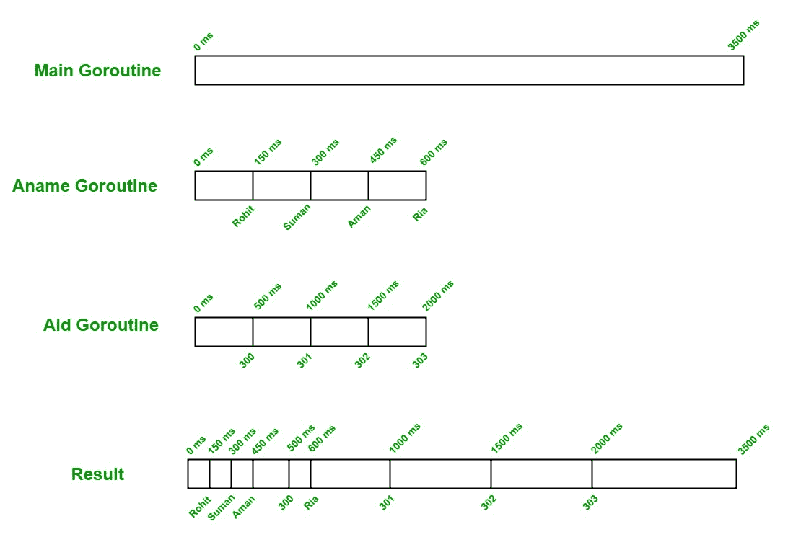

# 多戈鲁汀

> 原文:[https://www.geeksforgeeks.org/multiple-goroutines/](https://www.geeksforgeeks.org/multiple-goroutines/)

**先决条件:[多戈鲁汀](https://golangbot.com/goroutines/)**

一个 Goroutine 是一个函数或方法，它独立地同时与程序中的任何其他 Goroutine 一起执行。换句话说，Go 语言中的每个并发执行的活动都被称为 Goroutines。在 Go 语言中，您可以在一个程序中创建多个 goroutines。您可以通过使用 go 关键字作为函数或方法调用的前缀来创建 goroutine，如下语法所示:

```go
func name(){

// statements
}

// using go keyword as the 
// prefix of your function call
go name()

```

现在，我们借助一个示例来讨论如何创建和处理多个 goroutines:

```go
// Go program to illustrate Multiple Goroutines
package main

import (
    "fmt"
    "time"
)

// For goroutine 1
func Aname() {

    arr1 := [4]string{"Rohit", "Suman", "Aman", "Ria"}

    for t1 := 0; t1 <= 3; t1++ {

        time.Sleep(150 * time.Millisecond)
        fmt.Printf("%s\n", arr1[t1])
    }
}

// For goroutine 2
func Aid() {

    arr2 := [4]int{300, 301, 302, 303}

    for t2 := 0; t2 <= 3; t2++ {

        time.Sleep(500 * time.Millisecond)
        fmt.Printf("%d\n", arr2[t2])
    }
}

// Main function
func main() {

    fmt.Println("!...Main Go-routine Start...!")

    // calling Goroutine 1
    go Aname()

    // calling Goroutine 2
    go Aid()

    time.Sleep(3500 * time.Millisecond)
    fmt.Println("\n!...Main Go-routine End...!")
}
```

**输出:**

```go
!...Main Go-routine Start...!
Rohit
Suman
Aman
300
Ria
301
302
303

!...Main Go-routine End...!

```

**创造:**在上面的例子中，我们有两个主戈罗提内之外的戈罗提内，即*阿南*和*援助*。在这里， *Aname* 打印作者姓名， *Aid* 打印作者 id。

**工作:**在这里，我们有两个 goroutine，即 *Aname* ，以及 *Aid* 和一个主 goroutine。当我们首先运行主 goroutine strat 并打印“`!...Main Go-routine Start...!`”时，这里的主 goro tine 就像一个父级，其他 goro tine 是它的子级，所以首先运行主 goro tine，然后其他 goro tine 启动，如果主 goro tine 终止，那么其他 goro tine 也会终止。所以，在主 goroutine 之后， *Aname* 和*Aid*goro tine 同时开始工作。*启动装置*从*150 毫秒*开始工作，辅助装置从*500 毫秒*开始工作，如下图所示:

