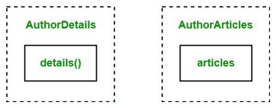

# 戈朗多个界面

> 原文:[https://www . geesforgeks . org/multi-interfaces-in-golang/](https://www.geeksforgeeks.org/multiple-interfaces-in-golang/)

在 Go 语言中，接口是方法签名的集合，它也是一种类型，意味着您可以创建一个接口类型的变量。在 Go 语言中，在给定语法的帮助下，您可以在程序中创建多个接口:

```go
type interface_name interface{

// Method signatures

}

```

**注意:**在 Go 语言中，不允许在两个或多个接口中创建同名方法。如果你试图这样做，那么你的程序就会死机。让我们借助一个例子来讨论多个接口。

**示例:**

```go
// Go program to illustrate the 
// concept of multiple interfaces
package main

import "fmt"

// Interface 1
type AuthorDetails interface {
    details()
}

// Interface 2
type AuthorArticles interface {
    articles()
}

// Structure
type author struct {
    a_name    string
    branch    string
    college   string
    year      int
    salary    int
    particles int
    tarticles int
}

// Implementing method 
// of the interface 1
func (a author) details() {

    fmt.Printf("Author Name: %s", a.a_name)
    fmt.Printf("\nBranch: %s and passing year: %d", a.branch, a.year)
    fmt.Printf("\nCollege Name: %s", a.college)
    fmt.Printf("\nSalary: %d", a.salary)
    fmt.Printf("\nPublished articles: %d", a.particles)

}

// Implementing method
// of the interface 2
func (a author) articles() {

    pendingarticles := a.tarticles - a.particles
    fmt.Printf("\nPending articles: %d", pendingarticles)
}

// Main value
func main() {

    // Assigning values 
    // to the structure
    values := author{
        a_name:    "Mickey",
        branch:    "Computer science",
        college:   "XYZ",
        year:      2012,
        salary:    50000,
        particles: 209,
        tarticles: 309,
    }

    // Accessing the method
    // of the interface 1
    var i1 AuthorDetails = values
    i1.details()

    // Accessing the method
    // of the interface 2
    var i2 AuthorArticles = values
    i2.articles()

}
```

**输出:**

```go
Author Name: Mickey
Branch: Computer science and passing year: 2012
College Name: XYZ
Salary: 50000
Published articles: 209
Pending articles: 100

```

**说明:**如上例所示，我们有两个带方法的接口，即 details()和 articles()。在这里，details()方法提供了作者的基本细节，articles()方法提供了作者的未决文章。



和一个名为 author 的结构，它包含一些变量集，这些变量的值在接口中使用。在主方法中，我们在作者结构中分配变量的值，这样它们将在接口中使用，并创建接口类型变量来访问 *AuthorDetails* 和 *AuthorArticles* 接口的方法。