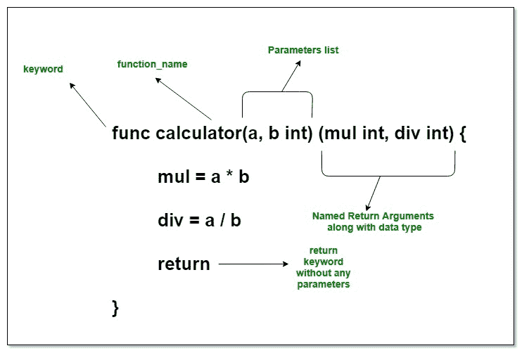

# Golang 中命名的返回参数

> 原文:[https://www . geesforgeks . org/named-return-parameters-in-golang/](https://www.geeksforgeeks.org/named-return-parameters-in-golang/)

**先决条件:[在戈朗的功能](https://www.geeksforgeeks.org/functions-in-go-language/)**

在 Golang 中，命名返回参数通常被称为命名参数。Golang 允许给函数签名或定义中的函数的返回或结果参数命名。也可以说是函数定义中返回变量的显式命名。基本上，它消除了在返回语句中提及变量名称的要求。通过使用命名返回参数或命名参数，只能在函数末尾使用 return 关键字将结果返回给调用方。当一个函数必须返回多个值时，通常使用这个概念。所以为了用户的舒适和增强代码的可读性，Golang 提供了这个工具。

#### 声明命名返回参数

要声明命名结果或返回参数，只需使用函数签名的返回类型部分。下面是在 Golang 中声明函数的一般语法。

**声明没有命名返回参数的函数的语法:**

```go
func function_name(Parameter-list)(Return_type){
    // function body.....
}

```

这里，Return_Type 是可选的，它包含函数返回的值的类型。如果在函数中使用 Return_Type，那么就需要在函数中使用 Return 语句。

**用命名返回参数声明函数的语法:**

> func function_name(参数列表)(result_parameter1 数据类型，result_parameter2 数据类型，…){
> //功能体…..
> 
> 返回

这里，`(result_parameter1 data-_type, result_parameter2 data_type, ....)`是命名的返回参数列表以及它们的类型。您可以声明 n 个命名的返回参数。

[](https://media.geeksforgeeks.org/wp-content/uploads/20190725175724/Named-Return-Parameters-Golang1.jpg)

**示例:**在下面的程序中，`func calculator(a, b int) (mul int, div int)`行代码包含命名的返回参数。函数末尾的 return 语句不包含任何参数。Go 编译器将自动返回参数。

```go
// Golang program to demonstrate the
// use of Named Return Arguments

package main

import "fmt"

// Main Method
func main() {

    // calling the function, here
    // function returns two values
    m, d := calculator(105, 7)

    fmt.Println("105 x 7 = ", m)
    fmt.Println("105 / 7 = ", d)
}

// function having named arguments
func calculator(a, b int) (mul int, div int) {

    // here, simple assignment will
    // initialize the values to it
    mul = a * b
    div = a / b

    // here you have return keyword
    // without any resultant parameters
    return
}
```

**输出:**

```go
105 x 7 =  735
105 / 7 =  15

```

#### 要点

*   If the type of all the named return arguments is common or same then you can specify the common data type. Compare the below code with the example that you read above to get a better understandability.

    ```go
    // function having named arguments
    func calculator(a, b int) (mul, div int) {

    ```

    这里， *mul* 和 *div* 变量都是 int 类型。因此，您也可以声明具有公共数据类型的命名参数，如函数变量(即 *a* 和 *b* )

*   使用命名的返回参数将增强代码的可读性，因为只需读取函数签名就可以知道返回参数。
*   在使用命名的返回参数后，返回语句通常被称为 ***裸返回或*** 裸返回。
*   默认情况下，Golang 用[零值](https://www.geeksforgeeks.org/?p=324512&preview=true)定义所有命名变量，函数将能够使用它们。如果函数不修改这些值，那么将自动返回零值。
*   如果您将使用[短声明运算符(:=)](https://www.geeksforgeeks.org/short-variable-declaration-operator-in-go/) 来初始化命名的返回参数，它将给出一个错误，因为它们已经被 Go 编译器初始化了。因此，可以使用简单赋值(=)将值赋给命名的返回参数。

    ```go
    // function having named arguments
    func calculator(a, b int) (mul int, div int) {

        // here, it will give an error
            // as parameters are already defined
            // in function signature
        mul := a * b
        div := a / b

        // here you have return keyword
        // without any resultant parameters
        return
    }

    ```

*   命名的返回参数或空的返回语句只适用于短函数签名。对于较长的函数，显式返回结果参数(不使用命名的返回参数)以保持代码的可读性。
*   在命名返回参数的情况下，裸返回语句是必须的。