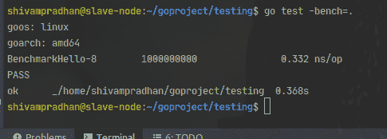

# 格朗基准测试概述

> 原文:[https://www . geesforgeks . org/golang 中基准测试概述/](https://www.geeksforgeeks.org/overview-of-benchmark-testing-in-golang/)

在自动化测试中，大多数框架只支持功能测试和基准测试中的一种。但是 Golang 测试包为不同类型的测试提供了许多功能，包括基准测试。

B 是传递给 benchmark 函数的类型(结构)，用于管理 Benchmark 计时和指定要运行的迭代次数。基本上测试包的基准测试套件给出了被测函数的基准报告，如消耗的时间、迭代/请求的次数(即函数的执行)。

**语法:**

```go
func BenchmarkXxx(*testing.B)

```

所有的基准功能都是通过 **go test** 命令执行的。基准结果包含基准运行的结果。

```go
type BenchmarkResult struct {
    N         int           // The number of iterations.
    T         time.Duration // The total time taken.
    Bytes     int64         // Bytes processed in one iteration.
    MemAllocs uint64        // The total number of memory allocations; added in Go 1.1
    MemBytes  uint64        // The total number of bytes allocated; added in Go 1.1

    // Extra records additional metrics reported by ReportMetric.
    Extra map[string]float64 // Go 1.13
}

```

**示例:**

*文件:main.go*

## 去

```go
package main

// function which return "geeks"
func ReturnGeeks() string{
    return "geeks";
}

// main function of package
func main() {
    ReturnGeeks()
}
```

*测试文件:pkg_test.go*

## 去

```go
package main

import (
    "testing"
)

// function to Benchmark ReturnGeeks()
func BenchmarkGeeks(b *testing.B) {
    for i := 0; i < b.N; i++ {
        ReturnGeeks()
    }
}
```

**命令:**

```go
go test -bench=.

```

其中**-长凳=。**是需要运行默认基准测试的标志。您可以在测试时操作不同的标志。

**输出:**

[](https://media.geeksforgeeks.org/wp-content/uploads/20200714183228/golangbenchmark.png)