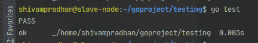

# 戈朗检测包概述

> 原文:[https://www . geesforgeks . org/测试概述-包在 golang/](https://www.geeksforgeeks.org/overview-of-testing-package-in-golang/)

在软件行业，手动测试和自动测试之间有明显的区别。其中手动测试用于确保软件代码按预期运行，并且需要时间和精力。大多数手动测试包括检查日志文件、外部服务和数据库中的错误。以不同的方式，自动化测试也是自动化的，某些软件/代码像用户一样执行测试。因为自动化测试是使用自动化工具完成的，所以探索测试花费更少的时间和更多的测试脚本，同时增加了测试的整体范围。

在 Golang，package **testing** 负责不同类型的测试，可能是性能测试、并行测试、功能测试，或者所有这些测试的任何可能组合。

**测试**包提供了对 Golang 代码自动化测试的支持。要运行任何测试功能，请使用“*开始测试*”命令，该命令自动执行表格**测试 XXX(*测试)的任何功能。T)** ，其中 Xxx 不得以任何小写字母开头。

**测试函数语法:**

```go
func TestXxx(*testing.T)
```

**在 Golang 编写测试套件的步骤:**

*   创建一个文件名以 _test.go 结尾的文件
*   通过导入“测试”命令导入包测试
*   编写 *<u>函数 TestXxx(*testing)形式的测试函数。T)</u>* 使用错误、、或相关方法中的任何一种来发出故障信号。
*   将文件放入任何包中。
*   运行命令开始测试

**注意:**测试文件将被排除在包构建之外，仅将在 go test 命令上执行。

**例:**

*<u>文件:</u>*

## 去

```go
package main

// function which return "geeks"
func ReturnGeeks() string{
    return "geeks";
}

// main function of package
func main() {
    ReturnGeeks()
}
```

*<u>测试文件:pkg _ Test . go</u>*T5】

## 去

```go
package main

import (
    "testing"
)

// test function
func TestReturnGeeks(t *testing.T) {
    actualString := ReturnGeeks()
    expectedString := "geeks"
    if actualString != expectedString{
        t.Errorf("Expected String(%s) is not same as"+
         " actual string (%s)", expectedString,actualString)
    }
}
```

**输出:**

[](https://media.geeksforgeeks.org/wp-content/uploads/20200714154610/golangtestscreenshot.png)

运行测试用例后的屏幕