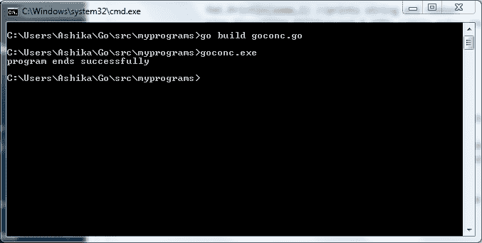

# 戈朗的比赛状态

> 原文:[https://www.geeksforgeeks.org/race-condition-in-golang/](https://www.geeksforgeeks.org/race-condition-in-golang/)

根据维基百科，竞争条件被定义为电子、软件或其他系统的条件，其中系统的实质性行为取决于其他不可控事件的顺序或时间。竞争条件属于“并发”部门。并发是同时在多个任务上取得进展的艺术。让我们理解并发实际上意味着什么。

考虑以下场景，以更好地理解并发性。想象一个装满梯子的篮子，两个人站在篮子旁边。一个人被分配一项任务来测量数量、质量、重量，并检查篮子里每个梯子的其他重要特征。现在，当他开始观察这些梯子以得出一些结论时，同时第二个人捣实了一些梯子的形状，把它们打成粉末，甚至吃了一些梯子的碎片。这是同时发生的:一个注意到梯子的特征&另一个破坏了原有的特征。现在世界上没有办法让第一个人知道原始数据，因为他只注意到被篡改的数据，甚至连他自己都不知道。这是一个**比赛状态**。两个任务同时执行会干扰一些常见的事情，导致大量数据丢失。

让我们实际地编码和理解比赛状态！

```go
package main

import (
    "fmt"
    "time"
)

func execute(some string) {

    // initializing a infinite for loop
    for i := 1; true; i++ {

        // prints string and number
        fmt.Println(some, i)

        // this makes the program sleep for
        // 100 milliseconds, wiz 10 seconds
        time.Sleep(time.Millisecond * 100)

    }
}

func main() {

    // Simple go synchronous program 
    // without any concurrency
    execute("First")

    // when this func is called it executes
    // and then passes on to next line
    execute("Second")

    // after the first second is to be executed
    // the problem is, execute function will 
    // never finish execution, its trapped 
    // in an infinite loop so the program will 
    // never move to second execution.
    fmt.Println("program ends successfully")

    // if I'm wrong and both first and second 
    // execute, then this line should print too
    // check the output
}
```


如果你使用 Windows，你很可能会在屏幕上看到这样的输出。上面的输出就这样继续下去，没有尽头，除非您手动停止它或者它耗尽系统内存来执行。

**考虑第二个代码。**

```go
package main

import (
    "fmt"
    "time"
)

func execute(some string) {

    // initializing a infinite for loop
    for i := 1; true; i++ {

        // prints string and number
        fmt.Println(some, i)

        // this makes the program sleep for
        // 100 milliseconds, wiz 10 seconds
        time.Sleep(time.Millisecond * 100)
    }
}

func main() {

    // Simple go program with concurrency
    go execute("First")

    // Placing the go command infront of the
    // func call simply creates a goroutine
    execute("Second")

    // The goroutine ensures that both functions
    // execute simultaneously & successfully
    fmt.Println("program ends successfully")

    // This statement still won't execute because
    // the func call is stuck in an infinite loop
    // check the output
}
```


如果你使用 Windows，你很可能会在屏幕上看到这样的输出。当你在 Go 中创建一个[goroutine](https://www.geeksforgeeks.org/goroutines-concurrency-in-golang/)时，它通常会通过将等待时间让给其他主要任务来加快执行速度，现在让我们看看如果你在同一个程序中创建两个 goro tine 会发生什么。

```go
package main

import (
    "fmt"
    "time"
)

func execute(some string) {

    // initializing a infinite for loop
    for i := 1; true; i++ {

        // prints string and number
        fmt.Println(some, i)

        // this makes the program sleep for
        // 100 milliseconds, wiz 10 seconds
        time.Sleep(time.Millisecond * 100) 
    }
}

func main() {

    // Simple go program with concurrency
    go execute("First")

    // Placing the go command in front of the
    // func call simply creates a goroutine
    go execute("Second")

    // The second goroutine, you may think that the
    // program will now run with lightning speed
    // But, both goroutines go to the background 
    // and result in no output at all Because the
    // program exits after the main goroutine
    fmt.Println("Program ends successfully")

    // This statement will now be executed
    // and nothing else will be executed
    // check the output
}
```



如果你使用 Windows，你很可能会在屏幕上看到这样的输出。让我们考虑一个比赛条件场景来结束我们的话题:

```go
package main

// one goroutine is the main
// goroutine that comes by default
import (
    "fmt"
    "runtime"
    "sync"
)

var wgIns sync.WaitGroup

func main() {

    // shared variable
    counter := 0

    // the other 10 goroutines are
    // supposed to come from here
    wgIns.Add(10)
    for i := 0; i < 10; i++ {

        // goroutines are made
        go func() {
            for j := 0; j < 10; j++ {

                // shared variable execution
                counter += 1
                // 100 should be the counter value but
                // it may be equal to 100 or lesser
                // due to race condition
            }
            wgIns.Done()
        }()
    }

    // this value should actually be 11
    fmt.Println("The number of goroutines before wait = ", runtime.NumGoroutine())

    wgIns.Wait()

    // value should be 100
    fmt.Println("Counter value = ", counter)

    fmt.Println("The number of goroutines after wait = ", runtime.NumGoroutine())

    // this value is supposed to be 1
    // but lets see if these values
    // stay consistently same every
    // time we run the code
}
```


这种不一致是由于比赛条件造成的。简单来说，比赛状态可以解释为，你有一颗糖，两个孩子跑向你，声称他们都饿了。他们最终都为那一块巧克力而战，他们争着要糖果。这是一种比赛状态。这里的解决办法是:再拿一块糖，这样两个人就可以平静地享受一块糖了。同样，我们可以增加资源分配，以确保不会出现竞争状况。