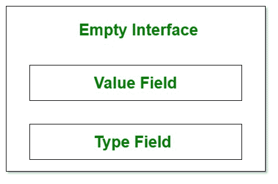

# 戈朗的倒影

> 原文:[https://www.geeksforgeeks.org/reflection-in-golang/](https://www.geeksforgeeks.org/reflection-in-golang/)

反射是程序在**运行时**内省和分析其结构的能力。在围棋语言中，主要通过**类型**进行反思。**反射包**提供了用于此目的的所有必需的原料药/方法。反射通常被称为**元编程的一种方法。**为了更好地理解反射，让我们先了解一下空接口:

> "指定零个方法的接口称为空接口."

当我们声明一个带有未知参数和数据类型的函数时，空接口非常有用。Println、Printf 等库方法以空接口作为参数。空接口具有某些隐藏属性，这些属性赋予它功能。数据以下列方式抽象。



**例 1:**

## 去

```go
// Understanding Empty Interfaces in Golang
package main

import (
    "fmt"
)

func observe(i interface{}) {

    // using the format specifier
    // %T to check type in interface
    fmt.Printf("The type passed is: %T\n", i)

    // using the format specifier %#v
    // to check value in interface
    fmt.Printf("The value passed is: %#v \n", i)
    fmt.Println("-------------------------------------")
}

func main() {
    var value float64 = 15
    value2 := "GeeksForGeeks"
    observe(value)
    observe(value2)
}
```

**输出:**

```go
The type passed is: float64
The value passed is: 15 
-------------------------------------
The type passed is: string
The value passed is: "GeeksForGeeks" 
-------------------------------------
```

在这里，我们可以清楚地看到，一个空接口将能够接受任何参数，并适应其值和数据类型。这包括但不限于**结构和指向结构的指针。**

**反思的需要是什么？**
传递给这些空接口的数据往往不是原语。例如，它们也可以是结构。我们需要在不知道这些数据的类型或其中存在的值的情况下，对这些数据执行过程。在这种情况下，为了对结构执行各种操作，例如解释结构中存在的数据以查询数据库或为数据库创建模式，我们需要知道结构中存在的类型以及字段的数量。这些问题可以在**运行时使用反射来处理。**

**反思包:**
围棋反思的基础是围绕 ***价值观、类型和种类*** 展开的。这些在包装中定义，属于**反射类型。价值，体现。类型**和**反映。种类**并且可以使用方法获得

1.  ***反映。ValueOf(x 接口{})。**T3】*
2.  ***反映。TypeOf(x 接口{})。**T3】*
3.  ***型。种类()。**T3】*

<figure class="table">

| 类型 | 种类 |
| --- | --- |
| 类型是围棋中类型的表现形式。例如，在 go 中的用户定义/自定义类型中，用户分配的名称存储为类型。 | 种类是类型的类型的表示。例如，在用户定义/自定义类型中，类型的数据类型将是种类。 |
| 使用**反射可以获得类型。TypeOf(x 接口{})** | 使用**可以获得种类。Kind()** |

</figure>

反射包为我们提供了许多其他方法:

1.  **NumField():** 此方法返回结构中存在的字段数。如果传递的参数不是种类反映。结构，然后它就会恐慌。
2.  **Field():** 这个方法允许我们使用 Indexing 变量访问结构中的每个字段。

在下面的例子中，我们将发现一个结构和另一个自定义数据类型的种类和类型之间的区别。除此之外，我们还将使用 reflect package 中的方法来获取和打印结构中的字段以及自定义数据类型中的值。

**例 2:**

## 去

```go
// Example program to show difference between
// Type and Kind and to demonstrate use of
// Methods provided by Go reflect Package
package main

import (
    "fmt"
    "reflect"
)

type details struct {
    fname   string
    lname   string
    age     int
    balance float64
}

type myType string

func showDetails(i, j interface{}) {
    t1 := reflect.TypeOf(i)
    k1 := t1.Kind()
    t2 := reflect.TypeOf(j)
    k2 := t2.Kind()
    fmt.Println("Type of first interface:", t1)
    fmt.Println("Kind of first interface:", k1)
    fmt.Println("Type of second interface:", t2)
    fmt.Println("Kind of second interface:", k2)

    fmt.Println("The values in the first argument are :")
    if reflect.ValueOf(i).Kind() == reflect.Struct {
        value := reflect.ValueOf(i)
        numberOfFields := value.NumField()
        for i := 0; i < numberOfFields; i++ {
            fmt.Printf("%d.Type:%T || Value:%#v\n",
              (i + 1), value.Field(i), value.Field(i))

            fmt.Println("Kind is ", value.Field(i).Kind())
        }
    }
    value := reflect.ValueOf(j)
    fmt.Printf("The Value passed in "+
      "second parameter is %#v", value)
}

func main() {
    iD := myType("12345678")
    person := details{
        fname:   "Go",
        lname:   "Geek",
        age:     32,
        balance: 33000.203,
    }
    showDetails(person, iD)
}
```

**输出:**

```go
Type of first interface: main.details
Kind of first interface: struct
Type of second interface: main.myType
Kind of second interface: string
The values in the first argument are :

1.Type:reflect.Value || Value:"Go"
Kind is  string
2.Type:reflect.Value || Value:"Geek"
Kind is  string
3.Type:reflect.Value || Value:32
Kind is  int
4.Type:reflect.Value || Value:33000.203
Kind is  float64
The Value passed in second parameter is "12345678"
```

在上面的例子中，我们将两个参数传递给函数 **showDetails()** ，该函数将空接口作为参数。论据是:

1.  ***人*** ，这是一个结构体。
2.  ***iD*** ，这是一个字符串。

我们已经使用了**反映的方法。类型为(I 接口{})** 和**类型。Kind()** 获取这些字段的方法，我们可以看到输出的差异。

*   结构人是**型主，细节**和善良**体现。结构**。
*   变量标识为**类型 main.myType** 和**类型字符串**。

因此，类型和种类之间的区别变得清晰，并根据他们的定义。这是《围棋语言》反思中的一个基本概念。此外，我们使用了**反映的方法。ValueOf()，。NumField()** 和**。Field()** 也可以从 reflect 包中获取空接口中的值、结构体的字段数，然后分别获取每个字段。这是可能的，因为在运行时使用了反射，这允许我们确定参数的类型和种类。
**注:****NumField()**和*T10。Field()* 只适用于结构体。如果元素不是结构，将导致死机。格式说明符 **%T** 不能用于打印种类。它会打印*反射。如果我们在带有 **%T** 的 Printf* 语句中传递 i.Kind()，它将打印**反射。种类**本质上是围棋中所有种类的类型。
值得注意的是，**值的类型。场(i)** 是**的反映。值**是类型而不是种类。“种类”显示在下面一行。因此，我们看到了反思在《围棋》中的重要性和作用。知道运行时变量的类型使我们能够编写大量的泛型代码。因此，反思是格朗不可或缺的根本