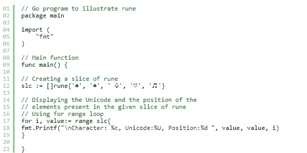

# 在戈兰高地运行

> 原文:[https://www.geeksforgeeks.org/rune-in-golang/](https://www.geeksforgeeks.org/rune-in-golang/)

过去，我们只处理一个字符集，即 ASCII 或美国信息交换标准代码。这里我们使用 7 位来表示 128 个字符，包括大小写英文字母、数字以及各种标点符号和设备控制字符。由于这一点，世界上的大量人口无法在计算机上使用他们自己的书写系统。所以为了解决这个问题，发明了 Unicode。它是 ASCII 的超集，包含世界书写系统中存在的所有字符，包括重音和其他变音符号、制表符和回车等控制代码，并为每个字符分配一个称为 Unicode 码点的标准数字，或者在 Go 语言中，分配一个符文。符文类型是 int32 的别名。

**要点:**

*   永远记住，字符串是字节序列，而不是符文。但是一个字符串可能包含用 UTF-8 编码的 Unicode 文本，并且我们知道中的 go 源代码总是用 UTF-8 编码，所以没有必要用 UTF-8 编码该字符串。
*   UTF-8 将所有的 Unicode 编码在 1 到 4 个字节之间，其中 1 个字节用于 ASCII，其余的用于符文。
*   ASCII 总共包含 256 个元素。其中 128 是字符，0-127 是代码点。这里的代码点指的是表示单个值的元素。

**示例:**

```go
 ♄
```

这是一个十六进制值为♄.的符文

#### 符文文字

它表示一个符文常量，其中一个整数值识别一个 Unicode 代码点。在围棋语言中，用单引号括起来的一个或多个字符表示的文字，如“g”和“t”等。在单引号之间，除了换行符和非转义单引号，您可以放置任何字符。这里，这些单引号字符本身代表给定字符的 Unicode 值，多字符序列(在多字符序列的开头)用反斜杠以不同的格式编码值。在符文文字中，所有以反斜杠开头的序列都是非法的，只有以下单字符转义符在与反斜杠一起使用时代表特殊值:

| 性格；角色；字母 | 统一码 | 描述 |
| \a | U+0007 | 警报还是钟声 |
| \b | U+0008 | 退格键 |
| \f | U+000C | 换页 |
| \n | U+000A | 换行 |
| \r | U+000D | 回车 |
| \t | U+0009 | 横表 |
| \v | U+000b | 垂直标签 |
| \\ | U+005c | 反斜线符号 |
| \' | U+0027 | 单引号 |
| \" | U+0022 | 双引号(仅在字符串中合法) |

**例 1:**

```go
// Simple Go program to illustrate
// how to create a rune
package main

import (
    "fmt"
    "reflect"
)

func main() {

    // Creating a rune
    rune1 := 'B'
    rune2 := 'g'
    rune3 := '\a'

    // Displaying rune and its type
    fmt.Printf("Rune 1: %c; Unicode: %U; Type: %s", rune1,
                             rune1, reflect.TypeOf(rune1))

    fmt.Printf("\nRune 2: %c; Unicode: %U; Type: %s", rune2,
                               rune2, reflect.TypeOf(rune2))

    fmt.Printf("\nRune 3: Unicode: %U; Type: %s", rune3, 
                                 reflect.TypeOf(rune3))

}
```

**输出:**

```go
Rune 1: B; Unicode: U+0042; Type: int32
Rune 2: g; Unicode: U+0067; Type: int32
Rune 3: Unicode: U+0007; Type: int32

```

**例 2:**



**输出:**

```go
Character: ♛, Unicode:U+265B, Position:0 
Character: ♠, Unicode:U+2660, Position:1 
Character: ♧, Unicode:U+2667, Position:2 
Character: ♡, Unicode:U+2661, Position:3 
Character: ♬, Unicode:U+266C, Position:4 

```