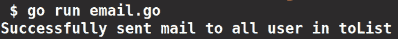

# 在格朗使用 Smtp 发送电子邮件

> 原文:[https://www . geesforgeks . org/sensing-email-use-SMTP-in-golang/](https://www.geeksforgeeks.org/sending-email-using-smtp-in-golang/)

net/smtp 是内置的 go 包，实现 smtp 协议。它提供了一种通过 smtp 服务器发送邮件的简单方法。这个包实现了简单邮件传输协议。

**发送邮件的步骤:**

**1。**从主机服务器获得身份验证，并使用 PlainAuth 功能建立到主机服务器的 TLS 连接。

```go
func PlainAuth(identity, username, password, host string) Auth
```

PlainAuth 接受字符串类型标识(它应该是一个空字符串来充当用户名)、用户名(发件人邮件地址)、密码(发件人邮件密码)和 SMTP 服务器端口的四个参数。PlainAuth 返回一个 Auth，一个 SMTP 身份验证机制的实现。为了向主机进行身份验证，返回的身份验证使用给定的用户名和密码，并充当身份。

**2。**使用获得的授权，通过发送邮件功能发送邮件

```go
func SendMail(addr string, a Auth, from string, to []string, msg []byte) error
```

SendMail 函数接受五个参数。addr 的类型是 string，包含服务器的地址和端口号(例如:“smtp.gmail.com:587”)，a 是我们从 PlainAuth 函数获得的 Auth，from 是 string 类型，包含发件人邮件地址，to 是包含收件人邮件地址的字符串片段，msg 是包含邮件正文的字节片段。

这里我们使用 Gmail 服务器发送邮件。您可以使用任何域的邮件地址，只需相应地更改主机即可。

## 去

```go
// Sending Email Using Smtp in Golang
package main

import (
    "fmt"
    "net/smtp"
    "os"
)

// Main function
func main() {

    // from is senders email address

    // we used environment variables to load the
    // email address and the password from the shell
    // you can also directly assign the email address
    // and the password
    from := os.Getenv("MAIL")
    password := os.Getenv("PASSWD")

    // toList is list of email address that email is to be sent.
    toList := []string{"example@gmail.com"}

    // host is address of server that the
    // sender's email address belongs,
    // in this case its gmail.
    // For e.g if your are using yahoo
    // mail change the address as smtp.mail.yahoo.com
    host := "smtp.gmail.com"

    // Its the default port of smtp server
    port := "587"

    // This is the message to send in the mail
    msg := "Hello geeks!!!"

    // We can't send strings directly in mail,
    // strings need to be converted into slice bytes
    body := []byte(msg)

    // PlainAuth uses the given username and password to
    // authenticate to host and act as identity.
    // Usually identity should be the empty string,
    // to act as username.
    auth := smtp.PlainAuth("", from, password, host)

    // SendMail uses TLS connection to send the mail
    // The email is sent to all address in the toList,
    // the body should be of type bytes, not strings
    // This returns error if any occured.
    err := smtp.SendMail(host+":"+port, auth, from, toList, body)

    // handling the errors
    if err != nil {
        fmt.Println(err)
        os.Exit(1)
    }

    fmt.Println("Successfully sent mail to all user in toList")
}
```

**输出:**

```go
Successfully sent mail to all user in toList
```

