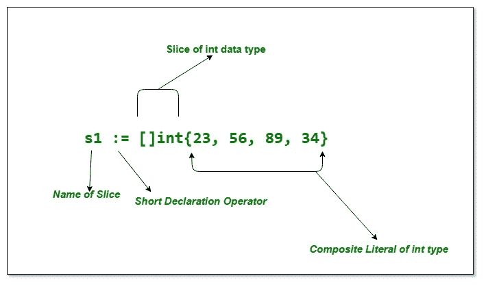

# 在 Go 中切片复合文字

> 原文:[https://www . geesforgeks . org/slice-composite-literal-in-go/](https://www.geeksforgeeks.org/slice-composite-literal-in-go/)

有两个术语，即切片和复合文字。切片是一种[复合数据类型](https://en.wikipedia.org/wiki/Composite_data_type)，类似于用于保存相同数据类型元素的数组。数组和切片之间的主要区别是切片的大小可以动态变化，但不是数组。
复合文字用于构造数组、结构、切片和映射的值。每次对它们进行评估，都会创造新的价值。它们由文字的类型后跟一个大括号绑定的元素列表组成。(你明白这一点了吗！)嗯，读完这本书，你会知道什么是复合字面意思，你会震惊于你已经知道了！！！！

让我们看看如何创建一个切片并使用复合文字:

```go
// Go program to show the slice 
// - composite literal
package main

import "fmt"

func main() {

    // Slice with composite literal
    // Slice allows you to group together
    // the values of the same type 
    // here type of values is int
    s1 := []int{23, 56, 89, 34}

    // displaying the values
    fmt.Println(s1)
}
```

**输出:**

```go
[23 56 89 34]

```

[](https://media.geeksforgeeks.org/wp-content/uploads/20190702155608/slice-composite-literal.jpg)

希望你明白这个术语到底是什么的复合字面意思。所以基本上赋值或者初始化数组，切片，等等。都是使用复合文字完成的。这些通常用于组成一堆相似类型的值。