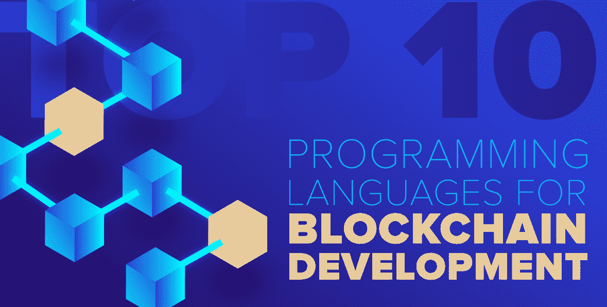

# 区块链开发十大编程语言

> Original: [https://www.geeksforgeeks.org/top-10-programming-languages-for-blockchain-development/](https://www.geeksforgeeks.org/top-10-programming-languages-for-blockchain-development/)

你有没有想过区块链的突然出现和流行？ 那是什么？ 嗯，区块链顾名思义就是一条区块链！ 只是这里的“块”是用密码术连接起来的数字信息。 这些块中的每一个都包含链接到前一块的**密码散列函数**、块中的**时间戳**和**数字信息**。 这些块的结构使得修改数据非常困难，因此它们在确保透明度的同时维护了安全性。

[区块链](https://www.geeksforgeeks.org/blockchain-technology-introduction/)实际上是安全的同义词，因为篡改这些块几乎是不可能的！ 而这使得这项技术在银行、金融等领域非常流行。事实上，区块链最早是在比特币实现时被普及的。 毕竟，人们希望他们的钱尽可能安全！ 因此，目前区块链开发者的需求量很大。 学习区块链开发的**顶级编程语言**肯定会让您比其他开发人员更有优势，所以这就是本文的全部内容。

### 1.[C++](https://www.geeksforgeeks.org/c-programming-language/)

C++在整个科技界都很流行，即使在区块链技术中也是如此！ C++之所以在区块链中如此流行，是因为它的多种功能，如移动语义、对内存的原语控制、高级多线程以及其他面向对象的功能，如函数重载、运行时多态性等。C++的这些不同的[面向对象特性允许区块链开发人员轻松地在单个模块中一起建模数据和函数，就像区块链使用密码链塑造块一样。 事实上，C++在区块链中也和比特币一样受欢迎，比特币是一种加密货币，区块链的第一个实现最初是用 C++编写的。](https://www.geeksforgeeks.org/object-oriented-programming-in-cpp/)

### 2.[Python](https://www.geeksforgeeks.org/python-programming-language/)

Python 正在迅速成为世界上最流行的编程语言，如果您是 Python 的新开发人员，那么它可能是最适合您的区块链语言。 Python 的一个问题是它是一种解释型语言，这给区块链中复杂的密码操作带来了一些问题。 但是，Python 是一种面向对象的语言，它有助于管理许多与性能相关的开销。 Python 的另一个好处是，开发人员可以通过任何冗长的编码快速构建他们的想法原型。 Python 也有巨大的开源支持，这使得它成为区块链的理想选择。 对于区块链开发中遇到的几乎每一个问题，网上都有许多 Python 库、插件和其他资源可用。

### ►T0−3.►T1*T2*T2*T3*

Java 在普及度和可用性方面与 C++形成了激烈的竞争。 这在区块链技术中也是如此！ Java 拥有丰富的应用程序编程接口(API)，其中包括许多 Java 类、包、接口等。这对于构建应用程序非常有用，而不必知道它们的内部实现。 此外，Java 在区块链中特别有用的一个属性是它的可移植性。 Java 程序可以移植到不同的平台上，因为它的 WORA(“一次编写，随处运行”)功能。 这些程序不依赖于特定于系统的体系结构，因为它们使用通用的 JVM(Java 虚拟机)来执行。 这种可移植性以及 Java 的其他流行特性使其非常适合区块链。

### 4.坚实度

Solidity 是增长最快的区块链编程语言之一，它是为编写在以太虚拟机(EVM)上运行的智能合约而创建的。 它是由基于区块链的分布式计算平台和操作系统 Etherum 开发的。 由于坚固性是在考虑到区块链的情况下创建的，因此它适合于解决区块链开发人员面临的许多问题。 Solidity 的开发类似于 ECMAScript 语法，但它具有各种返回类型、静态类型等特性。因此，如果您想要专门研究区块链开发的深度，那么它是一门很棒的语言。

### 5.Vyper

Vyper 是一种派生自 Python 3 的新区块链编程语言。因此，即使 Vyper 不具备 Python 的所有功能，Vyper 语法也是有效的 Python 3 语法。 Vyper 是作为固体的替代品而创建的。 它通常用于以太虚拟机(EVM)，，就像固态一样。 然而，Vyper 的控制结构与 Solity 不同，它处理安全问题的方式也不同。 Vyper 还在坚固性上取消了许多 OOPS 功能以及其他功能，如无限循环、修饰符、递归调用等。这有助于避免因这些功能而出现的安全问题。 因此，如果您需要区块链开发语言来编写智能合同，请查看 Vyper！

### [T06;T1#GolangT4T5T1T2_T3GolangT4T5)

Go 是一种优秀的编程语言，可用于构建快速高效的区块链系统。 它是创建超级分类帐结构的最佳语言，这是开发区块链应用程序的基础。 由于 Go 是静态类型的，是一种编译编程语言，因此非常适合区块链编码。 它还有其他增强性能的特性，比如泛型、类和继承、构造函数、注释、异常等等。Go 也是一种简单的语言，很容易学会。 这一点很明显，围棋语言网络上大约有 80 多万名开发人员。

### 7.[C#](https://www.geeksforgeeks.org/csharp-programming-language/)

C#在语法上类似于 Java 和 C++，因此它是区块链编程语言的理想选择。 虽然 C#最初只是作为一种微软语言创建的，但它现在相当流行，被认为是区块链最好的编程语言之一。 开源开发人员可以使用 C#轻松创建可在所有设备和多种操作系统(如 Windows、Windows、Linux、Mac、Android 等)上运行的高度可移植的代码。此外，由于 C#是一种面向对象的编程语言，区块链开发人员在开发下一个区块链时可以获得最高性能。 用 C#编写的项目包括 Stratis，这是一个区块链即服务提供商，允许企业轻松地在区块链平台上创建应用程序。

### 加入时间：清华大学 2007 年 01 月 25 日下午 3：33

JavaScript 是最流行的网络语言，多亏了 NodeJS，JavaScript 运行时环境，JavaScript 在区块链开发人员中也很受欢迎。 他们可以使用 JavaScript 构建高性能和创造性的区块链应用程序，因为它已经安装在大多数系统上。 这是 JavaScript 相对于其他编程语言的一大优势，因为每个 Web 系统都在一定程度上使用 JavaScript。 因此，开发人员在使用 JavaScript 时无需担心集成问题，他们只需专注于区块链的应用程序逻辑即可。 Lisk SideChain 开发工具包(SDK)就是一个这样的例子，它允许开发人员构建、发布和分发他们的区块链应用程序，这些应用程序是用 JavaScript 编写的。

### 9.简单性

Simple 是为智能合同创建的高级区块链开发语言。 事实上，无论对于专业程序员还是开源开发人员，它都是编写智能合同的最佳编程语言之一。 简单性还侧重于减少对比特币文字的复杂和低层次理解。 因为它对比特币开发人员隐藏了底层逻辑组件，所以简单性增加了开发人员的工作能力，这有助于创建更快的开发周期。 简单性也与 Elements Platform 兼容，Elements Platform 是一个具有侧链功能的开源区块链平台。 因此，在元素上构建侧链的区块链开发人员也可以使用简单的许多功能和特性。

### T010。HolangT1___

Rholang 是一种用于开发智能合约的优秀编程语言。 这种语言采用的是函数式方法，而不是面向对象的方法，这对解决许多区块链问题相当有帮助。 这是它受欢迎的原因之一。 Rholang 应用程序将整个程序评估为一系列函数并按顺序求解。 这与 C 或 Python 等语言明显不同，后者使用变量来存储数据，并随时间改变变量的值。 因此，Rholang 拥有函数式编程范例，而不是面向对象的范例，它是这一类别中最流行的区块链开发语言。