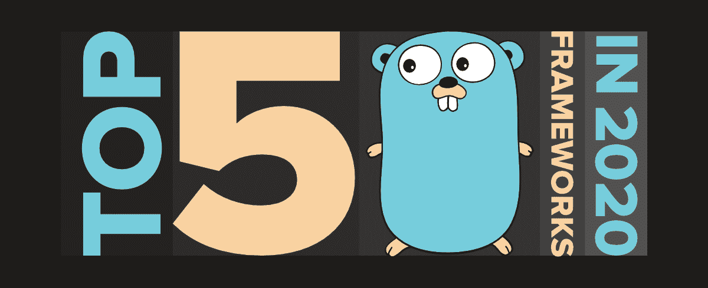

# 2020 年度五大 Golang 框架

> Original: [https://www.geeksforgeeks.org/top-5-golang-frameworks-in-2020/](https://www.geeksforgeeks.org/top-5-golang-frameworks-in-2020/)

[Golang](https://www.geeksforgeeks.org/golang/)(或 GO)是一种开源编译编程语言，用于构建简单、系统和安全的软件。 它是由 Google 在 2007 年设计的，由于其存储安全性、结构类型、垃圾收集以及与 C 语言的相似性等特性，已被世界各地的开发人员轻松采用。

Golang Web 框架用于直接编写应用程序编程接口(API)和 Web 服务。 在构建小型应用程序的过程中，框架不是必需的，但在生产级软件中是必需的。 即使了解这些特性和知识，编写一个调试生产级程序也要花费大量的时间。 由于这个原因，框架经常被使用。 框架提供了其他开发人员可以使用的附加功能和服务，这些开发人员希望在他们的软件中添加类似的功能，而不是自己编写成熟的软件。

根据 GitHub 上的明星排名，Golang 排名前 5 位的 web 框架如下：

<figure class="table">

| **<u>名称</u>** | **<u>星号</u>** | **<u>叉子</u>** | **<u>未解决问题</u>** |
| 轧棉机 / 三脚起重机 / 起重装置 / 杜松子酒 | 40.2k | 4.6k | 二百三十八

 |
| 自我陶醉 | 24.5k | 4.9k | 746 |
| 回响 / 回荡 / 重复 / 反射 | 17.7k | 1.6k | 37 |
| 一套工具 / 包 / 箱子 / 幼崽 | 17.5k | 1.8k | 59 |
| Fasthttp | 13K | 1.1k | 34 |

</figure>

让我们详细了解这些框架，并根据它们的功能和易用性对它们进行比较：

### 1.元 T0**金元 T1*

**GIN**框架因其简约的框架和性能而在受欢迎程度方面名列前茅。 如果程序员想要使用前端框架开发单页面应用程序，它主要用于为后端构建 rest API。 该框架利用 HTTP 路由器来处理 Golang 流量，非常适合初学者，并在 GitHub 上提供了丰富的文档。 它支持最基本的库和特性，这使得它成为最适合开发高性能 RESTAPI 的 Golang 框架。

这个 Web 框架的 API 将类似于马提尼，但比它快近 40 倍！ 庞大的杜松子酒用户社区已经开发出大量经过良好测试的中间件，这使得使用杜松子酒变得更加容易和可靠。

最大的缺点是虽然适用于较小的应用，但不适合开发大型后端应用或企业级服务器的复杂功能。

### 2.[比自己](https://github.com/astaxie/beego)

**Beego**框架用于在 Golang 中快速开发 RESTAPI、Web 应用程序和后端服务。 它通常被视为类似于 Python 中的 Django web 框架，并且包含 Golang 的特定特性，如接口和结构嵌入。 它不需要任何第三方安装。 它是一个成熟的模型-视图-控制器(Model-View-Controller，MVC)框架，具有自己的库和一个帮助查找代码更改的内置工具，称为*Bee 工具*。

此外，它还分为八个模块，可以忽略，也可以根据需要使用。 它集成了对象关系映射(Object-Relationship Map，ORM)，该映射有助于组织应用程序的数据库以及会话处理工具和日志记录系统。 不仅如此，它还集成了一个缓存处理程序和用于操作 HTTP 元素的库。 另一个很棒的特性是，它可以很好地与命令行工具配合使用，这与 Django 使用命令行的方式类似。

唯一的缺点是，由于它的高功能和广泛的特点，它不太适合初学者。

### 3.[**回声**](https://github.com/labstack/echo)

**ECHO**框架是 Golang 中的另一个高性能、可扩展和简约的 Web 框架。 它有一个高度优化的 HTTP 路由器，动态内存分配为零，可以智能地确定路由的优先级。 它用于构建健壮且可扩展的 REST API，这些 API 可以轻松地组织成组。 它自动安装来自*的 TLS 证书，让我们加密*，并提供 HTTP/2 支持，从而提高速度并提供更好的用户体验。 它还包含许多可供使用的内置中间件，开发人员甚至可以定义自己的中间件，这些中间件可以在根、组或路由级别进行设置。

它支持 HTTP 请求有效负载的数据绑定，包括 JSON、XML 或表单数据。 对于数据呈现，它包含一个 API 来发送各种 HTTP 响应，包括 JSON、XML、HTML、文件和附件。 模板可以使用任何模板引擎呈现，并具有自定义的中央 HTTP 错误处理。

使用 ECHO 框架的缺点是它只由一个开发人员维护，并且代码更新不频繁。

### 4 . " T0 **工具包"**

**KIT**框架是一个编程工具包，用于在 Golang 中构建健壮、可靠和可维护的微服务。 它是一组包和最佳实践，为任何规模的组织提供了构建微服务的全面、可靠和可靠的方法。 Go 是一种很棒的通用语言，但是微服务需要一定的专业支持。

因此，KIT 框架提供远程过程调用(RPC)安全性、系统可观察性和基础设施集成。 它由多个相互关联的包组成，这些包共同构成了构建大型面向服务的体系结构(SOA)的固定框架，并使 Golang 成为任何组织中编写微服务的一流语言。 它是为互操作性而设计的，开发人员可以自由选择最适合他们的数据库、组件、平台和体系结构。

使用 Go-kit 的缺点是接口使用量大，为服务添加 API 的开销非常高。

### 5.[**Fasthttp**](https://github.com/valyala/fasthttp)

**Fasthttp**框架提供了一个快速的 HTTP 服务器和客户端 API，由于其对优化机会的限制，作为 Net/Http 的替代方案。 它针对速度进行了优化，可以在现代硬件上轻松处理超过 100K QPS 和超过 100 万个并发保活连接。 它还针对低内存使用率进行了优化，并通过*RequestCtx.Hijack*提供轻松的连接升级支持。

Fasthttp API 能够扩展现有的客户端和服务器实现，或者从头开始编写自定义的客户端和服务器实现。 向请求处理程序公开了许多其他有用的信息，例如服务器和客户端地址、每个请求的记录器、唯一的请求 ID 等。

因为 net/http 拥有更广泛的受众，所以它更可靠，也更经过测试。 此外，由于 Net/http 和 Fasthttp 不兼容，开发人员经常发现很难从 Net/http 迁移到 Fasthttp。

以下是根据 GitHub 上的受欢迎程度整理的 2020 年最受欢迎的 5 个 Golang web 框架。 这里列出的每个框架都有一组不同的功能可供试验，在实现其中任何一个框架之前，请确保您清楚地了解它们的要求。 不仅限于这些，Golang 还提供了大量其他框架，如 Buffalo、Martini、Goji、Net/http、Revel 等，欢迎随时查看。